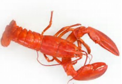
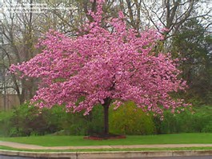
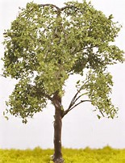

# 2017.11.30 DAY 1  #
> A light here required a shadow there.
> 此处有灯光，则彼处必有阴影。

http://blog.tianya.cn/blogger/post_show.asp?BlogID=1969164&PostID=16646831

## 今日单词 ##

1	

	preposterous /prɪˈpɑːstərəs/
	adj. 荒谬的，可笑的

2	

	flaunt /flɔːnt/
	n. 招摇；飘扬；藐视； vi. 炫耀；飘扬； vt. 炫耀

3	

	lobster /ˈlɑːbstər/
	n. 龙虾

4	

	terrestrial /təˈrestriəl/
	adj. 地球的，陆地的； n. 陆地生物；地球上的人

5	

	pry /praɪ/
	v. 刺探，打听，撬开

6	

	nibble /ˈnɪbl/
	v. 一点点地咬，慢慢啃，吹毛求疵； n. 细咬，轻咬，啃

7	

	obsequious /əbˈsiːkwiəs/
	adj. 逢迎的，谄媚的

8	

	almanac /ˈɔːlmənæk/
	n. 年鉴，历书，年历

9	

	janitor /ˈdʒænɪtər/
	n. 看门人；清洁工

10	

	scrupulous /ˈskruːpjələs/
	adj. 小心谨慎的；严谨的；细心的

11	

	rocker /ˈrɑːkər/
	n. 摇者，摇杆，摇滚乐歌手，镰刀弯，套钩

12	

	springtime /ˈsprɪŋtaɪm/
	n. 春天，春季，初期

13	

	raspberry /ˈræzberi/
	n. 覆盆子，（表示轻蔑，嘲笑等的）咂舌声

14	

	dogwood /ˈdɔːɡwʊd/
	n. 木属植物，山茱萸； adj. 山茱萸科植物的，淡黄褐色的

15	

	bosom /ˈbʊzəm/
	n. 胸部，胸怀，内部，内心； adj. 亲密的，知心的； v. 拥抱；把…藏心中

16	

	dandelions /'dændɪlaɪənz/
	n. 蒲公英

## 今日阅读 ##

Previous Story

Sarah是个清贫的姑娘,靠给一家餐厅提供菜单维持生计。而她的恋人Walter远在乡下农场,两人约好春天结婚,却意外失去联系。他们能否终成眷属，过上幸福生活呢？

Chapter 1

Springtime à la Carte(（法）菜单上的春天)

It was a day in March.

Never, never begin a story this way when you write one. No opening could possibly be worse. It is unimaginative(缺乏想象力的), flat（*）, dry（*） and likely to consist of(包含) mere wind（*）. But in this instance it is allowable（*）. For the following paragraph, which should have inaugurated（*） the narrative, is too wildly extravagant and preposterous(荒唐的) to be flaunted(卖弄) in the face of the reader without preparation.

如果你要写故事，可千万别这么开头。再没有比这更糟糕的开头了。这样的开头缺乏想象力，平淡乏味，可能也只不过是句废话，可是用在这儿倒还勉强凑合。因为接下来的一段话本该用在故事的开头，只是它太过唐突离奇，就那样置于缺少思想准备的读者面前，的确会叫人摸不着头脑。

Sarah was crying over her bill of fare（*）.

萨拉在对着菜单哭泣。

Think of a New York girl shedding tears on the menu card!

试像一下，一个纽约女孩在对着一份菜单流眼泪！

	shedding tears 流泪;
	[例句]She felt her eyes tingling and could hardly help shedding tears.
	她觉得两眼发酸，泪水止不住流了下来。

To **account for** this you will be allowed to guess that the lobsters(龙虾) were all out, or that she had sworn ice-cream off(保证弃绝) during Lent, or that she had ordered onions, or that she had just come from a Hackett matinée(（法）日场演出). And then, all these theories（*） being wrong, you will please let the story proceed. 

为了解释这一场景，你不妨随便猜测：也许是龙虾全部售完，也许她发过誓以至于再也不能在大斋期间吃冰淇淋，或许她吃饭时要了洋葱，或许她刚从哈克特戏院看完日场回来。然而，这些猜想都不对。还是让我继续把故事讲下去吧。

	account for 说明（原因、理由等）; 导致，引起; （在数量、比例上） 占; 对…负责;
	[例句]Now, the gene they discovered today doesn't account for all those cases.
	不过，他们现在发现的基因无法解释所有的病例。

	swear off 下决心不做…，停用…;
	[例句]I've decided to swear off smoking.
	我已宣布戒烟了。

	大斋期（亦称大斋节期；天主教会称四旬期；基督新教信义宗称预苦期），是基督教的教会年历一个节期。英文写作Lent，意即春天。

	theories
	n.	理论; 原理; 学说( theory的名词复数 ); 意见;
	[例句]They talked about the competing theories of the origin of life.
	他们讨论了几种相互矛盾的生命起源理论。

The gentleman（没有翻译成“特定的先生”，而是翻译成了有位先生） who announced that the world was an oyster which he with his sword would open made a larger hit than he deserved. It is not difficult to open an oyster with a sword. But did you ever notice any one try to open the terrestrial(陆地的) bivalve with a typewriter? **Like to wait for a dozen raw opened that way?**

有位先生曾经说，世界是个大牡蛎，他要用刀把它剖开。他因此而出了名。其实，用刀剖开一个牡蛎并没有什么大不了的，你有没有见过什么人要用打字机打开它呢？

	oyster	
	n.	牡蛎; <俚>守秘密的人; 鸡背肉; 沉默寡言的人;
	[例句]He had two dozen oysters and enjoyed every one of them.
	他吃了两打牡蛎，每一只都吃得津津有味。

	made a hit 
	成功了

	bivalve	
	n.	双壳类; 双阀;
	[例句]Marine or freshwater bivalve mollusk that lives attached to rocks etc..
	附着在岩石等物上的海水或淡水双科类软体动物。

	typewriter	
	n.	打字机;
	[例句]The typewriter is obsolete.
	这架打字机老掉牙了。

	Like to wait for a dozen raw opened that way? 不理解

 Sarah had managed to(成功做成（某事）) pry(撬开) apart the shells with her unhandy weapon far enough to nibble(轻咬) a wee bit at the cold and clammy(潮湿的) world within. She knew no more shorthand than if she had been a graduate in stenography(速记) just let slip upon the world by a business college. So, not being able to stenog, she could not enter that bright galaxy of(一群) office talent. She was a free-lance(自由职业的) typewriter and canvassed(招揽) for odd jobs of copying. 

萨拉就曾经用她那件不称手的工具把牡蛎撬开了一个大口子，然后在那又冷又粘的壳里细细地咬了一小口。她懂一点速记，但不比初出茅庐的商学院速记科毕业生强多少。所以，她做不了速记员，也就不能加入到前途光明、地位显赫的办公室精英的行列中。她是一名自由打字员，努力争取些零星的抄写工作。

	wee	
	adj.	很小的，极小的; 很早的;
	n.	一点点; 一会儿;
	[例句]I've got a wee kitten in the flat
	我在公寓里养了一只小猫。

	shorthand	
	n.	速记，速记法; 速记记录文字;
	adj.	速记法的;
	[例句]Ben took notes in shorthand.
	本用速记法记笔记。

	stenographer
	n.	速记员;
	[例句]I am alert, adaptable, and keen-minded. I am an efficient stenographer and typist.
	我机灵、适应性强、为人热情，是一个高效率的速记员和打字员；

	odd	 在本文上，应当作“临时”理解。
	adj.	古怪的; 奇数的; 剩余的; 临时的;
	n.	奇特的事物; 怪人; [高尔夫球] 多于对方的一次击球;
	[例句]He'd always been odd, but not to this extent
	他一直比较怪异，不过并没有到这种程度。

The most brilliant and crowning feat of Sarah’s battle with the world was the deal she made with Schulenberg’s **Home Restaurant**. The restaurant was next door to the old red brick in which she hall-roomed. One evening after dining at Schulenberg’s 40-cent, five-course table d’hôte(（法）定价套餐) (served as fast as you throw the five baseballs at the colored gentleman’s head) Sarah took away with her the bill of fare. It was written in an almost unreadable script neither English nor German, and so arranged that if you were not careful you began with a toothpick and rice pudding and ended with soup and the day of the week.

萨拉在与这个世界的战斗中所取得的最辉煌、最荣耀的成就就是她与斯库伦伯格**家庭餐馆**所订下的那个协议。这家餐馆位于一所红砖旧公寓的隔壁，萨拉就住在公寓门厅尽头的一间卧室里。一天晚上，她在那家餐馆吃了一份四十美分五个菜的套餐（菜上得很快，可以与你朝那黑人侍者的头上扔五个棒球的速度相比），然后顺手带走了她桌上的那份菜单。菜单是手写的，读起来既不像英文也不像德文，并且杂乱无章，如果不仔细看，您第一道菜会是牙签和米粉布丁，而最后一道菜是一份汤外加“今天是星期×”。

	bill	英[bɪl]
	美[bɪl]
	n.	账单; 清单; 钞票; 广告;
	vt.	安排; 给…开账单; 为…发提（货）单; 把…登录在账;
	vi.	鸟嘴相接触;
	[例句]They couldn't afford to pay the bills
	他们无力支付这些账单。

	fare	英[feə(r)]
	美[fer]
	n.	票价; 费; 食物; 乘客;
	vi.	吃; 进食; 进展; 遭遇;
	[例句]He could barely afford the railway fare.
	他几乎买不起火车票。

	bill of fare	英[bil ɔv fɛə]
	美[bɪl ʌv fɛr]
	n.	菜单，菜谱;
	[例句]I want to find a bill of fare for this dinner.
	我想要去找一个菜单为了这顿晚餐。
	【lsieun】 bill应该理解为“清单”，而fare应该理解为“费用”，因此bill of fare理解为“标明价格的菜单、菜谱”。

	script	英[skrɪpt]
	美[skrɪpt]
	n.	脚本，手迹; 书写体铅字; 剧本、广播稿或者电影剧本;
	vt.	为电影（或戏剧等）写剧本; 编造;
	[例句]Jenny's writing a film script.
	珍妮在写一个电影剧本。
	【lsieun】在本文中，理解为字迹，更为合理一些。

	pudding	英[ˈpʊdɪŋ]
	美[ˈpʊdɪŋ]
	n.	（一道） 甜食，甜点心; 布丁（通常用面粉经烘烤或蒸煮做成的美味甜食品）; 肥胖而迟钝的人; [航] 船尾碰垫;
	[例句]I tend to stick to fresh fruit for pudding.
	我一直坚持用新鲜水果做甜点。

The next day Sarah showed Schulenberg a neat card on which the menu was beautifully typewritten with the viands(食物) temptingly(诱人地) marshaled(被排列) under their right and proper heads from “hors d’oeuvre(（法）餐前开胃小吃)” to “not responsible for overcoats and umbrellas.”

第二天，萨拉找到斯库伦伯格，交给他一张卡片。那是一份用打字机打的菜单，干净整齐，漂亮极了。菜肴的排列让人胃口大增，从餐前小吃到“看好您的大衣和雨伞”的告诫语等各个条目都安排得当。

	neat	英[ni:t]
	美[nit]
	adj.	灵巧的; 整洁的，干净的; 匀整的; 未搀水的;
	[例句]So they left her in the neat little house, alone with her memories
	于是他们把她一个人留在整洁的小房子里，只有记忆陪着她。

	viands	英['vaɪəndz]
	美['vaɪəndz]
	n.	食物，粮食;
	[例句]The family sat down to table, and a frugal meal of cold viands was deposited before them.
	一家人围着桌子坐下来，几样素朴的冷食摆在他们的面前。

	marshaled	
	vt.	整理，排列，集结（marshal的过去式与过去分词形式）;
	[例句]He marshaled his facts well.
	他把事实列举得很好。

Schulenberg became a naturalized citizen on the spot. Before Sarah left him she had him willingly committed to(保证（签署）) an agreement. She was to furnish typewritten bills of fare for the twenty-one tables in the restaurant—a new bill for each day’s dinner, and new ones for breakfast and lunch as often as changes occurred in the food or as neatness required.

斯库伦伯格立刻臣服了，没等萨拉离开，他就心甘情愿地与她订了一份协议。萨拉要负责给餐馆的二十一个桌位提供打印的菜单。这包括每天一份新的晚餐菜单，以及因早餐和午餐换了新花样或是菜单被弄脏了而必须更换的新菜单。　　

	naturalized
	英['nætʃərəlaɪzd]
	美['nætʃərəlaɪzd]
	adj.	自然化的，归化的;
	v.	接收（外国人）入籍( naturalize的过去式和过去分词 ); 使归化; 将（植物等）引进异域种植; 吸收;
	[例句]European thistle naturalized in United States and Canada where it is a pernicious weed.
	美国和加拿大已引入的欧洲蓟，它是一种有害的杂草。

	on the spot	英[ɔn ðə spɔt]
	美[ɑn ði spɑt]
	[词典]	当场; 立刻; 在危险中; 处于负责地位;
	[例句]The question put me on the spot.
	这问题一下子把我难住了。

	furnish	英[ˈfɜ:nɪʃ]
	美[ˈfɜ:rnɪʃ]
	vt.	陈设，布置; 提供，供应; 装修（房屋）;
	[例句]Many proprietors try to furnish their hotels with antiques.
	许多经营者都想用古董装饰他们的酒店。
	【lsieun】这里应当作“提供”理解

In return for this Schulenberg was to send three meals per diem(（拉丁语）每天) to Sarah’s hall room by a waiter—an obsequious(奉承拍马的) one if possible—and furnish her each afternoon with a pencil draft of what Fate had in store for Schulenberg’s customers on the morrow(次日).

 作为报酬，斯库伦伯格会吩咐一个服务生（马屁精）把一日三餐送到萨拉的住处。同时，她会在每天下午接到一份草单，上面写满了命运为次日的斯库伦伯格的顾客们安排的食品。

	in return for	
	[词典]	作为…的回报;
	[例句]The deal offers an increase in policy value in return for giving up guarantees.
	作为放弃担保的交换，这笔交易将提高保单价值。

	hall room 
	厅室

	what Fate had in store 这句话，蛮好笑的。

Mutual satisfaction resulted from the agreement. Schulenberg’s patrons now knew what the food they ate was called even if its nature sometimes puzzled them. And Sarah had food during a cold, dull winter, which was the main thing with her. 

这份协议令双方都很满意。斯库伦伯格的顾客从此知道了他们吃的叫什么名堂，即使他们看不出食物到底是用什么做的。而萨拉也用不着在这阴冷的冬天里为一日三餐而发愁了——这可是她的头等大事。

	patrons	
	n.	资助人; 赞助人( patron的名词复数 ); 老主顾; 名义赞助人（支持慈善组织等的名人，名字常用于有关的广告宣传中）;
	[例句]We all performed action songs, sketches and dances before a captive audience of parents and patrons
	家长和赞助人被迫观看了我们表演的指令歌、滑稽小品和舞蹈。

	the main thing with her.翻译成头等大事

And then the almanac(年历) lied, and said that spring had come. Spring comes when it comes. The frozen snows of January still lay like adamant in the cross-town streets. The hand-organs(手风琴) still played “In the Good Old Summertime”, with their December vivacity(活力) and expression. Men began to make thirty-day notes to buy Easter dresses. Janitors(门房) shut off(关掉) steam. And when these things happen one may know that the city is still in the clutches of winter. 

日历牌撒谎，说是春天已经来到了。可是，春天总是想来才来，没个准儿。一月份的冰雪仍旧顽石般铺盖在贯穿市区的街道上；手摇风琴还在演奏《那夏日的美好旧时光》，还是用十二月份那种轻快的演奏方式；人们开始筹划复活节新装的月前订购；守门人关掉了暖气。当你看到这些事情发生时，便可知这城市仍掌控在冬天的手里。

	adamant	英[ˈædəmənt]
	美[ˈædəmənt, -ˌmænt]
	adj.	坚定不移的; 坚决的; 坚硬无比的; 牢不可破的;
	n.	坚硬的物质; <地质>硬石; <诗>牢不可破;
	[例句]The prime minister is adamant that he will not resign
	首相坚决不辞职。

	the cross-town streets 市区的街道上

	复活节（Easter），是纪念耶稣基督复活的节日，西方信基督教的国家都过这个节。在西方教会传统里，春分之后第一次满月之后的第一个星期日即为复活节。东方教会则规定，如果满月恰逢星期日，则复活节再推迟一周。因此，节期大致在3月22日至4月25日之间。

	janitors	
	n.	看门人( janitor的名词复数 ); 看管房屋的人; 锅炉工;
	[例句]Kennedy mischievously suggested that professors ought to trade jobs for a time with janitors
	肯尼迪调皮地建议教授和看门人互换一段时间工作。

	门房，指同宗的各房分支；看门的人。

	in the clutches of 
	处于控制之中

	clutches	
	v.	抓住，紧紧抓住( clutch的第三人称单数 ); （因害怕或痛苦） 突然抓住;
	[例句]Tony fell into the clutches of an attractive American who introduced him to drugs
	托尼落入了一个英俊的美国人的控制中，这个人引他走上了吸毒之路。

One afternoon Sarah shivered in her elegant hall-bedroom; “house heated; scrupulously(非常) clean; conveniences; seen to be appreciated.” She had no work to do except Schulenberg’s menu cards. Sarah sat in her squeaky(嘎吱响的) willow rocker(柳条摇椅), and looked out the window. The calendar on the wall kept crying to her: “Springtime is here, Sarah—springtime is here, I tell you. Look at me, Sarah, my figures show it. You’ve got a neat figure yourself, Sarah—a—nice springtime figure—why do you look out the window so sadly?” 

一天下午，萨拉呆在她那间雅致的“内置暖气，整洁干净，舒适便利，包您满意”的小房间里，瑟瑟发抖。除了给斯库伦伯格餐馆打菜单之外，萨拉没接到其它的活。她坐在吱吱作响的柳条摇椅上，朝窗外望着。墙上的日历在不停地对她大叫：“春天来了，萨拉，我跟你说，春天来了。看看我，萨拉，我身上的那些数字说明了这点。你的身体轻巧起来了，萨拉，你的身体也有了春天的迹象，你为什么仍旧那么悲伤地看着窗外呢？”

	shivered	
	v.	（因寒冷，害怕等） 颤抖，哆嗦( shiver的过去式和过去分词 );
	[例句]I shivered and pulled my scarf more tightly round my neck
	我打了个寒战，用围巾把脖子围得更紧了。

	squeaky	英[ˈskwi:ki]
	美[ˈskwiki]
	adj.	吱吱响的，发轧声的;
	[例句]Maybe this guy isn't so squeaky clean after all.
	也许这个人说到底品行并非那么完美。

Sarah’s room was at the back of the house. Looking out the window she could see the windowless rear brick wall of the box factory on the next street. But the wall was clearest crystal; and Sarah was looking down a grassy lane shaded with cherry trees and elms and bordered with raspberry(山莓) bushes and Cherokee roses(金樱子).

萨拉的房间在公寓楼的阴面，从窗户向外望去，能看到街对面箱包厂那光秃秃的后墙。不过萨拉对这堵墙视而不见，她正沿着一条长满杂草的小道望去，小道被樱桃树和榆树遮掩着，两边种着悬钩子和金樱子。

	windowless	英[ˈwɪndəʊləs]
	美[ˈwɪndoʊləs]
	[词典]	无窗的;
	[例句]Downstairs in the windowless basement, where the real work is done, it is sleazy and sweaty.
	工作实际上在楼下没有窗户的地下室里完成，又脏又累。

	rear	英[rɪə(r)]
	美[rɪr]
	vt.	饲养; 养育; 抚养; 养育;
	vt.	抬起;
	n.	后部，背面，背后; 臀部; （舰队或军队的） 后方，后尾，殿后部队; 〈英口〉厕所;
	[例句]He settled back in the rear of the taxi.
	他靠坐在出租车的后排座上。

	the box factory 这里翻译成“箱包厂”

	grassy	英[ˈgrɑ:si]
	美[ˈgræsi]
	adj.	长满草的; 草绿色的;
	[例句]Its buildings are half-hidden behind grassy banks.
	它的建筑群半掩在长满青草的河岸后面。

	lane	英[leɪn]
	美[len]
	n.	车道; 小路，小巷; 航道，空中走廊，规定的单向行车道; [篮球] 罚球区;
	[例句]Follow the lane to the river.
	沿着小路走到河边。

	shaded	英['ʃeɪdɪd]
	美['ʃeɪdɪd]
	v.	遮蔽住，使阴暗(shade的过去式和过去分词); 险胜; 加灯罩; 画阴影于…之上;
	[例句]Under the shaded light her expression was difficult to read.
	她的表情隐在阴影中，很难读懂。

	cherry trees	
	网络	樱桃树; 樱花树;
	[例句]There is no blossom on the cherry trees this year.
	今年这些樱树没有开花。

	elms	
	n.	<植>榆树，榆木( elm的名词复数 );
	[例句]The dead elms have been replaced by a row of saplings.
	枯死的榆树已被移去而换栽了一排幼树。

 Spring’s real harbingers(先兆) are too subtle for the eye and ear. Some must have the flowering crocus(藏红花), the wood-starring dogwood(梾木), the voice of bluebird(蓝知更鸟)—even so gross a reminder as the farewell handshake of the retiring buckwheat(荞麦) and oyster before they can welcome the Lady in Green to their dull bosoms(怀抱). But to old earth’s choicest kin there come straight, sweet messages from his newest bride, telling them they shall be no stepchildren(被冷落的人) unless they choose to be.

春天的征兆的确太细微了以致于逃过了人们的视听。一些人必须看到番红花盛开，见到森林里冒出星星点点的山茱萸，听到了蓝知更鸟的鸣叫，甚至要跟吃了一冬天的荞麦和牡蛎握手道别后，才肯张开他们迟钝的臂膀与春姑娘拥抱。但是古老大地的新娘已经明白无误地向大地的那些出色的子孙传达了一个好信息说，他们会被视若己出，不会被冷落，除非他们自愿这样。

	harbingers	
	n.	预言者，预兆( harbinger的名词复数 );
	v.	预言者，预兆( harbinger的第三人称单数 );
	[例句]Therefore say up from this angle, Morris is one of the important harbingers of the modern design.
	因此，从这个角度上说，莫里斯是现代设计的重要先驱者之一。

	gross	英[grəʊs]
	美[groʊs]
	adj.	总的; 粗俗的; 显而易见的; 恶劣的;
	n.	总额;
	vt.	总共收入;
	[例句]The company were guilty of gross negligence.
	该公司犯有严重过失。

	choicest	
	[词典]	choice（上等的，精选的）的最高级形式;
	[例句]They are the best and choicest articles, the choicest flowers.
	它们是最上等的精品，最好的花。

	kin	英[kɪn]
	美[kɪn]
	n.	亲戚; 家族，门第; 亲属关系;
	adj.	有亲属关系的; 同类的;
	[例句]She has gone to live with her husband's kin.
	她住到丈夫的亲戚家里去了。

	bride	英[braɪd]
	美[braɪd]
	n.	新娘，即将（或刚刚）结婚的女子; 姑娘;
	[例句]Everyone was supposed to dance with the bride and pin money on her dress
	每个人都要和新娘跳舞，并把钱别在她的衣服上。

	stepchildren	英[ˈsteptʃɪldrən]
	美['steptʃɪldrən]
	n.	丈夫与其前妻或妻子与其前夫所生的孩子( stepchild的名词复数 );
	[例句]His commitments to the stepchildren will not reduce his obligation to his natural children.
	他对继子女的关爱和投入不会减少他对亲生孩子的责任。

On the previous summer Sarah had gone into the country and loved a farmer. (In writing your story never hark back(追忆过去) thus. It is bad art, and cripples interest. Let it march, march. )

去年夏天萨拉曾经去了乡下，并爱上了一个农夫。（你在写小说时千万不要像这样往回写。这种手法很拙劣，会严重破坏了读者的兴趣。你要让你的小说向前，再向前，一步步发展下去。）

	hark	英[hɑ:k]
	美[hɑ:rk]
	vi.	重提; <文>听; 回想;
	[例句]Hark. I hear the returning footsteps of my love.
	听！我听见我爱人回来的脚步声了。

	cripple	英[ˈkrɪpl]
	美[ˈkrɪpəl]
	vt.	使跛; 受伤致残; 严重削弱; 使陷于瘫痪;
	n.	跛子，瘸子; 瘫子，残疾; <美方>杂木丛生的沼地; 脚蹬;
	[例句]She has gone from being a healthy, fit, and sporty young woman to being a cripple.
	她从一个健康、强壮、爱好运动的年轻女性变成了一个跛子。

	march	英[mɑ:tʃ]
	美[mɑ:rtʃ]
	vi.	（坚定地向某地） 前进; 行军，进军; 游行示威; 进展，进行;
	vt.	使前进; 使行军;
	n.	行军; 行进，前进; 游行示威; 进行曲;
	[例句]A Scottish battalion was marching down the street
	苏格兰军队的一个营正沿街行进。

Sarah stayed two weeks at Sunnybrook Farm. There she learned to love old Farmer Franklin’s son, Walter. Farmers have been loved and wedded and turned out to grass in less time. But young Walter Franklin was a modern agriculturist. He had a telephone in his cow-house, and he could figure up exactly what effect next year’s Canada wheat crop would have on potatoes planted in the dark of the moon. 

萨拉在桑尼布鲁克农场待了两个星期。在那儿，她爱上了老农富兰克林的儿子，沃尔特。农夫们世世代代都在做一件事——相爱、结婚，然后寿终正寝。不过年轻的沃尔特·富兰克林是位现代农业者。他在奶牛舍里安装了一部电话，还能准确地估计出来年的加拿大小麦的产量对月黑时种植的马铃薯有什么样的影响。

	cow-house 奶牛舍

It was in this shaded and raspberried lane that Walter had wooed and won her. And together they had sat and woven a crown of dandelions(蒲公英) for her hair. He had immoderately praised the effect of the yellow blossoms against her brown tresses(长发); and she had left the chaplet(花冠) there, and walked back to the house swinging her straw sailor in her hands. 

曾经就是在这样一条绿荫遮阳、旁边长满悬钩子的小路上，沃尔特向她求爱，并赢得了她的芳心。然后，他们一起坐下来，用蒲公英编了一顶花冠，戴在萨拉的头上。沃尔特大肆夸赞她的褐色发辫与那些黄色花朵搭配起来是多么好看；然后她把花冠留在了小路上，摇着手里的草帽走回屋去。

	shaded	英['ʃeɪdɪd]
	美['ʃeɪdɪd]
	v.	遮蔽住，使阴暗(shade的过去式和过去分词); 险胜; 加灯罩; 画阴影于…之上;
	[例句]Under the shaded light her expression was difficult to read.
	她的表情隐在阴影中，很难读懂。

	raspberry	英[ˈrɑ:zbəri]
	美[ˈræzberi]
	n.	悬钩子（树），覆盆子; 木莓（树）; 呸声，嘘声; [色彩] 紫红色;
	[例句]He blows a raspberry down the telephone line and hangs up
	他对着电话呸了一声，然后挂断了。

	lane	英[leɪn]
	美[len]
	n.	车道; 小路，小巷; 航道，空中走廊，规定的单向行车道; [篮球] 罚球区;
	[例句]Follow the lane to the river.
	沿着小路走到河边。

	woo	英[wu:]
	美[wu]
	vt.	求爱，求婚; 争取…的支持;
	vi.	求爱; 恳求;
	[例句]They wooed customers by offering low interest rates
	他们靠提供低息来招揽客户。

	immoderately	英[ɪ'mɒdərətlɪ]
	美[ɪ'mɒdərətlɪ]
	adv.	无节制地，过度地;
	adj.	无节制的，过度的;
	[例句]That is mainly showed on immoderately stylized artifice, which has transformed into pure-technique style of craftsman.
	主要表现在技巧的过分程式化使其逐渐蜕变为纯技术的匠人作派。

	blossoms	
	n.	（尤指果树的） 花( blossom的名词复数 ); 花丛，花簇;
	v.	（植物） 开花( blossom的第三人称单数 ); 发展; 长成; 变得更加健康（或自信、成功）;
	[例句]The spring comes and peach blossoms [ flowers] are all open.
	春天了，桃花都开了。

	tresses	英[ˈtresɪz]
	美[ˈtrɛsɪz]
	n.	（女子的） 披肩长发，秀丽长发; （女子的） 一绺长发( tress的名词复数 ); （女子的） 披肩长发;
	[例句]And now, they were hers, but the tresses that should have adorned the coveted adornments were gone.
	现在，这一切居然属于她了，可惜那有资格佩戴这垂涎已久的装饰品的美丽长发已无影无踪了。

	chaplet	英[ˈtʃæplət]
	美[ˈtʃæplɪt]
	n.	花冠，念珠，项圈;
	[例句]A chaplet or headband decorated with gold or jewels.
	有金子或宝石的花环或带状头饰。

	swinging	英[ˈswɪŋɪŋ]
	美[ˈswɪŋɪŋ]
	adj.	愉快活跃的，多姿多彩的;
	v.	（使） 摇摆( swing的现在分词 ); （使） 摇荡; （使） 旋转; （使） 突然转向;
	[例句]Ian lit a cigarette and sat on the end of the table, one leg swinging.
	伊恩点燃了一支烟，坐在桌子的一端，一条腿晃来晃去。

	straw	英[strɔ:]
	美[strɔ]
	n.	稻草; 吸管; 麦秆; 毫无价值的东西;
	adj.	稻草的，麦秆的; 稻草[麦秆]做的; 假的，假想的; 无价值的;
	[例句]The barn was full of bales of straw
	谷仓里堆满了成捆的稻草。

	sailor	英[ˈseɪlə(r)]
	美[ˈselɚ]
	n.	水手，海员; 驾船人;
	[例句]The sailor's wife had a foreboding that he would not return.
	那海员的妻子预感到他将一去不复返。

	straw sailor 
	草帽

They were to marry in the spring—at the very first signs of spring, Walter said. And Sarah came back to the city to pound her typewriter.

他们打算到了春天就结婚。就像沃尔特说的，只要一春天一露脸，他们就结婚。后来，萨拉回到城里来敲打她的打字机。

pound	英[paʊnd]
美[paʊnd]
n.	磅; 英镑; 兽栏; 重击声;
vt.	连续重击; 咚咚地走;
vi.	（持续地） 苦干; （驾舟时）拍打（水面） ; （心脏） 狂跳; 脚步沉重地走（或跑）;
[例句]Beer cost three pounds a bottle
啤酒每瓶3英镑。

