# 2017.12.30 DAY 2  #

> Happiness is beneficial for the body but it is grief that develops the powers of the mind.——Marcel Proust, The past Recaptured
> 快乐有益身体健康，但悲痛却能让思想更有力量。

## 今日单词 ##

1	

	nimble /ˈnɪmbl/
	adj. 敏捷的，灵活的，机智的

2	

	turnip /ˈtɜːrnɪp/
	n. 萝卜；芜菁甘蓝，大头菜

3	

	pervade /pərˈveɪd/
	vi. 弥漫；渗透； vt. 普及；渗透；弥漫

4	

	beneficent /bɪˈnefɪsnt/
	adj. 慈善的；善行的

5	

	apothecary /əˈpɑːθəkeri/
	n. 药剂师

6	

	wreath /riːθ/
	n. 花圈；花环；圈状物

7	

	callow /ˈkæloʊ/
	adj. （鸟）未生羽毛的；年轻而无经验的

8	

	affection /əˈfekʃn/
	n. 关爱，爱慕；感情；作用，影响；疾病

9	

	flute /fluːt/
	n. 笛子

10	

	phonograph /ˈfoʊnəɡræf/
	n. 留声机

11	

	landlady /ˈlændleɪdi/
	n. 女地主，女房东，女店主

12	

	glean /ɡliːn/
	v. 收集（资料）；拾（落穗）

13	

	proprietor /prəˈpraɪətər/
	n. 所有人；经营者

## 今日阅读 ##

A knock at the door dispelled Sarah’s visions of that happy day. A waiter had brought the rough pencil draft of the Home Restaurant’s next day fare in old Schulenberg’s angular hand. 

一阵敲门声打断了莎拉对那段幸福时光的回忆。服务生送来了一份粗糙的菜单草稿，那是斯库伦伯格的僵硬的老手用铅笔写出来的，上面写有餐馆第二天所要出售的食品。

	dispel	英[dɪˈspel]
	美[dɪˈspɛl]
	vt.	驱逐; 消除（疑虑等）; 驱散（云雾等）;
	[例句]The President is attempting to dispel the notion that he has neglected the economy.
	有人认为总统忽视了经济，总统正试图消除这种看法。

	vision	英[ˈvɪʒn] 【lsieun】在本文当中，应该是指脑海中对那个美好一天的景象再现
	美[ˈvɪʒən]
	n.	视力，视觉; 美景，绝妙的东西; 幻影; 想像力;
	vt.	在幻觉中看到; 幻想，想象; 梦见;
	[例句]I have a vision of a society that is free of exploitation and injustice
	我希望建立一个没有剥削和不公的社会。

	rough	英[rʌf] 【lsieun】在本文当中，应该是指书写的“潦草的、未加工的”字迹
	美[rʌf]
	adj.	粗糙的，崎岖不平的; 粗鲁的; 狂暴的，汹涌的; 未经加工的;
	vt.	粗暴地对待; 使粗糙; 草拟;
	n.	粗糙的部分; 艰难，苦难; （高尔夫球场的） 深草区;
	[例句]His hands were rough and calloused, from years of karate practice
	由于多年练习空手道，他的双手粗糙不平，布满老茧。

	fare	英[feə(r)] 【lsieun】在本文当中，应该是指Schulenberg给食物定的价格
	美[fer]
	n.	票价; 费; 食物; 乘客;
	vi.	吃; 进食; 进展; 遭遇;

	angular	英[ˈæŋgjələ(r)]【lsieun】在本文当中，应该理解为“生硬的，笨拙的”
	美[ˈæŋɡjəlɚ]
	adj.	有角的; 用角测量的，用弧度测量的; 生硬的，笨拙的; （人） 瘦削的;
	[例句]He had an angular face with prominent cheekbones.
	他的脸棱角分明，颧骨突出。

Sarah sat down at her typewriter and slipped a card between the rollers. She was a nimble(敏捷的) worker. Generally in an hour and a half the twenty-one menu cards were written and ready. 

莎拉坐到打字机前，把一张卡片插进滑筒里。她干活很利索，通常只要一个半小时就能把这二十一份菜单打好。

	slip	英[slɪp]【lsieun】在本文当中，我觉得应该理解为“使顺利滑动”，应该是说把一张card在rollers之间进行滑动，来完成打字的工作。
	美[slɪp]
	vi.	滑，滑脱; 犯过失，出错; （时间） 不知不觉地过去; （健康状况等） 变差;
	vt.	使顺利滑动; 摆脱; 放松，松开;
	n.	跌倒，失足; 纸条; 失误，口误; 事故;
	[例句]He had slipped on an icy pavement
	他在一条结了冰的人行道上滑了一跤。

	card	英[kɑ:d]【lsieun】在过去的理解中，我总是理解为“手机卡、身份证卡、名片”那种小的卡片，但这里的用法表示，即使像明信片或菜单那么大的纸张也可以称为Card。
	美[kɑ:rd]
	n.	卡片; 信用卡; 纸牌; 明信片;
	vt.	记于卡片上;
	[例句]Check the numbers below against the numbers on your card.
	把下列数字和你卡片上的数字比照一下。

	roller	英[ˈrəʊlə(r)]【lsieun】这里应该是打字机的组成部分，即“滚筒”，虽然不知道是什么样子的，应该就是那样一个时代，对打字机某个部位的称呼
	美[ˈroʊlə(r)]
	n.	滚筒; 滚压机; 定型卷夹，塑料发卷; 巨浪;
	[例句]On the way out a boy of about ten came up on roller skates
	出去时一个十来岁的男孩踩着溜冰鞋滑了过来。

	nimble	英[ˈnɪmbl]【lsieun】这个nimble应该有两方面的意思，一方面是指手脚上的，另一方面是指头脑上的。
	美[ˈnɪmbəl]
	adj.	灵活的; 敏捷的; 机敏的; （头脑） 思路敏捷的，机智的;
	[例句]Everything had been stitched by Molly's nimble fingers
	每一件东西都是莫莉灵巧的双手缝制出来的。

Today there were more changes on **the bill of fare** than usual. The soups were lighter; pork was eliminated from the entrees(主菜), figuring only with Russian turnips(芜菁) among the roasts. The gracious spirit of spring pervaded(弥漫) the entire menu. Lamb, that lately capered(跳跃) on the greening hill-sides, was becoming exploited with the sauce that commemorated its gambols(嬉戏). The song of the oyster, though not silenced, was diminuendo(渐弱的) con amore( [意]温柔地 ). The frying-pan seemed to be held, inactive, behind the beneficent bars of the broiler(烤箱). The pie list swelled; the richer puddings had vanished; the sausage, with his drapery(肠衣) wrapped about him, barely lingered in a pleasant thanatopsis(死亡) with the buckwheats(荞麦) and the sweet but doomed maple. 

这一天菜单上的改动比往常要多。汤更清淡了，主菜里没有了猪肉，只有佐以俄国萝卜的烤肉。整份菜单充满着春天的淡雅的气息。不久前还在返青的山坡上活蹦乱跳的羊羔，正在加以配菜烹制，以纪念其欢跃。牡蛎之歌虽未沉寂，但已渐唱渐弱。煎锅被仁慈的烧烤师傅收到了餐柜里面，似乎已无用武之地了。馅饼的种类增多了，比较油腻的布丁不见了，裹着装饰布的香肠与荞麦、槭糖一起高雅地表现出视死如归的形象。

	The soups were lighter 【lsieun】汤更清淡了

	pork	英[pɔ:k]
	美[pɔ:rk]
	n.	猪肉; 〈美俚〉支持政党上台所分到的好处，政治分肥; 〈古〉猪;
	[例句]Pork is also the most versatile of meats. It can be roasted whole or in pieces
	在肉类中，猪肉的做法也是最多的，可以整块烤来吃，也可以切片烤来吃。

	entrees	【lsieun】 作者是美国的，这里就和“<美>主菜”很贴切，而且跟“法律”没有什么关系，因理解为“入场权”不合适
	n.	<法>入场权( entree的名词复数 ); <美>主菜;
	[例句]We had a choice of the following entrees: roast beef, fried chicken, or baked mackerel.
	我们从下列各主菜中选择一项：烤牛肉、鸡或烘鲭鱼。

	roasts	【lsieun】 烤肉，让我想到了barbecue，这两个词应该有关系吧。那barbecue有两个意思：一个是指具体的烤架，另一个是指户外烧烤的活动。
	n.	烤肉( roast的名词复数 ); 户外烧烤野餐; 以取笑方式赞扬某人一生行事的聚会;
	v.	烤，烘，焙( roast的第三人称单数 ); 嘲讽; （对某人） 非常生气，严厉批评;
	[例句]After the pork chops and steaks and roasts she cooked for the family, this was quiet cooking.
	在惯常给全家做猪排牛排烧烤之余，今天的这顿饭确实是清静的做法。

	barbecue	英[ˈbɑ:bɪkju:]
	美[ˈbɑ:rbɪkju:]
	n.	烤架; 户外烧烤;
	v.	烧烤;
	[例句]Tuna can be grilled, fried or barbecued
	金枪鱼可以用烤炉烤、油炸或者烧烤。

	turnips	【lsieun】 对这个单词，我倒是有一个拼写记忆法：Turn + IP ，为什么会理解成“芜青”，我就不知道了，哈哈。。。
	n.	芜青( turnip的名词复数 ); 芜菁块根; 芜菁甘蓝块根; <俚>怀表;
	[例句]Cook the potatoes and turnips in a large saucepan.
	用大炖锅煮土豆和芜菁。

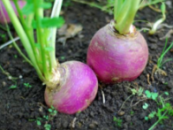

	gracious	英[ˈgreɪʃəs] 【lsieun】 我还有些理解不了，按照翻译，是理解成了“雅致的”
	美[ˈɡreʃəs]
	adj.	亲切的，和蔼的; （对王族及其行为的敬语） 仁慈的，谦和的; 雅致的; 有礼貌的;
	int.	（表示惊异） 天哪，老天爷;
	[例句]She closed with a gracious speech of thanks.
	她最后彬彬有礼地致谢，结束了讲话。

	spirit	英[ˈspɪrɪt] 【lsieun】 我总是理解成“精神”，但是本文中应该理解为“情绪、氛围”，是说菜单上充满了春天的“气息”
	美[ˈspɪrɪt]
	n.	精神，心灵; 情绪; 勇气; 精髓;
	v.	神秘地带走;
	[例句]The human spirit is virtually indestructible
	人的精神实际上是不可摧毁的。

	lamb	英[læm] 【lsieun】 这主要也是理解两个意思，一个是“肉”，而且是“小羊、羔羊”的肉，另一个是理解成“动物”，即“羔羊，小羊”
	美[læm]
	n.	羔羊肉; 羔羊，小羊; <宗>耶稣;
	vi.	生小羊，产羊羔;
	[例句]She came and put her arms around me. 'You poor lamb. What's wrong?'
	她走过来搂着我。“可怜的宝贝，出什么事儿啦？”

	capered	【lsieun】 “跳跃，雀跃”，这个好像只能硬背
	v.	跳跃，雀跃( caper的过去式和过去分词 );
	[例句]Painted musicians capered behind gorgeous banners.
	涂脂抹粉的音乐家们在绚丽的横幅后面欢跳雀跃。

	hillsides	【lsieun】 刚开始我理解成“山脚下”，原来是错误的，正确的理解是“山坡上”
	n.	（小山的） 山坡( hillside的名词复数 );
	[例句]Many hillsides had been denuded of trees.
	许多山坡上都已经光秃秃的，没有任何树木了。

	exploited	【lsieun】 这个词很常用，但总是记不住
	v.	剥削; 开采( exploit的过去式和过去分词 ); 利用（…为自己谋利）; 运用;
	[例句]We've always been marginalized, exploited, and constantly threatened.
	我们总是遭到排挤、剥削和不断的恐吓。

	sauce	英[sɔ:s] 【lsieun】 以前我理解的“酱”，是理解成了“麻酱”那种“浓稠的、颜色上偏暗淡的”，但这里的“酱汁”应该是那种“稀的、颜色鲜明的调味酱”
	美[sɔs]
	n.	酱汁; 调味汁; 〈非〉莽撞无礼; 〈俚〉烈酒;
	vt.	调味或加沙司于…; 给…增加趣味或风味; 〈非〉对…无礼;
	[例句]'I just added a little soy sauce,' he informs us.
	“我就加了一点儿酱油，”他告诉我们。

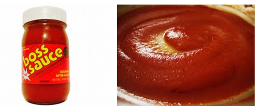

	commemorated	【lsieun】 comm + memerize 这个词应该记住
	v.	纪念，庆祝( commemorate的过去式和过去分词 );
	[例句]The 200th anniversary of Mozart's death is being commemorated around the world with concerts featuring his work.
	世界各地将举办以莫扎特的作品为主题的音乐会，以纪念他逝世200周年。

	gambol	英[ˈgæmbl] 【lsieun】 这个词应该与文中的“caper”相对应，这个好像也只能硬背，注意与gamble区分，也可以与gamble一起记
	美[ˈɡæmbəl]
	vi.	蹦跳，跳跃，嬉戏;
	n.	跳跃，嬉戏;
	[例句]He determined to revisit the scene of the last evening's gambol.
	他决计再到昨晚嬉戏的地方去一趟。

	gamble	英[ˈgæmbl]
	美['ɡæmbl]
	vi.	赌博; 孤注一掷; 投机，冒风险; 打赌;
	vt.	赌博，下赌注; 使冒风险;
	n.	冒险; 赌博或其他投机;
	[例句]Yesterday, he named his cabinet and took a big gamble in the process.
	昨天他冒了很大的风险任命了内阁成员。

	oyster	英[ˈɔɪstə(r)] 【lsieun】 “牡蛎”，牡蛎是软体动物，有两个贝壳，一个小而平，另一个大而隆起，壳的表面凹凸不平。
	我一直不确定长什么样子，今天看到了，看着恶心，能产珍珠吗？
	从没受过伤的牡蛎永远无法产出珍珠。
	珍珠是痛苦的产物，是一颗小沙粒或是小寄生物进入牡蛎体内而形成的。
	珍珠是伤口愈合的产物，牡蛎体内能分泌一种闪亮的珍珠质，
	当一颗小沙粒钻进牡蛎后这些珍珠质就开始工作了，一层一层的覆盖在小沙粒的表面，
	日复一日，就形成了一颗美丽的珍珠。因此没有经过伤痛的牡蛎永远无法产出珍珠，因为珍珠是愈合的伤口。
	美[ˈɔɪstɚ]
	n.	牡蛎; <俚>守秘密的人; 鸡背肉; 沉默寡言的人;
	[例句]He had two dozen oysters and enjoyed every one of them.
	他吃了两打牡蛎，每一只都吃得津津有味。

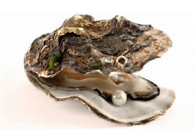

	diminuendo  【lsieun】 这个单词，我好像学过的，如果要拆分的话，我会这样拆：di + minu + endo
	英[dɪˌmɪnjuˈendəʊ]
	美[dɪˌmɪnjuˈendoʊ]
	n.	<音>渐弱;
	adv.	渐弱地（的）;
	[例句]Trombones sharply pronounce a d, followed by tuba and oboe in a sudden diminuendo.
	长号尖锐地吹出一个d音，之后是大号和双簧管的突然的渐弱演奏。

	con amore 【lsieun】 看来，这是意大利语的固定搭配哦
	英[ˌkɒn æˈmɔ:reɪ]
	美[ˈkɑ:n æˈmɔ:reɪ]
	adv.	<意>亲爱地; 柔情地; 热心地; 亲切地;

	frying-pan	【lsieun】 百度的解释是“平底锅”，是一种用来煎煮食物的器具，约20 至 30厘米直径大，低锅边并且向外倾斜的铁制平底煮食用器具。
	[词典]	[医] 煎锅;
	[例句]Heat the oil in a non-stick frying-pan, then pour in the egg mixture.
	在不粘煎锅里将油加热，然后倒入鸡蛋糊。

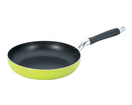

	hold	英[həʊld] 【lsieun】 我之前只注意“拿住”的意思，本文中应该是指“保留、收藏”的意思
	美[hoʊld]
	vt.	容纳; 拿住，握住; 保留，保存; 扣留，拘押;
	vi.	拿住，握住; 同意，赞成; 保持不变; 有效;
	n.	握住; 保留; 控制;
	[例句]Hold the knife at an angle
	斜握住刀。

	beneficent	英[bɪˈnefɪsnt] 【lsieun】 有点记不住哎。。。意思应该是“心中怀有做好事的意愿”，似乎有两个意思，一是说行为上是“行善的”，另一个是说心里状态“仁慈的、慈爱的”。
	美[bəˈnɛfɪsənt]
	adj.	行善的; 仁慈的，慈爱的;
	[例句]The demon as long as have a beneficent heart isn't a demon any more, but freak.
	妖只要具有仁慈的心就不再是妖了，而是人妖。

	broiler	英[ˈbrɔɪlə(r)] 【lsieun】 倒是联想不到“烤箱”，但是觉得“酷热的日子”更接近一些
	美[ˈbrɔɪlɚ]
	n.	争吵者，酷热的日子;
	[例句]Coccidiostats are routinely used in broiler feeds.
	抗球虫药物每天均用于肉用仔鸡饲料中。

	bar	英[bɑ:(r)] 【lsieun】 我觉得，本文中，应该作为“障碍”理解
	美[bɑ:r]
	n.	条，棒; （门、窗等的） 闩; 障碍; 酒吧间;
	vt.	闩（门等）; 阻碍，封锁; 排除，去除;
	prep.	除…之外;
	[例句]I'll see you in the bar later
	一会儿酒吧见。

	richer	英['rɪtʃər] 【lsieun】 文中翻译为“油腻的”，我想看看布丁长什么样子。看了布丁的样子，我想“richer”或许也可以理解成“布丁”的“种类、样式多种多样”的意思
	美['rɪtʃər]
	adj.	富裕的; 更富有的; 富人( rich的比较级 ); 深的; 强烈的;
	[例句]The timbre of the violin is far richer than that of the mouth organ.
	小提琴的音色远比口琴丰富。

	pudding	英[ˈpʊdɪŋ]
	美[ˈpʊdɪŋ]
	n.	（一道） 甜食，甜点心; 布丁（通常用面粉经烘烤或蒸煮做成的美味甜食品）; 肥胖而迟钝的人; [航] 船尾碰垫;
	[例句]I tend to stick to fresh fruit for pudding.
	我一直坚持用新鲜水果做甜点。

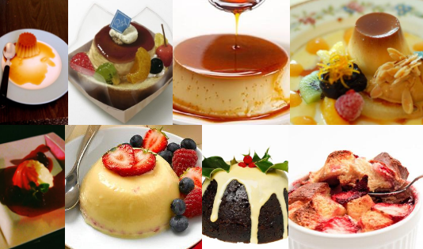

	sausage	英[ˈsɒsɪdʒ] 【lsieun】 完全的不认识这个单词，不过倒是知道了如何称呼“香肠”，即sausage
	美[ˈsɔ:sɪdʒ]
	n.	香肠，腊肠; 〈口〉德国人;
	[例句]He dropped his sausage on the pavement and someone's dog ate it, mustard and all.
	他把香肠丢在人行道上，不知是谁家的狗将香肠甚至连带芥末都吃个了精光。

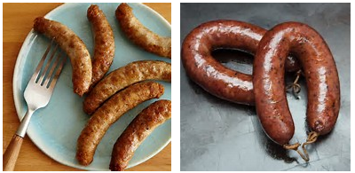

香肠和火腿肠有什么区别

香肠是一种利用非常古老的食物生产和肉食保存技术的食物，将动物的肉绞碎成条状，再灌入肠衣制成的长圆柱体管状食品。中国的香肠有着悠久的历史，香肠的类型也有很多，主要分为川味儿香肠和广味儿香肠。主要的不同处就在于广味儿是甜的，川味儿是辣的。在以前香肠是每年过年前制作的食品，而现在一年中的任何时候都可以吃到香肠了。

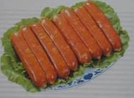

火腿肠是深受广大消费者欢迎的一种肉类食品，它是以畜禽肉为主要原料，辅以填充剂（淀粉、植物蛋白粉等），然后再加入调味品（食盐、糖、酒、味精等）、香辛料（葱、姜、蒜、豆蔻、砂仁、大料、胡椒等）、品质改良剂（卡拉胶、Vc等）、护色剂、保水剂、防腐剂等物质，采用腌制、斩拌（或乳化）、高温蒸煮等加工工艺制成，它的特点是肉质细腻、鲜嫩爽口、携带方便、食用简单、保质期长。

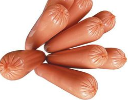

	thanatopsis 【lsieun】 理解不了啊啊啊。。。
	英[ˌθænə'tɒpsɪs]
	美[ˌθænə'tɒpsɪs]
	n.	死亡观，对死亡的见解等;
	[例句]The paper discusses the relationship of thanatopsis between Heidegger and Sartre on the aspects of exterior and interior relation.
	本文拟从海德格尔与萨特死亡观的表面对立和内在关联的角度探讨二者死亡观的关系问题。

	buckwheat	英[ˈbʌkwi:t]
	美[ˈbʌkˌhwit, -ˌwit]
	n.	荞麦粉; 蓼科荞麦属; 荞麦种; 荍;
	[例句]We had a simple dinner of buckwheat bread and boiled lettuce.
	我们的晚饭很简单，就是荞馍馍和水煮的生菜。

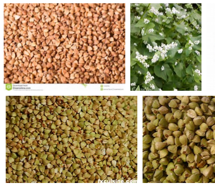

Sarah’s fingers danced like midgets(小帆船) above a summer stream. Down through the courses she worked, giving each item its position according to(根据) its length with an accurate eye. 

萨拉的手指轻快地跳动着，宛如一群在夏日溪流上跳舞的小矮人。她打出一道又一道菜肴，看准每一菜名的长度，并给以适当的位置。

	midget	英[ˈmɪdʒɪt] 【lsieun】 他是怎么翻译成“小帆船”的呢？
	美[ˈmɪdʒɪt]
	n.	侏儒，小矮人;
	adj.	极小的，微型的;
	[例句]I guess I'd have to go with the midget.
	我猜我只能和侏儒出去了。

	course	英[kɔ:s] 【lsieun】 真是没有相到course还有“一道菜”的意思
	美[kɔ:rs]
	n.	课程; 航线; 行动方向; 一道菜;
	vt.	快速地流动; 奔流; 跑过; 追逐;
	vi.	沿…（方向）前进; 指引航线; 快跑; 迅速移动;
	[例句]Aircraft can avoid each other by going up and down, as well as by altering course to left or right
	飞机可以通过上下升降和左右移动改变航线来避免相撞。

Just above the desserts came the list of vegetables. Carrots and peas, asparagus on toast, the perennial tomatoes and corn and succotash(青玉米粒煮利马豆), lima beans, cabbage—and then— Sarah was crying over her bill of fare. Tears from the depths of some divine despair rose in her heart and gathered to her eyes. Down went her head on the little typewriter stand; and the keyboard rattled a dry accompaniment to her moist sobs.

在甜点的上方正是蔬菜的目录。葫萝卜拌豌豆，芦笋土司，四季不断的西红柿、玉米以及豆煮玉米，利马豆，卷心菜——然后——萨拉对着菜单哭了起来。极度的失望感从她的内心深处涌起，然后在眼中汇聚成泪水。她的头低垂下去，碰到了打字机的小支架上，键盘发出干涩的咔嗒声回应着她泪汪汪的啜泣声。

	dessert	英[dɪˈzɜ:t] 【lsieun】 这个词是“甜点”，经常会乱，会忘，另外这是“餐后的甜食”，是“餐后”才吃的。我开始好奇外国人吃饭的顺序了：主菜、布丁、蔬菜、甜点（餐后甜食），还有开胃的菜吗？究竟是怎么样个顺序呢？
	美[dɪˈzɜ:rt]
	n.	甜点; 餐后甜食;
	[例句]She had homemade ice cream for dessert
	她用自制的冰激凌作饭后甜点。

	carrot	英[ˈkærət] 【lsieun】 胡萝卜，为啥不叫它“红萝卜”哩？
	美[ˈkærət]
	n.	胡萝卜; 〈非正式〉好处，回报; 不能兑现的报酬;
	[例句]They will be set targets, with a carrot of extra cash and pay if they achieve them
	会给他们设定目标，如果能达到，就能得到额外的现金和报酬。

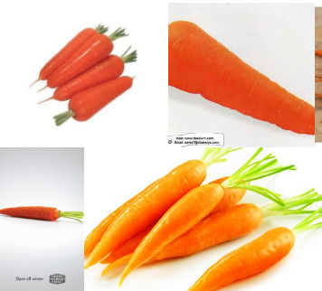

胡萝卜和红萝卜是两码事，从外表上看，胡萝卜一般成桔黄色，而红萝卜则是鲜红或是紫红色，营养价值也不同，胡萝卜要高于红萝卜，不过不管是红萝卜还是胡萝卜，最好不要生吃，对肠胃不好哦。

	pea	英[pi:] 【lsieun】 想想豌豆夹应用程序的logo，哈哈。。。。。。。
	美[pi:]
	n.	豌豆，豌豆类; 豌豆状物; 〈美俚〉棒球;
	[例句]Every Saturday dad made a beautiful pea and ham soup
	每个星期六爸爸都做美味的豌豆火腿汤。

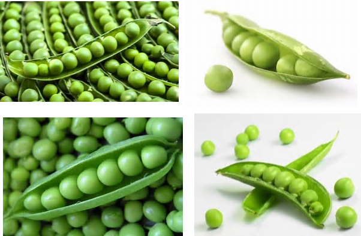

	asparagus	英[əˈspærəgəs]
	美[əˈspærəɡəs]
	n.	天冬; 芦笋，芦笋的茎;
	[例句]Layer the potatoes, asparagus and salmon in the tin
	把土豆、芦笋和大麻哈鱼分层装入罐头内。

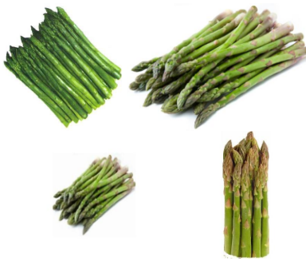

	toast	英[təʊst] 【lsieun】 烤面包
	美[toʊst]
	n.	烤面包; 干杯; 接受敬酒的人; （在某领域） 广受赞誉的人;
	vt.	向…祝酒，为…干杯;
	vi.	烤火，取暖; 使暖和; 烘烤（面包片等）;
	[例句]Toast the bread lightly on both sides.
	稍稍烘烤面包两面。

	perennial	英[pəˈreniəl] 【lsieun】 终年的，四季不断的;
	美[pəˈrɛniəl]
	adj.	多年生的; 终年的，长久的; 不断生长的; 四季不断的;
	n.	多年生植物; 长期存在的;
	[例句]There's a perennial shortage of teachers with science qualifications.
	有理科教学资格的老师一直都很短缺。

	tomato	英[təˈmɑ:təʊ] 【lsieun】 意外发现，原来有“[俚语] 美女”的意思，以后或许我可以说你是我的“tomato”
	美[təˈmeɪtoʊ]
	n.	番茄，西红柿; [俚语] 美女;
	[例句]Add tomato paste, salt and pepper to taste.
	酌量添加番茄酱、盐和胡椒粉。

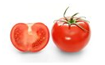

	You are the apple of my eyes 你是我最珍贵的人。
	"apple of one's eye" 这一词最早出现於圣经里
	跟东方一样，在西方，人们也一直都把苹果视为一种吉祥的水果。
	所以"apple of one's eye"就是指「珍贵的东西」，也就常被引申为「珍爱的人或物」。
	所以说You are the apple of my eye，意思就是指说：你是我的挚爱，或是同等意思。

	cabbage	英[ˈkæbɪdʒ] 【lsieun】 甘蓝（洋白菜、卷心菜）
	美[ˈkæbɪdʒ]
	n.	甘蓝（洋白菜、卷心菜）; <非正式、侮辱>植物人，常用于英式英语; <俚>钱，尤指纸币，常用于美式俚语; <俚>脑袋;
	[例句]They ate a mash of 2 potatoes, 2 carrots& cabbage
	他们吃了由两个土豆、两根胡萝卜和洋白菜做的糊。

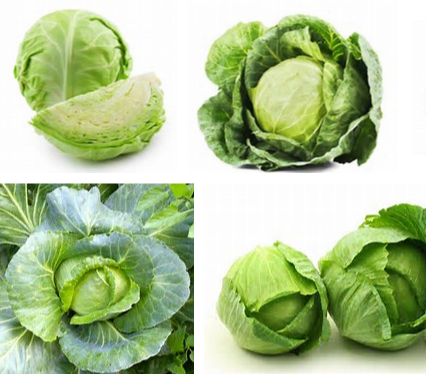

	divine	英[dɪˈvaɪn] 【lsieun】 在本文中，理解为“神圣的”不合适，应该理解为“天赐的，被命运安排的”
	美[dɪˈvaɪn]
	adj.	神圣的; 神的， 天赐的; 极好的;
	vt.	占卜，预言; 猜测， 预测; （用丫形杖）探测（地下水） ;
	n.	牧师; 神学家;
	[例句]He suggested that the civil war had been a divine punishment.
	他暗示说内战是上天的惩罚。

	stand	英[stænd] 【lsieun】 这里理解为“名词”，觉得“支架”不够好，理解为什么适合呢？
	美[stænd]
	n.	立场; 台，看台; 停止; 抵抗;
	vi.	站立，起立; 竖直放置; 保持看法; 停滞;
	vt.	忍受; 使站立; 抵御; 承担责任;
	[例句]She was standing beside my bed staring down at me
	她站在我的床边低头盯着我。

	rattle	英[ˈrætl] 【lsieun】  发出格格的响声
	美[ˈrætl]
	vt.	（使） 发出格格的响声，（使）作嘎嘎声; 喋喋不休地说话;
	vi.	迅速而嘎嘎作响地移动，堕下或走动;
	vt.	使紧张，使恐惧; 给（桅索）扎梯绳;
	[例句]She slams the kitchen door so hard I hear dishes rattle
	她把厨房门重重地关上，我甚至听到了碟子的震颤声。

	dry	英[draɪ] 【lsieun】 现在不能理解成“干旱的”，而是理解成“无趣味的，枯燥的”
	美[draɪ]
	adj.	干的干燥的，干旱的; 干旱的，口渴的; 干咳的; 无趣味的，枯燥的;
	vt.	从…去掉水分，使…变干; 脱水保存（如肉或其它食物）;
	vi.	变干;
	[例句]Clean the metal with a soft dry cloth
	用柔软的干布擦拭金属。

	accompaniment
	英[əˈkʌmpənimənt]
	美[əˈkʌmpənimənt, əˈkʌmpni-]
	n.	伴奏; 伴随物;
	[例句]He sang 'My Funny Valentine' to a piano accompaniment.
	他在钢琴的伴奏下演唱了《我可爱的情人》。

	moist	英[mɔɪst] 【lsieun】 不能理解为“潮湿的; 微湿的”，而是理解成“人含泪的”
	美[mɔɪst]
	adj.	潮湿的; 微湿的; 多雨的; 含泪的;
	[例句]Wipe off any excess make-up with a clean, moist cotton flannel
	用干净的湿绒布擦去多余的化妆品。

	sob	英[sɒb] 【lsieun】 名词，“呜咽声”
	美[sɑ:b]
	vi.	呜咽; 发呜咽声;
	vt.	哭诉，呜咽着说; 哭得使…;
	n.	啜泣（声），呜咽（声）;
	[例句]She began to sob again, burying her face in the pillow
	她把脸埋在枕头里，又开始抽噎起来。

For she had received no letter from Walter in two weeks, and the next item on the bill of fare was dandelions(蒲公英)—dandelions with some kind of egg—but bother the egg!—dandelions, with whose golden blooms Walter had crowned her his queen of love and future bride—dandelions, the harbingers(先兆) of spring, her sorrow’s crown of sorrow—reminder of her happiest days.

因为她已经两个星期没有收到沃尔特的信了，而菜单上的下一道菜是蒲公英——蒲公英加一种蛋！去你的蛋吧！蒲公英，沃尔特曾用它那金色的花朵编成的花冠为他心爱的女王和未来的新娘加冕；蒲公英，这春天的使者，让她想起了最幸福的时光，却又使她悲伤至极。

	bloom	英[blu:m]
	美[blum]
	n.	（常指供观赏的） 花; 开花期; 最盛期; 健康有精神的面貌;
	vi.	开花; 使植物繁盛; 发光，闪亮; 大量出现;
	[例句]Harry carefully picked the bloom.
	哈里小心翼翼地摘下那朵花。

	blossom	英[ˈblɒsəm]
	美[ˈblɑ:səm]
	n.	花，群花; 开花时期，（发育的）初期; 兴旺时期;
	vi.	（植物） 开花; 繁荣，兴旺; 长成;
	[例句]The cherry blossom came out early in Washington this year.
	今年华盛顿的樱花开得很早。

	bosom	英[ˈbʊzəm]
	美[ˈbʊzəm, ˈbuzəm]
	n.	胸怀; 胸部，乳房; 衣服的胸襟; 家庭般的温暖;
	vt.	怀抱; 把…藏在心中;
	adj.	心爱的; 亲密的;
	[例句]Joan was delighted to welcome her boyfriend into the bosom of her large, close-knit family.
	琼十分高兴地欢迎她的男朋友加入她亲密无间的大家庭。

Madam, I dare you to smile until you suffer this test: Let the Maréchal Niel roses that Percy brought you on the night you gave him your heart be served as a salad with French dressing(调料) before your eyes at a Schulenberg table d’hôte( [法]定价套餐 ) . Had Juliet so seen her love tokens dishonored the sooner would she have sought the lethean(使人遗忘过去的) herbs of the good apothecary(药剂师).

女士，如果您在经历了这样的遭遇后，我估计您一定笑不出来了：你定情的那个夜晚珀西送你的黄玫瑰，如今加上法式调料做成了一道凉拌菜，出现在斯库伦伯格餐馆的餐桌上。若是朱丽叶看到她的爱情信物遭受到如此亵渎，她会立刻去找一位高明的药剂师给她配一剂能够遗忘一切的药。

	dare sb to do：敢于做某事，量某人敢不敢做某事, 激发某人做某事。

	salad	英[ˈsæləd]
	美[ˈsæləd]
	n.	色拉;
	[例句]The Grand Hotel did not seem to have changed since her salad days.
	从她年少时候到现在，格兰德酒店似乎一直就没有变过。

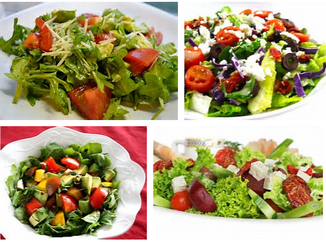

	token	英[ˈtəʊkən] 【lsieun】 象征
	美[ˈtoʊkən]
	n.	象征; 记号; 代币;
	adj.	象征性的; 作为对某事的保证的; 作为标志的;
	vt.	预兆：预示或象征，预兆;
	[例句]The announcement was welcomed as a step in the right direction, but was widely seen as a token gesture
	该公告被认为是向正确方向迈进的一步，因而受到欢迎，但也被普遍看作是一种象征性的姿态。

	dishonor	英[dɪs'ɒnə]
	美[dɪs'ɒnə]
	n.	侮辱; 丢脸; （票据的） 拒付; 丢脸的事（或人）;
	vt.	拒付; 侮辱; 奸污; 使丢脸;
	[例句]She refuses to see her beloved boy die in such dishonor.
	她不愿看到她深爱的男友就这样不名誉地死去。

	sooner	英['su:nə]
	美['su:nə]
	n.	抢先占有者; Sooner 捷足者;
	[例句]Detective Holt said: 'The kidnapper is a man we must catch and the sooner the better'.
	霍尔特侦探说：“绑架者是一名男子，我们必须抓住他，越快越好。”

	lethean	
	adj.	忘河的;

	herb	英[hɜ:b]
	美[ɜ:rb]
	n.	草，草本植物; 药草，香草; 牧草;
	[例句]The whole herb has a characteristic taste and odour
	整株药草有种独特的味道和气味。

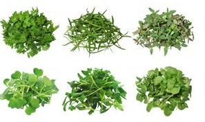

	apothecary	英[əˈpɒθəkəri]
	美[əˈpɑ:θəkeri]
	n.	药剂师，药店;
	[例句]You can take my grand apothecary with you.
	我把我的大药剂师指派给你。

But what a witch is Spring! Into the great cold city of stone and iron a message had to be sent. There was none to convey it but the little hardy courier of the fields with his rough green coat and modest air(神情). He is a true soldier of fortune, this dent-de-lion—this lion’s tooth, as the French chefs call him. Flowered, he will assist at love-making, wreathed(被扎成环) in my lady’s nut-brown(栗色的) hair; young and callow(未成熟的) and unblossomed, he goes into the boiling pot and delivers the word of his sovereign mistress.

然而，春天真是个无所不能的女巫！她一定会有办法把信息送到这个用石头和钢铁筑成的冰凉的大城市来的。而除了穿着粗陋的绿色外衣、面带羞怯神情的勇敢的田野小信使之外也不会有谁来传递春天的信息了。他是命运的忠实战士，正如法国厨师对他的称谓——狮子的牙齿。他在开花的时候，帮助人们谈情说爱，并被编制成花冠戴在姑娘栗色的头发上；而在稚嫩、未开花的时候，他会跳进开水锅里，为他至高无上的女主人传话。

	witch	英[wɪtʃ]
	美[wɪtʃ]
	n.	女巫，巫婆; <贬>讨人嫌的丑女人; 迫害的对象;
	vt.	施巫术;
	[例句]They say she died after a witch cast a spell on her.
	他们说她是被一个女巫施了魔法后死的。

	hardy	英[ˈhɑ:di]
	美[ˈhɑ:rdi]
	adj.	强壮的; 大胆，勇敢的; 鲁莽的; [植] 耐寒的;
	n.	强壮的人; 耐旱植物; 方柄凿;
	[例句]The silver-leaved varieties of cyclamen are not quite as hardy.
	银叶仙客来品种不太耐寒。

	courier	英[ˈkʊriə(r)]
	美[ˈkʊriɚ, ˈkə:-, ˈkʌr-]
	n.	导游; 旅游团的服务员; （传递信息或重要文件的） 信使; 通讯员;
	[例句]He worked as a motorcycle courier
	他的工作是骑摩托车送快递。

	field	英[fi:ld] 【lsieun】 这里应该理解为“田野”
	美[fild]
	n.	田; （作某种用途的） 场地; （学习或研究的） 领域; 运动场;
	vi.	[棒球、板球等] 担任外场员，担任守队队员; 接守，接防; 接，掷还（球）;
	adj.	实地的; [体育] 1)。 在田赛场地进行的2)。 田赛的; 军事]野战的; 在实地工作的;
	[例句]They went for walks together in the fields.
	他们一起在田野里漫步。

	modest	英[ˈmɒdɪst] 应该理解为“羞怯的”
	美[ˈmɑ:dɪst]
	adj.	谦虚的，谦逊的; 适度的，适中的; 端庄的; 羞怯的;
	[例句]Swiss unemployment rose to the still modest rate of 0.7%
	瑞士的失业率上升到了0.7%，这个百分比仍然不算太高。

	air	英[eə(r)]  【lsieun】 应该理解为“气氛”
	美[er]
	n.	空运; 天空; 气氛; （简单易记的） 曲调;
	vt.	晾晒; 烘干; 播送; 广播;
	vt.	使房间通风， 透气;
	[例句]Draughts help to circulate air
	穿堂风有助于空气流通。

	fortune	英[ˈfɔ:tʃu:n] 【lsieun】  命运
	美[ˈfɔ:rtʃu:n]
	n.	幸运; （某人的） 命运; 富有; [常作复数] （人生事件中的） 时运;
	vt.	给予财富;
	vi.	偶然发生;
	[例句]We had to eat out all the time. It ended up costing a fortune
	我们不得不总在外面吃饭，结果花了很多钱。

	love-making	
	[词典]	调情；谈情说爱；做爱;
	[例句]Their love-making became less and less frequent.
	他们做爱的频率越来越低。

	wreath	英[ri:θ]
	美[riθ]
	n.	花环; 花圈; （烟、云等的） 圈状物; 环状物;
	v.	环绕;
	[例句]The coffin lying before the altar was bare, except for a single wreath of white roses
	祭台前的棺木上除了仅有的一个白玫瑰花圈外，没有其他任何装饰。

	callow	英[ˈkæləʊ]
	美[ˈkæloʊ]
	adj.	乳臭未干的; 羽翼未丰的; 幼小的; <文>稚嫩的;
	[例句]He was only a callow youth.
	他只是个无经验的年轻人。

	boiling	英[ˈbɔɪlɪŋ]
	美[ˈbɔɪlɪŋ]
	adj.	沸腾的; 炎热的; 炽热的; 激昂的;
	n.	煮沸，沸腾; 一次烹煮量; <俚>一群，全体;
	v.	“boil”的现在分词;
	[例句]'It's boiling in here,' complained Miriam
	“这里热死了，”米里亚姆抱怨道。

	pot	英[pɒt]
	美[pɑ:t]
	n.	罐; 一罐; （某种用途的） 容器; 陶盆;
	vt.	把…栽入盆中; 种盆栽; 台球、普尔和斯诺克击（球）入袋; 射杀;
	vi.	随手射击;
	[例句]There's tea in the pot.
	壶里有茶。

	sovereign	英[ˈsɒvrɪn] 【lsieun】  至高无上的
	美[ˈsɑ:vrən]
	n.	君主; 最高统治者; 独立国; 旧时价值为一镑的英国金币;
	adj.	至高无上的; 独立自主的; 拥有最高统治权的; 极好的;
	[例句]Lithuania and Armenia signed a treaty in Vilnius recognising each other as independent sovereign states
	立陶宛和亚美尼亚在维尔纽斯签订条约，承认彼此为独立主权国家。

	mistress	英[ˈmɪstrəs] 【lsieun】 女主人;女统治者
	美[ˈmɪstrɪs]
	n.	情妇; 主妇，女主人; 霸主，女统治者; <英>女教师;
	[例句]She was his mistress for three years
	她曾做过他3年的情妇。

By and by Sarah forced back her tears. The cards must be written. But, still in a faint, golden glow from her dandeleonine dream, she fingered the typewriter keys absently for a little while, with her mind and heart in the meadow lane with her young farmer. But soon she came swiftly back to the rock-bound lanes of Manhattan, and the typewriter began to rattle and jump like a strike-breaker’s motor-car.

过了一会儿，萨拉抑制住自己的泪水。菜单得赶紧打好。但是，她的思想依然沉浸在蒲公英梦境的金色光芒里。有好一会儿她心不在焉地敲打着打字机的键盘，她的心思却同那年轻的农夫留在了草地的小径上。但很快，她回到了曼哈顿的石砌的巷道里，她的打字机开始跳动起来，发出像汽车出了故障一样的咔嗒咔嗒声。

	by and by	英[bai ænd bai]
	美[baɪ ənd baɪ]
	[词典]	不久，马上; 晚些时候;
	[例句]He'll come round by and by.
	他会慢慢想通的。

	faint	英[feɪnt]
	美[fent]
	adj.	微弱的，模糊的; 软弱的; 无勇气的; 将昏倒似的;
	vi.	头晕，昏过去; 渐渐不明，消失;
	n.	昏厥，昏倒;
	[例句]He became aware of the soft, faint sounds of water dripping
	他开始注意到轻微的水滴声。

	glow	英[gləʊ] 【lsieun】 脸红; 洋溢，喜形于色;
	美[gloʊ]
	vi.	发光，灼热; 脸红; 洋溢，喜形于色;
	n.	白热，炽热; 色彩鲜艳，尤指红光; 激情; 热烈;
	[例句]The rising sun casts a golden glow over the fields.
	冉冉升起的太阳在田野中洒下金色的阳光。

	meadow	英[ˈmedəʊ]
	美[ˈmedoʊ]
	n.	草地; 牧场;
	[例句]In the spring, the meadow is a mass of daffodils.
	春天，草地上开满了黄水仙。

	lane	英[leɪn]
	美[len]
	n.	车道; 小路，小巷; 航道，空中走廊，规定的单向行车道; [篮球] 罚球区;
	[例句]Follow the lane to the river.
	沿着小路走到河边。

	rock-bound	英['rɒkbaʊnd]
	美['rɒkˌbaʊnd]
	adj.	多岩的; 被岩石包围的; 顽固的; 僵硬的;
	[例句]"It's a fog-bell on a rock-bound coast!"
	“那是岩石环绕的海岸上的雾铃！”

	strike-breaker	英[straik ˈbreikə]
	美[straɪk ˈbrekɚ]
	n.	破坏罢工者；顶替罢工者工作的人；工贼;

	motor-car 
	电机车

At six o’clock the waiter brought her dinner and carried away the typewritten bill of fare. When Sarah ate she set aside, with a sigh, the dish of dandelions with its crowning ovarious(子房结成的) accompaniment. As this dark mass had been transformed from a bright and love-endorsed flower to be an ignominious(可鄙的) vegetable, so had her summer hopes wilted(枯萎) and perished. Love may, as Shakespeare said, feed on itself: but Sarah could not bring herself to eat the dandelions that had graced, as ornaments, the first spiritual banquet of her heart’s true affection(爱情).

六点钟，服务生送来她的晚餐，并取走了打好的菜单。吃晚餐时，萨拉叹了口气，把那盘盖着鱼子酱的蒲公英推到一旁去。看着作为自己爱情见证的鲜艳的花朵变成这样一团黑糊糊的、不体面的食物，她之前的美妙的希望也随之枯萎、消逝了。就像莎士比亚说的，热恋的人们能从爱本身中得到满足，但萨拉却吃不下这盘蒲公英，因为那曾是为她第一个爱情盛宴添彩的装饰品。

	endorse	英[ɪnˈdɔ:s]
	美[ɪnˈdɔ:rs]
	vt.	支票的背书，签名; 签署，批准：签署（签名），; 开发票，开证明文件; 支持，核准;
	[例句]I can endorse their opinion wholeheartedly.
	我可以全力支持他们的意见。

	ignominious
	英[ˌɪgnəˈmɪniəs]
	美[ˌɪɡnəˈmɪniəs]
	adj.	耻辱的; 不光彩的; 丢脸的; 不名誉的;
	[例句]Many thought that he was doomed to ignominious failure.
	许多人认为他注定会极不光彩地失败。

	wilt	英[wɪlt]
	美[wɪlt]
	vt.	（使） 凋谢，（使）枯萎; 使畏缩; 使衰弱;
	n.	枯萎; 憔悴;
	[例句]The roses wilted the day after she bought them
	她买的玫瑰第二天就凋谢了。

	perish	英[ˈperɪʃ]
	美[ˈpɛrɪʃ]
	vi.	毁灭; 死亡，丧生; 腐烂，枯萎; 老化;
	vt.	使麻木; 使毁坏;
	[例句]Most of the butterflies perish in the first frosts of autumn.
	大多数蝴蝶会在秋天的第一场霜冻来临时纷纷死去。

	grace	英[greɪs]  【lsieun】 使优美
	美[ɡres]
	n.	优雅; 恩泽; 慈悲; 魅力;
	v.	使优美; 惠赐;
	[例句]He moved with the grace of a trained boxer
	他的动作带着一种训练有素的拳击手的风采。

	gracious	英[ˈgreɪʃəs]
	美[ˈɡreʃəs]
	adj.	亲切的，和蔼的; （对王族及其行为的敬语） 仁慈的，谦和的; 雅致的; 有礼貌的;
	int.	（表示惊异） 天哪，老天爷;
	[例句]She closed with a gracious speech of thanks.
	她最后彬彬有礼地致谢，结束了讲话。

	banquet	英[ˈbæŋkwɪt] 【lsieun】 盛宴
	美[ˈbæŋkwɪt]
	n.	筵席; 宴会，盛宴; 宴请，款待;
	vt.	宴请，设宴招待; 饮宴，参加宴会;
	vi.	参加宴会;
	[例句]Last night he attended a state banquet at Buckingham Palace.
	昨晚他出席了在白金汉宫举行的国宴。

At 7:30 the couple in the next room began to quarrel; the man in the room above sought for A on his flute(长笛); the gas went a little lower; three coal wagons started to unload—the only sound of which the phonograph(留声机) is jealous; cats on the back fences slowly retreated toward Mukden. By these signs Sarah knew that it was time for her to read. She got out The Cloister and the Hearth, the best non-selling book of the month, settled her feet on her trunk, and began to wander with Gerard.

晚上七点半，隔壁的一对夫妇开始吵起嘴来；楼上的男房客吹着笛子，摸索着Ａ调；煤气灯暗淡了一点；三辆煤车开始卸煤——这是唯一让留声机嫉妒的声音；屋后栅栏上的猫慢慢地向沈阳撤退。这种种迹象提醒萨拉，看书的时间到了。她拿出当月最好的非卖品书籍《修道院与家》，把脚搁到皮箱上，开始同杰勒德一起去流浪。

	gas	英[gæs] 【lsieun】 这里翻译成“煤气灯”，我觉得还挺贴切的
	美[ɡæs]
	n.	气体; 汽油; [矿业] 瓦斯; 毒气;
	vt.	加油; 毒（死）;
	vi.	加油; 放出气体; 空谈;
	[例句]Coal is actually cheaper than gas
	煤实际上比煤气便宜。

	wagon	英[ˈwægən]
	美[ˈwæɡən]
	n.	四轮的运货马车; <英>铁路货车; <美>小手推车; 囚车;
	vt.	用运货马车运输货物;
	na.	“waggon”的变体;
	[例句]I'm on the wagon for a while. Cleaning out my system.
	我这段时间正在戒酒，对体内进行大扫除。

	Mukden	英[ˈmukdən]
	美[ˈmʊkdən, -ˈdɛn, ˈmuk-]
	n.	奉天（沈阳的旧称）;
	[例句]The army then took control of Mukden in a single day.
	然后仅用了一天他们就控制了奉天。

	cloister	英[ˈklɔɪstə(r)]
	美[ˈklɔɪstɚ]
	n.	回廊; 隐居; （学院、修道院、教堂等建筑的） 走廊; 修道院的生活;
	vt.	隐退，使与世隔绝;
	[例句]The thirteenth-century cloisters are amongst the most beautiful in central Italy.
	这些13世纪的回廊是意大利中部最美的建筑。

	hearth	英[hɑ:θ]
	美[hɑ:rθ]
	n.	灶台，炉边; （高炉的） 炉膛，炉缸; 〈比喻〉家庭; 壁炉地面;
	[例句]It was winter and there was a huge fire roaring in the hearth.
	时值冬天，壁炉里炉火熊熊。

	trunk	英[trʌŋk] 【lsieun】 行李箱
	美[trʌŋk]
	n.	树干; 躯干; 象鼻; 汽车车尾的行李箱;
	[例句]toadstools growing on fallen tree trunks.
	在倒下的树干上长出的伞菌

	Gerard	
	n.	杰拉德（男子名，Garrett的变体，昵称Jerry）;
	[例句]Gerard also took on wider familial respon-sibilities.
	杰勒德还承担了更多的家庭责任。

The front-door bell rang. The landlady(女房东) answered it. Sarah left Gerard and Denys treed by a bear and listened. Oh, yes; you would, just as she did!

前门的门铃响了。房东太太去开门。萨拉暂且先让书中的杰勒德和丹尼斯爬到树上躲避那只熊，然后便听着外面的动静。噢，是的，你也会这么做的，和她一样！

And then a strong voice was heard in the hall below, and Sarah jumped for her door, leaving the book on the floor and the first round easily the bear’s.

然后，楼下的大厅里响起一个响亮的声音。萨拉跳起来，朝房门口奔去，把书和熊的第一次轻易的进攻都丢在了地上。

You have guessed it. She reached the top of the stairs just as her farmer came up, three at a jump, and reaped and garnered her, with nothing left for the gleaners(拾穗人).

您猜到了。当她跑到楼梯口时，正好看到她的农夫三级一跨地奔上楼梯来。他将她从头到脚一把兜住，全部收获，仿佛要让拾落穗的人一无所获。

	reap	英[ri:p]
	美[rip]
	vt.	收割; 获得; 得到（报偿）;
	[例句]You'll soon begin to reap the benefits of being fitter
	你很快就会体会到身体更健康带来的好处。

	garner	英[ˈgɑ:nə(r)]
	美[ˈgɑ:rnə(r)]
	vt.	获得; 贮藏，积累;
	n.	谷仓;
	[例句]Durham had garnered three times as many votes as Carey
	德拉姆获得的选票是凯里的3倍。

	gleaner	英['gli:nə]
	美['gli:nə]
	n.	割捆机; 拾穗的人;
	[例句]Your feet are rosy-red with the glow of my heart's desire, Gleaner of my sunset songs!
	你的双脚被我心切望的热光染得绯红，我的落日之歌的搜集者！

“Why haven’t you written—oh, why?” cried Sarah.

“你为什么不给我写信！哦，为什么？”萨拉叫道。

“New York is a pretty large town,” said Walter Franklin. “I came in a week ago to your old address. I found that you went away on a Thursday. That consoled some; it eliminated the possible Friday bad luck. But it didn’t prevent my hunting for you with police and otherwise ever since!”

沃尔特•富兰克林说：“纽约城真是大，我一个星期前曾到你的旧住址去找过你，但却发现你在那个星期四就搬走了。总算还不错，避开了倒霉的星期五。从那以后，我一直在找你，我去过警察局，通过各种渠道。”

“I wrote!” said Sarah vehemently.
“我写信告诉你了！”萨拉激动地喊道。

	vehemently	英['vi:əməntlɪ]
	美[ˈviəməntlɪ]
	adv.	激烈地; 强烈地; 暴烈地; 热烈地;
	[例句]He has vehemently rejected claims that he is a government stooge
	他言辞激烈地驳斥了称自己是政府的狗奴才的说法。

 “Never got it!”
“从来没收到！”

 “Then how did you find me?”
“那你怎么找到我的？”

 The young farmer smiled a springtime smile.
那年轻的农夫满面春风地笑了。

“I dropped into that Home Restaurant next door this evening,” said he. “I don’t care who knows it; I like a dish of some kind of greens at this time of the year. I ran my eye down that nice, typewritten bill of fare looking for something in that line. When I got below cabbage I turned my chair over and hollered for the proprietor(店主). He told me where you lived.”

他说：“今天晚上我偶然去到隔壁的斯家餐馆吃晚饭，也没管它有没有名气。我只想来一份这个时季的青菜。我浏览着那份精美的，用打印机打出来的菜单，在蔬菜类里寻找着。当看到卷心菜下面的那道菜时，我跳起来，把椅子都掀倒了，大叫店主。他告诉我你住在这儿。”

	holler	英[ˈhɒlə(r)]
	美[ˈhɑ:lə(r)]
	n.	呼叫，呼救; 〈美〉盗贼受害人的控诉; （美国黑人随口哼的） 劳动号子;
	vi.	叫喊; 发牢骚; 诉苦，抱怨;
	vt.	大声叫喊;
	[例句]The audience whooped and hollered
	观众又是欢呼又是叫嚷。

	proprietor	英[prəˈpraɪətə(r)]
	美[prəˈpraɪɪtɚ]
	n.	所有人，业主; 地主;
	[例句]He was the sole proprietor with total management control.
	他是唯一业主，掌握全部管理权。

“I remember,” sighed Sarah happily. “That was dandelions below cabbage.”

萨拉高兴地舒了一口气：“我想起来了，卷心菜下面是蒲公英。”

“I’d know that cranky capital W ’way above the line that your typewriter makes anywhere in the world,” said Franklin.

“无论我走到哪里，都能认出你的打字机打出的大写字母‘W’的样子，高高在上。”

	cranky	英[ˈkræŋki]
	美[ˈkræŋki]
	adj.	古怪的; （机器） 不稳的; 摇晃的; 待修理的;
	[例句]Vegetarianism has shed its cranky image
	素食主义者已经摆脱了其古怪的形象。

“Why, there’s no W in dandelions,” said Sarah, in surprise.

“什么？可是，蒲公英这个词里没有字母‘Ｗ’啊。”萨拉诧异地说。

 The young man drew the bill of fare from his pocket, and pointed to a line.

那个年轻的农夫从口袋里取出一份菜单，指着一行字给她看。

Sarah recognized the first card she had typewritten that afternoon. There was still the rayed splotch in the upper right-hand corner where a tear had fallen. But over the spot where one should have read the name of the meadow plant, the clinging memory of their golden blossoms had allowed her fingers to strike strange keys.

萨拉认出这是她下午打的第一份菜单。菜单的右上角还留着一块被泪滴打湿的放射状的污痕。然而，在本该打出那种草场植物名称的位置，对那金黄色花朵的挥之不去的回忆让萨拉的手指敲出了一些奇怪的文字。

	ray	英[reɪ]
	美[re]
	n.	（热或其他能量的） 射线; 光束，光线; 微量; 伞形花序柄;
	vt.	放射; 照射; （思想，希望等） 闪现; 发光;
	[例句]It can be seen clearly in a ray of sunlight or under a lamp
	它在阳光或灯光下清晰可见。

	splotch	英[splɒtʃ]
	美[splɑtʃ]
	n.	斑点;
	vt.	使…有斑点;
	[例句]The kitten was black with white front paws and a white splotch on her chest
	那只黑色小猫长着白色前爪，胸口上有一块白斑。

	meadow	英[ˈmedəʊ]
	美[ˈmedoʊ]
	n.	草地; 牧场;
	[例句]In the spring, the meadow is a mass of daffodils.
	春天，草地上开满了黄水仙。

	clinging	英[ˈklɪŋɪŋ]
	美[ˈklɪŋɪŋ]
	adj.	执着的; 有黏性的; 紧靠着的; 紧贴着的;
	v.	附着于( cling的现在分词 ); 抓紧或抱住; 坚持; 依恋，依附于;
	[例句]I was terrified he would leave me, so I was clinging to him.
	我害怕他会离开我，所以缠着他不放。

Between the red cabbage and the stuffed green peppers was the item:

在红卷心菜和酿青椒之间出现了这样一道菜：

	stuffed	英[stʌft]
	美[stʌft]
	adj.	充满的; 饱的;
	v.	塞住( stuff的过去式和过去分词 ); 把…装进; 把…装满; （使） 吃撑;
	[例句]They stuffed themselves with ice creams, chocolate and lollies.
	他们填了一肚子的冰激凌、巧克力和棒棒糖。

	pepper	英[ˈpepə(r)]
	美[ˈpɛpɚ]
	n.	辣椒; 胡椒; 胡椒粉;
	vt.	在…上撒胡椒粉; 使布满;
	[例句]Season with salt and pepper.
	用盐和胡椒调味。

 “Dearest Walter, with Hard-Boiled Egg.”

“最亲爱的沃尔特，加水煮蛋。”

	hard-boiled	英[ˈhɑ:dˈbɔild] 【lsieun】可能是煮过的蛋，冷了之后就变成Hard了，因此称为Hard-Boiled Egg。。。。哈哈哈哈，理解错了
	美[ˈhɑrdˈbɔɪld]
	adj.	煮过熟了的; 没有感情的; 老于世故;
	[例句]She's hard-boiled, tough and funny.
	她冷峻、坚韧而风趣。

	Hard-boiled egg	
	n.	煮鸡蛋；煮老的蛋;
	[例句]Hard-boiled egg, ham, beef and tuna.
	有蛋、火腿、牛肉和金枪鱼等各种三有治。

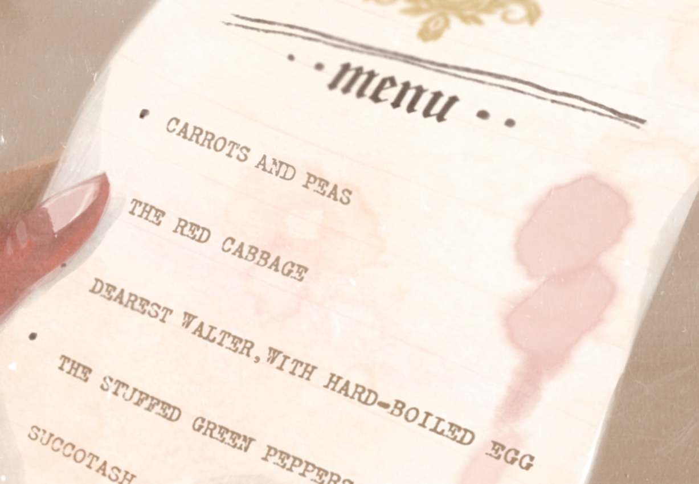

