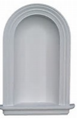

# 2017.12.02 DAY 2  #

> When life pulls you under, you can kick against the bottom, beak the surface, and breathe again.
> 當生活將你拖入水底，你可以用力蹬地，衝出水面，重新呼吸。

## 今日詞表 ##

1	

	flit /flɪt/
	n. 轻快的飞行；迁移； vi. 掠过；轻快地飞过；偷偷溜走；去世

2	

	abode /əˈboʊd/
	n. 住处，住所

3	

	ragtime /ˈræɡtaɪm/
	n. 拉格泰姆音乐（多切分节奏的一种早期爵士乐）； adj. 滑稽的；不严肃的

4	

	vagrant /ˈveɪɡrənt/
	n. 游民； adj. 漂泊的

5	

	housekeeper /ˈhaʊskiːpər/
	n. 主妇；女管家

6	

	mitigate /ˈmɪtɪɡeɪt/
	v. 减轻，缓和

7	

	lush /lʌʃ/
	adj. 草木茂盛的，多的，丰富豪华的

8	

	lichen /ˈlaɪkən/
	n. 地衣，苔藓； vt. 使长满地衣，以地衣覆盖

9	

	viscid /ˈvɪsɪd/
	adj. 黏的，黏质的

10	

	niche /niːʃ/
	n. 壁龛；合适的职业

11	

	taint /teɪnt/
	n. 污点；感染；异味； vi. 腐败，腐烂； vt. 污染；玷污，使受不良影响

12	

	mole /moʊl/
	n. 【动】鼹鼠，潜伏很深的间谍，在黑暗中工作的人，黑痣，防波堤

13	

	interrogate /ɪnˈterəɡeɪt/
	v. 审问，审讯

14	

	granule /ˈɡrænjuːl/
	n. 颗粒，微粒，粒状斑点

15	

	ooze /uːz/
	v. （使）渗出，泄漏，流露； n. 软泥，渗出物

16	

	slimy /ˈslaɪmi/
	adj. 黏糊糊的；黏滑的；谄媚的

17	

	hectic /ˈhektɪk/
	adj. 紧张的，忙碌的，患肺病的，（因患肺病等）发烧的，有病态潮红的脸上发红，发热的，兴奋的，狂热的，肺病的

18	

	haggard /ˈhæɡərd/
	adj. 憔悴的，消瘦的

19	

	perfunctory /pərˈfʌŋktəri/
	adj. 草率的，敷衍搪塞的

20	

	specious /ˈspiːʃəs/
	adj. 外表美观，华而不实的，徒有其表的

21	

	ragged /ˈræɡɪd/
	adj. 破旧的；参差不齐的；未梳理的；粗糙的；精疲力竭的

22	

	upholstery /ʌp'hoʊlstəri/
	n. 垫衬物，家具装饰用品业

23	

	recline /rɪˈklaɪn/
	vi. 躺，斜倚（常与on，upon或against连用），信赖； vt. 使后靠，使斜倚

24	

	inert /ɪˈnɜːrt/
	adj. 不动的，惰性的；行动迟钝的；无生气的

25	

	chaste /tʃeɪst/
	adj. 贞洁的；纯洁的；朴素的

26	

	askew /əˈskjuː/
	adj. 歪斜的； adv. 歪斜地，斜地

27	

	threadbare /ˈθredber/
	adj. 磨破的，衣衫褴褛的，乏味的，俗套的

28	

	throng /θrɔːŋ/
	n. 一大群人； vi. 群集，蜂拥； vt. 挤向

29	

	forbearance /fɔːrˈberəns/
	n. 自制，忍耐；宽容

30	

	garish /ˈɡerɪʃ/
	adj. 炫耀的；过分装饰的；过分鲜艳的

31	

	grotesque /ɡroʊˈtesk/
	adj. 奇形怪状的，奇异的； n. 奇形怪状的人（或物、图案等），奇异风格

32	

	convulsion /kənˈvʌlʃn/
	n. 惊厥，动乱，震撼，震动

33	
	upheaval /ʌpˈhiːvl/
	n. 动乱，大变动

34	

	plank /plæŋk/
	n. 厚木板，木板制成物，政纲条款，要点； v. 在……上铺板，砰一声放下，用菜板端出

## 今日閱讀 ##

Previous Story

一阵敲门声传来，打断了Sarah的思绪。侍者送来新一份菜单，一切都洋溢着春天的气息。菜单上的“蒲公英配白煮蛋”再一次让Sarah情绪失控，恍恍惚惚中她坚持打完了菜单。不想，天意眷顾，小小失误，竟意外送来了她心心念念的Walter。

The Furnished Room

带家具出租的房间

Restless, shifting, fugacious(来去匆匆的) as time itself is a certain vast bulk of the population of the red brick district of the lower West Side. Homeless, they have a hundred homes. They flit(辗转) from furnished room to furnished room, transients for ever—transients in abode(住所), transients in heart and mind. They sing “Home, Sweet Home” in ragtime(雷格泰姆音乐); they carry their lares et penates(家财) in a bandbox(硬纸盒); their vine is entwined(被缠绕) about a picture hat; a rubber plant is their fig tree.

在纽约西区南部的红砖房那一带地方，绝大多数居民都如时光一样动荡不定、迁移不停、来去匆匆。正因为无家可归，他们也可以说有上百个家。他们不时从这间客房搬到另一间客房，永远都是那么变幻无常——在居家上如此，在情感和理智上也无二致。他们用爵士乐曲调唱着流行曲“家，甜美的家”；全部家当用硬纸盒一拎就走；缠缘于阔边帽上的装饰就是他们的葡萄藤；拐杖就是他们的无花果树。 

	restless	英[ˈrestləs] 【lsieun】應該理解為“不能安定下來的”。restless、shfting和fugacious似乎是遞進的關係，首先是“不能安定下來”restless，接著就要多次變換shfting，因而每一次停留都是“短暫的”fugacious
	美[ˈrɛstlɪs]
	adj.	焦躁不安的; 坐立不安的; 不耐烦的; 难以入睡的;
	[例句]By 1982, she was restless and needed a new impetus for her talent.
	到了1982年，她感到厌倦了，需要新的动力来激发她的才能。

	shifting	英[ʃɪftɪŋ]【lsieun】應該理解為“移動的、多變的”
	美[ʃɪftɪŋ]
	n.	移位; 转移，偏移; 狡猾;
	v.	改变(shift的现在分词);
	adj.	移动的; 多变的; 狡诈的;
	[例句]The Croatian town of Ilok is a classic case of shifting populations.
	伊洛卡的克罗地亚小镇就是人口不停流动的典型例子。

	fugacious	英[fju:'geɪʃəs]【lsieun】短暂的; 无常的
	美[fju:'geɪʃəs]
	adj.	短暂的; 无常的; 难捕捉的; 易逃逸的;
	[例句]Some patients appear cry laugh fugacious, depressed wait for a symptom alternately with excitement, call "disease of benzine sex hysteria".
	有的患者出现哭笑无常、抑郁与兴奋交替等症状，称为“汽油性癔症”。

	vast	英[vɑ:st] 【lsieun】 這里的vast應該是理解為形容詞“大量的”
	美[væst]
	adj.	广阔的; 巨大的; 大量的; 巨额的;
	n.	浩瀚; 广大无边的空间;
	[例句]The vast majority of the eggs would be cracked.
	绝大部分鸡蛋都会被打碎。

	bulk	英[bʌlk] 【lsieun】 這里的bulk應該理解為名詞，即“大多數”，就是指“大量的人組成的那一部份”
	美[bʌlk]
	n.	（大） 体积; 大块，大量; 大多数，大部分; 主体;
	vt.	变得越来越大（或重要）;
	vi.	显得庞大; 形成大块; 堆积起来;
	[例句]The truck pulled out of the lot, its bulk unnerving against the dawn.
	卡车从空地上开出来，庞大的车身小心翼翼地避让着草坪。

	flit	英[flɪt] 【lsieun】 因為行李輕便，因此離開的時候，會覺得“轻快地掠过”，真正定居的人才知道搬家的難處。
	美[flɪt]
	vi.	轻快地掠过; 突然换位; 迁移，离开; 死亡;
	n.	飞掠; 夜逃; 偷偷搬家; 〈非〉古怪的人;
	[例句]Laura flits about New York hailing taxis at every opportunity
	劳拉穿梭于纽约各处，一有机会就打车。

	furnished	英[ˈfɜ:nɪʃt]
	美[ˈfɜ:rnɪʃt]
	adj.	家具，有家具的;
	v.	陈设，布置( furnish的过去式和过去分词); 提供，装备;
	[例句]Eleanor moved into a small furnished apartment.
	埃莉诺搬进了一间配有家具的小公寓里。

	transients	英[t'rænzɪənts]
	美[t'rænzɪrnts]
	n.	暂住某地的人，过往旅客，临时工( transient的名词复数 );
	[例句]a hotel for transients.
	为过路客人开设的旅馆

	abode	英[əˈbəʊd]
	美[əˈboʊd]
	n.	住所; 公寓; <古>（在某地的）暂住; 逗留;
	vt.	<古>预兆，预示;
	v.	容忍( abide的过去式和过去分词 ); 等候; 逗留; 停留;
	[例句]I went round the streets and found his new abode.
	我走街串巷找到了他的新住所。

	lares	英[ˈleəri:z,ˈlɑ:reiz]
	美[ˈlɛriz]
	n.	（古罗马） 家庭守护神; （古罗马） 家神，家庭守护神( lar的名词复数 );
	[例句]Memory is the hour of clothes, though no longer lares and useful.
	回忆是小时后的衣服，舍不得丢弃，虽已不再有用。

	bandbox	英['bændbɒks]
	美['bændbɒks]
	n.	（盛帽子的） 圆筒形纸板盒;
	[例句]In spite of the long trip, Jody arrived looking as if she had come out of a bandbox.
	虽然经过长途旅行，乔迪到达的时候仍然显得神采奕奕。

	vine	英[vaɪn]
	美[vaɪn]
	n.	藤; 葡萄树; 藤本植物;
	vi.	形成藤蔓;
	[例句]Every square metre of soil was used, mainly for olives, vines, and almonds.
	每一寸土地都利用上了，主要用来种植橄榄树、葡萄藤和杏树。

	entwined	
	v.	缠绕，盘绕( entwine的过去式和过去分词 );
	[例句]He entwined his fingers with hers.
	他和她十指相扣。

	rubber	英[ˈrʌbə(r)]
	美[ˈrʌbɚ]
	n.	橡胶; 橡皮; 决胜局; 避孕套;
	adj.	橡胶制成的;
	vt.	涂橡胶于; 用橡胶制造;
	[例句]Let's have a few rubbers of bridge.
	我们玩几局桥牌吧。

	fig	英[fɪg]
	美[fɪɡ]
	n.	无花果; 无花果树;
	[例句]I do not give a fig what society thinks.
	我一点儿也不在乎社会怎么想。

Hence the houses of this district, having had a thousand dwellers, should have a thousand tales to tell, mostly dull ones, no doubt; but it would be strange if there could not be found a ghost or two in the wake of all these vagrant(流浪的) guests.

这一带有成百上千这种住客，这一带的房子可以述说的故事自然也是成百上千。当然，它们大多干瘪乏味；不过，要说在这么多漂泊过客掀起的余波中找不出一两个鬼魂，那才是怪事哩。 

	dwellers	
	n.	居民，居住者( dweller的名词复数 );
	[例句]Urban dwellers often accept noise as part of city life
	城市居民常将噪音当成城市生活的一部分。  

	ghost	英[gəʊst]【lsieun】這個ghost不是特別理解，為什麽要找出鬼魂呢？
	美[goʊst]
	n.	鬼，幽灵; （尤指可怕事物的） 记忆; 隐约的一点点; （电视屏幕上的） 重影;
	vt.	悄悄地行进;
	vi.	替人代笔;
	[例句]The village is haunted by the ghosts of the dead children.
	死去的孩子们的幽灵常在该村出没。

	in the wake of	英[in ðə weik ɔv]
	美[ɪn ði wek ʌv]
	adv.	随着; 尾随，紧跟，仿效; 跟着;
	[例句]In the wake of developments in science and technology, man has become more capable of conquering nature.
	随着科学技术的发展，人们征服自然的能力也越来越强了。

One evening after dark a young man prowled among these crumbling red mansions, ringing their bells. At the twelfth he rested his lean hand-baggage(手提行李) upon the step and wiped the dust from his hat-band(帽沿) and forehead. The bell sounded faint and far away in some remote, hollow depths.

一天傍晚擦黑以后，有个青年男子在这些崩塌失修的红砖大房中间转悠寻觅，挨门挨户按铃。在第十二家门前，他把空当当的手提行李放在台阶上，然后揩去帽沿和额头上的灰尘。门铃声很弱，好像传至遥远、空旷的房屋深处。   

	prowl	英[praʊl]【lsieun】這里應該理解為“徘徊”，因為主人公正在找一所住處
	美[praʊl]
	vi.	徘徊; 小心翼翼地移动;
	vt.	（动物）潜行（为捕猎等） ; 潜行（图谋不轨等）; （因无聊、焦躁等） 徘徊;
	n.	（动物）悄然潜行（以觅食） ; 人)（人为抓捕或行窃等）悄悄巡行以寻找;
	[例句]Policemen prowled around the building.
	警察在大楼四周暗中巡查。

	crumbling	英['krʌmblɪŋ] 【lsieun】或許理解成“正在不斷飽受時間流逝帶來的磨損的”大夏
	美['krʌmblɪŋ]
	v.	坍塌; （把…） 弄碎， （使）碎成细屑( crumble的现在分词 ); 衰落; 损坏;
	[例句]Cracks, bulges, crumbling pointing and damp patches mean trouble.
	裂缝、凸起、剥落的勾缝和湿斑都意味着存在问题。

	mansion	英[ˈmænʃn]
	美[ˈmænʃən]
	n.	大厦; 宅第，公馆;
	[例句]The very best properties, however, the colonial mansions and villas, were reserved for the government.
	不过，最好的地产——也就是殖民时期的宅邸和别墅——都留给了政府。

	At the twelfth 【lsieun】之前，我一直理解為“時間”上的，看了譯文才知道原來是問到了第12家。

	lean	英[li:n] 【lsieun】是對hand-baggage的描述，理解為“简洁的、精簡的”
	美[lin]
	vt.	（使） 倾斜，屈身;
	vt.	倚; 依赖; 使斜靠; 使变瘦;
	adj.	瘦的; 贫瘠的; 简洁的; 精干的;
	[例句]Eileen leaned across and opened the passenger door
	艾琳倾身把后座门打开。

	hand-baggage 
	手提行李

	hat band	英[hæt bænd]
	美[hæt bænd]
	[词典]	帽圈;
	[例句]The hat top fixed band is made by a nylon snap and fixed on the hat top.
	帽顶固定带用尼龙搭扣做成并固定在帽顶上。

	forehead	英[ˈfɔ:hed] 【lsieun】額頭上有塵土嗎？這樣理解對嗎？
	美[ˈfɔ:rhed]
	n.	额; 前部;
	[例句]He wiped away the beads of sweat on his forehead.
	他擦去了额头上的汗珠。

	faint	英[feɪnt]
	美[fent]
	adj.	微弱的，模糊的; 软弱的; 无勇气的; 将昏倒似的;
	vi.	头晕，昏过去; 渐渐不明，消失;
	n.	昏厥，昏倒;
	[例句]He became aware of the soft, faint sounds of water dripping
	他开始注意到轻微的水滴声。

	hollow	英[ˈhɒləʊ] 【lsieun】 這里理解成“空曠”不合適吧
	美[ˈhɑ:loʊ]
	adj.	空洞的; 空的; 虚伪的; 空腹的;
	n.	洞，坑; 山谷;
	vt.	挖空（某物），变空; 挖出（孔、洞）;
	[例句]He looked young, dark and sharp-featured, with hollow cheeks.
	他看起来很年轻，肤色黝黑，五官分明，双颊凹陷。

To the door of this, the twelfth house whose bell he had rung, came a housekeeper(房东) who made him think of an unwholesome, surfeited(过度饮食的) worm that had eaten its nut to a hollow shell and now sought to fill the vacancy with edible lodgers.

这是他按响的第十二家门铃。铃声响过，女房东应声出来开门。她的模样使他想起一只讨厌的、吃得过多的蛆虫。它已经把果仁吃得只剩空壳，现在正想寻找可以充饥的房客来填充空间。   

	unwholesome	英[ˌʌnˈhəʊlsəm]
	美[ˌʌnˈhoʊlsəm]
	adj.	不卫生的，有害身心健康的; 看上去不健康的;
	[例句]The fish were unwholesome and old.
	这些鱼既不卫生又不新鲜。

	wholesome	英[ˈhəʊlsəm]
	美[ˈhoʊlsəm]
	adj.	有益健康的; 健全的; 合乎卫生的;
	[例句]The food is filling and wholesome.
	这种食物既能充饥又有营养。

	surfeited	
	v.	吃得过多( surfeit的过去式和过去分词 ); 由于过量而厌腻;
	[例句]To cause to feel surfeited.
	因过食而发腻。

	hollow	英[ˈhɒləʊ] 【lsieun】應該是理解為“worm把nut給吃空了”
	美[ˈhɑ:loʊ]
	adj.	空洞的; 空的; 虚伪的; 空腹的;
	n.	洞，坑; 山谷;
	vt.	挖空（某物），变空; 挖出（孔、洞）;
	[例句]He looked young, dark and sharp-featured, with hollow cheeks.
	他看起来很年轻，肤色黝黑，五官分明，双颊凹陷。

	vacancy	英[ˈveɪkənsi]
	美[ˈvekənsi]
	n.	空缺; 空位; 空白; 空虚;
	[例句]They had a short-term vacancy for a person on the foreign desk
	他们在国际新闻组有一个短期的空缺职位。

	edible	英[ˈedəbl]
	美[ˈɛdəbəl]
	adj.	可以吃的，可食用的;
	n.	食物;
	[例句]This kind of mushroom is edible, but that kind is not.
	这种蘑菇吃得，那种吃不得。

	lodgers	
	n.	房客，租住者( lodger的名词复数 );
	[例句]The other lodgers had moved away or had died, or had been turned out in default of payment.
	其他的房客都早已搬了，死了，或是因欠付租金而被撵走了。

He asked if there was a room to let.

年轻人问有没有房间出租。   

	let	英[let] 【lsieun】這里是“出租”的意思
	美[lɛt]
	[词典]	允许，任由; 让，随; 假设; 出租;
	[例句]People said we were interfering with nature, and that we should just let the animals die
	人们说我们是在干涉自然界，还说我们应该任由动物死去。

“Come in,” said the housekeeper.

“进来吧，”房东说。

Her voice came from her throat; her throat seemed lined with fur. “I have the third floor back, vacant since a week back. Should you wish to look at it?”

她的声音从喉头挤出，嘎声嘎气，好像喉咙上绷了层毛皮。“三楼还有个后间，空了一个星期。想看看吗？”  

	be lined with	英[bi: laɪnd wið]
	美[bi laɪnd wɪð]
	[词典]	与…相并列，与…相排列，内膜上衬有/布满…;
	[例句]The walls would be lined with books and periodicals.
	这几面墙会摆放书籍和期刊。 

	vacant	英[ˈveɪkənt] 【lsieun】 空閒的
	美[ˈvekənt]
	adj.	空缺的; 茫然的; 空闲的; 空虚的;
	[例句]Half way down the coach was a vacant seat
	车厢中部有一个空座。

The young man followed her up the stairs. A faint light from no particular source mitigated(缓和) the shadows of the halls. They trod noiselessly upon a stair carpet that its own loom would have forsworn(发誓抛弃). It seemed to have become vegetable; to have degenerated in that rank, sunless air to lush(茂盛的) lichen(地衣) or spreading moss that grew in patches to the staircase and was viscid(粘稠的) under the foot like organic matter. At each turn of the stairs were vacant niches(壁龛) in the wall. Perhaps plants had once been set within them. If so they had died in that foul and tainted(肮脏的) air. It may be that statues of the saints had stood there, but it was not difficult to conceive that imps(小恶魔) and devils had dragged them forth in the darkness and down to the unholy depths of some furnished pit below.

年轻人跟她上楼。不知从什么地方来的一线微光缓和了过道上的阴影。他们不声不响地走着，脚下的地毯破烂不堪，可能连造出它的织布机都要诅咒说这不是自己的产物。它好像已经植物化了，已经在这恶臭、阴暗的空气中退化成茂盛滋润的地衣或满地蔓延的苔藓，东一块西一块，一直长到楼梯上，踩在脚下像有机物一样粘糊糊的。楼梯转角处墙上都有空着的壁龛。它们里面也许曾放过花花草草。果真如此的话，那些花草已经在污浊肮脏的空气中死去。壁龛里面也许曾放过圣像，但是不难想象，黑暗之中大大小小的魔鬼早就把圣人拖出来，一直拖到下面某间客房那邪恶的深渊之中去了。  

	hall	英[hɔ:l] 【lsieun】以前，我總是理解為“大廳”，原來也有“過道、走廊”的意思
	美[hɔl]
	n.	过道，走廊; 大厅，前厅; 娱乐中心，会所;
	[例句]The lights were on in the hall and in the bedroom.
	门厅和卧室的灯都亮着。 

	trod	英[trɒd]
	美[trɑ:d]
	v.	踏出; 踩，踏( tread的过去式 ); 踩成; 步行于;
	[例句]They trod their enemies under foot.
	他们把敌人踩在脚下。

	carpet	英[ˈkɑ:pɪt]
	美[ˈkɑ:rpɪt]
	n.	地毯，桌毯; 毛毯，绒毯; 地毯状覆盖物; （装在飞机上的） 雷达电子干扰仪;
	vt.	在…上铺地毯; 把地毯铺在…上; 斥责;
	[例句]They put down wooden boards, and laid new carpets on top.
	他们铺好木地板，在上面铺上新地毯。

	loom	英[lu:m] 【lsieun】這里應該理解為“織出地毯的織布機”
	美[lum]
	n.	织布机，织布法; 若隐若现的景象; 桨柄; [航] 翼肋腹部;
	vi.	朦胧出现;
	vi.	隐约地出现; 赫然耸现; 迫在眉睫;
	[例句]Vincent loomed over me, as pale and grey as a tombstone.
	文森特赫然耸现在我面前，面色灰白得像一块墓碑。

	forsworn	英[fɔ:ˈswɔ:n]
	美[fɔ:rˈswɔ:rn]
	adj.	不守誓言的，伪誓的; forswear的过去分词;
	v.	作伪证; 发伪誓; 坚决放弃; 发誓抛弃( forswear的过去分词 );
	[例句]I have forsworn his bed and company.
	我已经发过誓不和他同寝同眠了。

	degenerated	
	v.	衰退，堕落，退化( degenerate的过去式和过去分词 );
	[例句]Standards in the administration of justice have degenerated
	执法标准下降了。

	lichen - Bing dictionary 【lsieun】 拼音上正好是“李晨”
	US['laɪken]UK['lɪtʃ(ə)n]
	n.地衣
	v.使生满地衣

	moss	英[mɒs]
	美[mɔ:s]
	n.	苔藓; 藓沼; 莫斯（男子名）; 泥炭沼;
	vt.	以苔藓覆盖; 使长满苔藓;
	abbr.	[宇] (=manned orbital space station) 载人轨道航天站;
	[例句]Moss is soft like velvet.
	苔藓软如丝绒。

	patches	
	n.	补丁; 斑; 小块( patch的名词复数 ); 小块土地;
	v.	补( patch的第三人称单数 ); 修理; 调停; 解决;
	[例句]Cracks, bulges, crumbling pointing and damp patches mean trouble.
	裂缝、凸起、剥落的勾缝和湿斑都意味着存在问题。

	viscid	英[ˈvɪsɪd]
	美[ˈvɪsɪd]
	adj.	胶粘的，粘质的;
	[例句]Viscid branched perennial of the southwestern United States and northern Mexico having tuberous roots and deep red flowers.
	美国西南部和墨西哥北部的长有粘质树枝的多年生植物，具有块状根茎和深红色花朵。

	niches	
	n.	壁龛( niche的名词复数 ); 合适的位置[工作等]; （产品的） 商机; 生态位（一个生物所占据的生境的最小单位）;
	[例句]Different niches, having different requirements, result in different genes and different shaped mouthparts.
	不同的环境，对物种有不同要求，从而产生了不同的基因和不同形状的口器。

	foul	英[faʊl] [lsieun]應該理解為“氣味上难闻的”
	美[faʊl]
	adj.	[体] 违反规则的，犯规的; 邪恶的; 难闻的，有恶臭的; 下流的;
	vt.	纠缠，纠结; [体] 违反规则的;
	vt.	弄脏，使污秽; 使纠缠; 使阻塞;
	[例句]The smell was quite foul.
	臭气熏天。

	tainted	
	adj.	污染的; 腐坏的; 沾污的; 感染的;
	v.	使变质( taint的过去式和过去分词 ); 使污染; 败坏; 被污染，腐坏，败坏;
	[例句]Opposition leaders said that the elections had been tainted by corruption.
	反对派领导人说，选举中存在舞弊现象。

	conceive	英[kənˈsi:v]  [lsieun]想像
	美[kənˈsiv]
	vt.	怀孕; 构思; 想像，设想; 持有;
	vi.	设想; 怀孕; 考虑;
	[例句]I just can't even conceive of that quantity of money
	那么多钱，我根本都无法想象。

	imps	
	n.	顽童; （故事中的） 小恶魔( imp的名词复数 ); 小魔鬼; 小淘气;
	[例句]Imps said. It's beyond my imagination!
	小鬼说。这真是出乎我的想象之外！

	unholy	英[ʌnˈhəʊli]
	美[ʌnˈhoʊli]
	adj.	邪恶的; 不神圣的; 不洁净的; 不合理的;
	[例句]She protested that it wasn't traditional jazz at all, but an unholy row
	她抗议说那根本不是传统爵士乐，而是令人憎恶的噪音。

	pit	英[pɪt] [lsieun]這個有點理解不了啊
	美[pɪt]
	n.	井; 煤矿; 麻子; （赛车道旁的） 修理加油站;
	vt.	使有麻子; 使有凹陷;
	vi.	凹陷; 起凹点;
	[例句]It was a better community then when all the pits were working.
	所有的煤矿都在开工的那个时候，这个社区的情况要更好一些。

“This is the room,” said the housekeeper, from her furry throat.

“就是这间，”房东说，还是那副毛皮嗓子。

“It’s a nice room. It ain’t often vacant.

“房间很不错，难得有空的时候。

I had some most elegant people in it last summer—no trouble at all, and paid in advance to the minute.

今年夏天这儿还住过一些特别讲究的人哩——从不找麻烦，按时提前付房租。

The water’s at the end of the hall.

自来水在过道尽头。

Sprowls and Mooney kept it three months. They done a vaudeville(歌舞杂耍表演) sketch.

斯普罗尔斯和穆尼住了三个月。她们演过轻松喜剧。

Miss B’retta Sprowls—you may have heard of her—Oh, that was just **the stage names**—right there over the dresser is where **the marriage certificate** hung, **framed**.

布雷塔·斯普罗尔斯小姐——也许你听说过她吧——喔，那只是艺名儿——就在那张梳妆台上边，原来还挂着她的结婚证书哩，镶了框的。

	dresser	英[ˈdresə(r)] [lsieun]這里應該理解為“化妝臺”
	美[ˈdrɛsɚ]
	n.	化妆台; （剧组的） 服装员; 食具柜; 外科手术助手;
	[例句]'Tell them to hold all my calls, Theresa,' she instructed her dresser.
	“特雷莎，告诉他们我所有的电话都别挂。”她吩咐她的服装师。

The gas is here, and you see there is plenty of closet room.

煤气开关在这儿，瞧这壁橱也很宽敞。

	closet	英[ˈklɒzɪt]
	美[ˈklɑ:zət]
	n.	壁橱; 盥洗室; 议事室，密室; 贮藏室;
	adj.	隐蔽的，暗藏的; 不公开的; 秘密的，私下的; 空谈的;
	vt.	把…关在房间里; 把…引入内室密谈;
	[例句]He is a closet Fascist.
	他是个秘密的法西斯分子。

It’s a room everybody likes. It never stays idle long. ”

这房间人人见了都喜欢，从来没长时间空过。”   

“Do you have many theatrical people rooming here?” asked the young man.

“你这儿住过很多演戏的？”年轻人问。   

“They comes and goes.

A good proportion of my lodgers is connected with the theaters.

Yes, sir, this is the theatrical district.

Actor people never stays long anywhere.

I get my share.

Yes, they comes and they goes. ”

“他们这个来，那个去。我的房客中有很多人在演出界干事。对了，先生，这一带剧院集中，演戏的人从不在一个地方长住。到这儿来住过的也不少。他们这个来，那个去。”   

	I get my share. 是什麽意思呢？

He engaged the room, paying for a week in advance. He was tired, he said, and would take possession at once. He counted out the money. The room had been made ready, she said, even to towels and water. As the housekeeper moved away he put, for the thousandth time, the question that he carried at the end of his tongue.

他租下了房间，预付了一个星期的租金。他说他很累，想马上住下来。他点清了租金。她说房间早就准备规矩，连毛巾和水都是现成的。房东走开时，——他又——已经是第一千次了——把挂在舌尖的问题提了出来。   

	count out	英[kaunt aut] 【lsieun】這里應該是“逐一数出money”的意思
	美[kaʊnt aʊt]
	[词典]	<非正>逐一数出，大声数; <非正>不把…考虑在内;
	[例句]Mr. Rohmbauer counted out the money and put it in an envelope.
	罗姆保先生把钱数好放在了一个信封里。

“A young girl—Miss Vashner—Miss Eloise Vashner—do you remember such a one among your lodgers? She would be singing on the stage, most likely.

A fair girl, of medium height and slender, with reddish, gold hair and a dark mole(痣) near her left eyebrow. ”

“有个姑娘——瓦西纳小姐——埃卢瓦丝·瓦西纳小姐——你记得房客中有过这人吗？她多半是在台上唱歌的。她皮肤白嫩，个子中等，身材苗条，金红色头发，左眼眉毛边长了颗黑痣。”   

	reddish	英[ˈredɪʃ]
	美[ˈrɛdɪʃ]
	adj.	淡红色的，微红的; 混有或染有红色的;
	[例句]He had reddish brown hair
	他的头发是红棕色的。

“No, I don’t remember the name.

Them stage people has names they change as often as their rooms.

They comes and they goes.

No, I don’t call that one to mind. ”

“不，我记不得这个名字。那些搞演出的，换名字跟换房间一样快，来来去去，谁也说不准。不，我想不起这个名字了。”   

No. Always no. Five months of ceaseless interrogation(询问) and the inevitable negative. So much time spent **by day** in questioning managers, agents, schools and choruses; **by night** among the audiences of theaters from all-star casts down to music-halls so low that he dreaded to find what he most hoped for. He who had loved her best had tried to find her. He was sure that since her disappearance from home this great, water-girt(水流环绕的) city held her somewhere, but it was like a monstrous quicksand(流沙), shifting its particles constantly, with no foundation, its upper granules(颗粒) of to-day buried to-morrow in ooze(稀泥) and slime(粘土).

不。总是不。五个月不间断地打听询问，千篇一律地否定回答。已经花了好多时间，白天去找剧院经理、代理人、剧校和合唱团打听；晚上则夹在观众之中去寻找，名角儿会演的剧院去找过，下流污秽的音乐厅也去找过，甚至还害怕在那类地方找到他最想找的人。他对她独怀真情，一心要找到她。他确信，自她从家里失踪以来，这座水流环绕的大城市一定把她蒙在了某个角落。但这座城市就像一大团流沙，沙粒的位置变化不定，没有基础，今天还浮在上层的细粒到了明天就被淤泥和粘土覆盖在下面。

	choruses	
	n.	合唱曲; 合唱( chorus的名词复数 ); 齐声; （歌曲的） 副歌;
	v.	合唱，齐声背诵，异口同声地说( chorus的第三人称单数 );
	[例句]Listened through the CD, I knew all the words to the choruses, at least.
	当我听着这张CD听第三遍的时候，至少，我已经知道合唱部分的所有歌词了。  

	cast	英[kɑ:st] [lsieun]這里應該是名詞“表演”的意思
	美[kæst]
	vt.	铸造; 投射; 投掷; 脱落，脱皮;
	n.	铸型; 演员表; 轻微的斜视; 投，掷骰;
	vi.	掷，投; 计算，加;
	[例句]The show is very amusing and the cast are very good.
	演出妙趣横生，演员的表演也很出彩。

	dread	英[dred]
	美[drɛd]
	vt.	害怕，担心; （古语） 敬畏;
	n.	恐惧，畏惧; 令人恐惧的事物;
	adj.	可怕的;
	[例句]I'm dreading Christmas this year
	今年我非常害怕过圣诞节。

	monstrous	英[ˈmɒnstrəs]
	美[ˈmɑ:nstrəs]
	adj.	巨大的; 畸形的; 丑陋的; 与传说中怪物相象的;
	[例句]She endured the monstrous behaviour for years
	多年来，她一直忍受着这种骇人听闻的暴行。

	quicksand	英[ˈkwɪksænd]
	美[ˈkwɪkˌsænd]
	n.	流砂; 流沙，敏捷，危险而捉摸不定的事物; 悬浮体;
	[例句]The sandbank was uncertain, like quicksand under his feet.
	那个沙坝并不稳固，他脚下如同踩着流沙一般。
 
The furnished room received its latest guest with a first glow of pseudo-hospitality(假殷勤), a hectic(忙乱的), haggard(憔悴的), perfunctory(敷衍的) welcome like the specious(虚假的) smile of a demirep( [法]娼妓 ). The sophistical(似是而非的) comfort came in reflected gleams from the decayed furniture, the ragged(破旧的) brocade(织锦) upholstery(座套) of a couch and two chairs, a footwide cheap pier glass(穿衣镜) between the two windows, from one or two gilt picture frames and a brass bedstead(床架) in a corner.

客房以假惺惺的热情迎接新至的客人，像个暗娼脸上堆起的假笑，红中透病、形容枯槁、马马虎虎。破旧的家具、破烂绸套的沙发、两把椅子、窗户间一码宽的廉价穿衣镜、一两个烫金像框、角落里的铜床架——所有这一切折射出一种似是而非的舒适之感。  

	hectic	英[ˈhektɪk]
	美[ˈhɛktɪk]
	adj.	繁忙的，忙乱的; 兴奋的，狂热的; （因患肺病等） 发烧的; 患热病的;
	n.	肺病热患者; [医] 潮红;
	[例句]Despite his hectic work schedule, Benny has rarely suffered poor health
	尽管工作繁忙，本尼却少有身体不好的时候。 

	perfunctory	英[pəˈfʌŋktəri]
	美[pərˈfʌŋktəri]
	adj.	敷衍的; 马虎的; 肤浅的; 浅薄的;
	[例句]She gave the list only a perfunctory glance
	她马马虎虎地扫了一眼清单。

	specious	英[ˈspi:ʃəs]
	美['spi:ʃəs]
	adj.	似是而非的;
	adv.	似是而非地;
	[例句]It is unlikely that the Duke was convinced by such specious arguments.
	公爵不太可能相信这种似是而非的论点。

	sophistical	英[sə'fɪstɪkl]
	美[sə'fɪstɪkəl]
	adj.	诡辩的，强词夺理的;
	[例句]It is a powerful and sophistical tool for optimization design of electric machines.
	随机搜索法是比较简便有效的方法，适用于电机的优化设计。

The guest reclined(斜倚), inert(懒怠的), upon a chair, while the room, confused in speech as though it were an apartment in Babel, tried to discourse to him of its divers tenantry.

房客懒洋洋地半躺在一把椅子上，客房则如巴比伦通天塔的一个套间，尽管稀里糊涂扯不清楚，仍然竭力把曾在这里留宿过的房客分门别类，向他细细讲来。 

	confused	英[kənˈfju:zd]
	美[kənˈfjuzd]
	adj.	糊涂的; 迷乱的; 混杂的; 不清楚的;
	v.	困惑(confuse的过去式);
	[例句]A survey showed people were confused about what they should eat to stay healthy
	一项调查表明，人们对该吃什么才能保持健康这个问题感到困惑。  

	discourse	英[ˈdɪskɔ:s]
	美[ˈdɪskɔ:rs]
	n.	论述，交谈; 正式的讨论;
	vi.	演说; 谈论;
	vt.	叙述; 讨论;
	[例句]The Centre has a strong record of research in discourse analysis.
	该中心在语篇分析研究方面成果丰硕。

	tenantry	英['tenəntrɪ]
	美['tenəntrɪ]
	n.	租货; 承租人，佃农;
	[例句]He ended his tenantry of the estate.
	他结束了对该地产的租借。

A polychromatic(杂色的) rug like some brilliant-flowered rectangular, tropical islet(小岛) lay surrounded by a billowy(汹涌的) sea of soiled matting. Upon the gay-papered wall were those pictures that pursue the homeless one from house to house—The Huguenot Lovers, The First Quarrel, The Wedding Breakfast, Psyche at the Fountain. The mantel’s(壁炉) chastely(风格简朴地) severe outline was ingloriously(不光彩地) veiled behind some pert(时髦的) drapery(布帘) drawn rakishly(潇洒地歪戴着地) askew(歪斜) like the sashes(腰带) of the Amazonian ballet. Upon it was some desolate flotsam(废弃物) cast aside by the room’s marooned(被困居于此的人) when a lucky sail had borne them to a fresh port—a trifling vase or two, pictures of actresses, a medicine bottle, some stray cards out of a deck.

地上铺了一张杂色地毯，像一个艳花盛开的长方形热带小岛，四周是肮脏的垫子形成的波涛翻滚的大海。用灰白纸裱过的墙上，贴着紧随无家可归者四处漂流的图片——“胡格诺情人”，“第一次争吵”，“婚礼早餐”，“泉边美女”。壁炉炉额的样式典雅而庄重，外面却歪歪斜斜扯起条花哨的布帘，像舞剧里亚马逊女人用的腰带。炉额上残留着一些零碎物品，都是些困居客房的人在幸运的风帆把他们载到新码头时抛弃不要的东西——一两个廉价花瓶，女演员的画片，药瓶儿，残缺不全的扑克纸牌。   

One by one, as the characters of a cryptograph(密码) become explicit, the little signs left by the furnished room’s procession of guests developed a significance. 

渐渐地，密码的笔形变得清晰可辨，前前后后居住过这间客房的人留下的细小痕迹所具有的意义也变得完整有形。

The threadbare(磨薄的) space in the rug in front of the dresser told that lovely woman had marched in the throng(人群). Tiny finger-prints on the wall spoke of little prisoners trying to feel their way to sun and air. A splattered(溅开的) stain, raying like the shadow of a bursting bomb, witnessed where a hurled glass or bottle had splintered with its contents against the wall. Across the pier glass had been scrawled(被乱写) with a diamond in staggering letters the name “Marie.” 

梳妆台前那片地毯已经磨得只剩麻纱，意味着成群的漂亮女人曾在上面迈步。墙上的小指纹表明小囚犯曾在此努力摸索通向阳光和空气之路。一团溅开的污迹，形如炸弹爆炸后的影子，是杯子或瓶子连同所盛之物一起被砸在墙上的见证。穿衣镜镜面上用玻璃钻刀歪歪扭扭地刻着名字“玛丽”。

It seemed that the succession of dwellers in the furnished room had turned in fury—perhaps tempted beyond forbearance(忍耐) by its garish(花哨的) coldness—and wreaked(施行暴力) upon it their passions. The furniture was chipped and bruised; the couch, distorted by bursting springs, seemed a horrible monster that had been slain during the stress of some grotesque(怪诞的) convulsion(抽搐). Some more potent upheaval(动荡) had cloven(劈开) a great slice from the marble mantel. Each plank(木板) in the floor owned its particular cant(倾斜) and shriek as from a separate and individual agony. It seemed incredible that all this malice and injury had been wreaked upon the room by those who had called it for a time their home; and yet it may have been the cheated home instinct surviving blindly, the resentful rage at false household gods that had kindled their wrath. A hut that is our own we can sweep and adorn and cherish.

看来，客房留宿人——也许是受到客房那俗艳的冷漠之驱使吧——   曾先先后后在狂怒中辗转反侧，并把一腔愤懑倾泄在这个房间上。家具有凿痕和磨损；长沙发因凸起的弹簧而变形，看上去像一头在痛苦中扭曲的痉挛中被宰杀的可怖怪物。另外某次威力更大的动荡砍去了大理石壁炉额的一大块。地板的每一块拼木各自构成一个斜面，并且好像由于互不干连、各自独有的哀怨而发出尖叫。令人难以置信的是，那些把所有这一切恶意和伤害施加于这个房间的人居然就是曾一度把它称之为他们的家的人；然而，也许正是这屡遭欺骗、仍然盲目保持的恋家本性以及对虚假的护家神的愤恨点燃了他们胸中的冲天怒火。一间茅草房——只要属于我们自己——我们都会打扫、装点和珍惜。  

	malice	英[ˈmælɪs]
	美[ˈmælɪs]
	n.	怨恨; 恶意，恶感; [法] 预谋; 祸心;
	[例句]There was a strong current of malice in many of his portraits
	他的许多肖像画中都透着一股强烈的怨恨。 

	wreak	英[ri:k]
	美[rik]
	vt.	造成（混乱或破坏）; 实施（报复）;
	[例句]Violent storms wreaked havoc on the French Riviera, leaving three people dead and dozens injured
	猛烈的暴风雨给法国里维埃拉地区造成了极大的破坏，致使三人死亡，数十人受伤。

	hut	英[hʌt]
	美[hʌt]
	n.	小屋; 棚屋; 临时营房; 牢房;
	v.	使住临时营房; 驻扎;
	[例句]The hut was constructed from trees that grew in the nearby forest.
	这棚屋是用附近森林里长的树木建造的。

椅子上的年轻人任这些思绪缭绕心间，与此同时，楼中飘来有血有肉、活灵活现的声音和气味。他听见一个房间传来吃吃的窃笑和淫荡放纵的大笑；别的房间传来独自咒骂声，骰子的格格声，催眠曲和呜呜抽泣；楼上有人在兴致勃勃地弹班卓琴。不知什么地方的门砰砰嘭嘭地关上；架空电车不时隆隆驶过；后面篱墙上有只猫在哀叫。他呼吸到这座房子的气息。这不是什么气味儿，而是一种潮味儿，如同从地窖里的油布和朽木混在一起蒸发出的霉臭。   他就这样歇在那儿，突然，房间里充满木犀草浓烈的芬芳。它乘风而至，鲜明无误，香馥沁人，栩栩如生，活脱脱几乎如来访的佳宾。年轻人忍不住大叫：“什么？亲爱的？”好像有人在喊他似地。他然后一跃而起，四下张望。浓香扑鼻而来，把他包裹其中。他伸出手臂拥抱香气。刹那间，他的全部感觉都给搅混在一起。人怎么可能被香味断然唤起呢？唤起他的肯定是声音。难道这就是曾抚摸、安慰过他的声音？   “她在这个房间住过，”他大声说，扭身寻找起来，硬想搜出什么征迹，因为他确信能辨认出属于她的或是她触摸过的任何微小的东西。这沁人肺腑的木犀花香，她所喜爱、唯她独有的芬芳，究竟是从哪儿来的？   房间只马马虎虎收拾过。薄薄的梳妆台桌布上有稀稀拉拉五六个发夹——都是些女性朋友用的那类东西，悄声无息，具有女性特征，但不标明任何心境或时间。他没去仔细琢磨，因为这些东西显然缺乏个性。他把梳妆台抽屉搜了个底朝天，发现一条丢弃的破旧小手绢。他把它蒙在脸上，天芥菜花的怪味刺鼻而来。他顺手把手绢甩在地上。在另一个抽屉，他发现几颗零星纽扣，一张剧目表，一张当铺老板的名片，两颗吃剩的果汁软糖，一本梦释书。最后一个抽屉里有一个女人用的黑缎蝴蝶发结。他猛然一楞，悬在冰与火之间，处于兴奋与失望之间。但是黑缎蝴蝶发结也只是女性庄重端雅但不具个性特征的普通装饰，不能提供任何线索。   

随后他在房间里四处搜寻，像一条猎狗东嗅西闻，扫视四壁，趴在地上仔细查看拱起的地毡角落，翻遍壁炉炉额和桌子、窗帘和门帘、角落里摇摇欲坠的酒柜，试图找到一个可见的、但他还未发现的迹象，以证明她就在房间里面，就在他旁边、周围、对面、心中、上面，紧紧地牵着他、追求他，并通过精微超常的感觉向他发出如此哀婉的呼唤，以至于连他愚钝的感觉都能领悟出这呼唤之声。他再次大声回答“我在这儿，亲爱的！”然后转过身子，目瞪口呆，一片漠然，因为他在木犀花香中还察觉不出形式、色彩、爱情和张开的双臂。唔，上帝啊，那芳香是从哪儿来的？从什么时候起香味开始具有呼唤之力？就这样他不停地四下摸索。   

他把墙缝和墙角掏了一遍，找到一些瓶塞和烟蒂。对这些东西他不屑一顾。但有一次他在一折地毡里发现一支抽了半截的纸雪茄，铁青着脸使劲咒了一声，用脚后跟把它踩得稀烂。他把整个房间从一端到另一端筛了一遍，发现许许多多流客留下的无聊、可耻的记载。但是，有关可能曾住过这儿的、其幽灵好像仍然徘徊在这里的、他正在寻求的她，他却丝毫痕迹也未发现。   这时他记起了女房东。   

他从幽灵萦绕的房间跑下楼，来到透出一缝光线的门前。   

她应声开门出来。他竭尽全力，克制住激动之情。   “请告诉我，夫人，”他哀求道，“我来之前谁住过那个房间？”   

“好的，先生。我可以再说一遍。以前住的是斯普罗尔斯和穆尼夫妇，我已经说过。布雷塔·斯普罗尔斯小姐，演戏的，后来成了穆尼夫人。我的房子从来声誉就好。他们的结婚证都是挂起的，还镶了框，挂在钉子上——”   “斯普罗尔斯小姐是哪种女人——我是说，她长相如何？”   

“喔，先生，黑头发，矮小，肥胖，脸蛋儿笑嘻嘻的。他们一个星期前搬走，上星期二。”   

“在他们以前谁住过？”   “嗨，有个单身男人，搞运输的。他还欠我一个星期的房租没付就走了。在他以前是克劳德夫人和她两个孩子，住了四个月；再以前是多伊尔老先生，房租是他儿子付的。他住了六个月。都是一年以前的事了，再往以前我就记不得了。”   

他谢了她，慢腾腾地爬回房间。房间死气沉沉。曾为它注入生机的香气已经消失，木犀花香已经离去，代之而来的是发霉家具老朽、陈腐、凝滞的臭气。   

希望破灭，他顿觉信心殆尽。他坐在那儿，呆呆地看着咝咝作响的煤气灯的黄光。稍许，他走到床边，把床单撕成长条，然后用刀刃把布条塞进门窗周围的每一条缝隙。一切收拾得严实紧扎以后，他关掉煤气灯，却又把煤气开足，最后感激不尽地躺在床上。   

按照惯例，今晚轮到麦克库尔夫人拿罐子去打啤酒。她取酒回来，和珀迪夫人在一个地下幽会场所坐了下来。这是房东们聚会、蛆虫猖厥的地方。   

“今晚我把三楼后间租了出去，”珀迪夫人说，杯中的酒泡圆圆的。“房客是个年轻人。两个钟头以前他就上床了。”   

“嗬，真有你的，珀迪夫人，”麦克库尔夫人说，羡慕不已。“那种房子你都租得出去，可真是奇迹。那你给他说那件事没有呢？”她说这话时悄声细语，嘎声哑气，充满神秘。   “房间里安起家具嘛，”珀迪夫人用她最令人毛骨悚然的声音说，“就是为了租出去。我没给他说那事儿，麦克库尔夫人。”  

 “可不是嘛，我们就是靠出租房子过活。你的生意经没错，夫人。如果知道这个房间里有人自杀，死在床上，谁还来租这个房间呢。”   

“当然嘛，我们总得活下去啊，”珀迪夫人说。   “对，夫人，这话不假。一个星期前我才帮你把三楼后间收拾规矩。那姑娘用煤气就把自己给弄死了——她那小脸蛋儿多甜啊，珀迪夫人。”   “可不是嘛，都说她长得俏，”珀迪夫人说，既表示同意又显得很挑剔。“只是她左眼眉毛边的痣长得不好看。再来一杯，麦克库尔夫人。”

