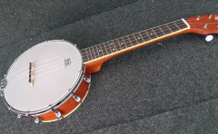
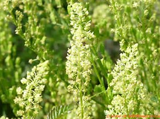

# 2017.12.03 DAY 4  #

>I am more vulnerable than I thought, but much stronger than I ever imagined.
>我比自己以為的更脆弱，但同時也比自己想像中堅強得多。

The young tenant in the chair allowed these thoughts to file, soft-shod, through his mind, while there drifted into the room furnished sounds and furnished scents. 

椅子上的年轻人任这些思绪缭绕心间，与此同时，楼中飘来有血有肉、活灵活现的声音和气味。

	tenant	英[ˈtenənt]
	美[ˈtɛnənt]
	n.	房客; 佃户; <律>占用者; 占有者;
	vt.	租借，租用;
	[例句]Regulations placed clear obligations on the landlord for the benefit of the tenant
	为维护房客的利益，条例明确规定了房东负有的各项义务。

	file	英[faɪl] 【lsieun】意思應該是讓更種想法“進入”自己的頭腦當中。
	美[faɪl]
	vt.	提出（离婚诉讼或其他讼案）; 把…归档; 用锉锉; 发稿，寄给报社;
	vi.	发送（报道给报社）; 排成一行行走; 提出申请;
	n.	档案; 文件（夹）; 纵列; 锉刀;
	[例句]He sat behind a table on which were half a dozen files.
	他坐在一张放有6个文件夹的桌子后面。

	drift	英[drɪft] 【lsieun】讓聲音“漂流進”房間
	美[drɪft]
	vi.	漂泊; 流动; 随意移动; 浮现;
	vt.	漂流; 堆积成堆;
	n.	漂移，偏移; 趋势，动向; 大意; 放任自流;
	[例句]We proceeded to drift on up the river
	我们继续向河流的上游漂流。

	furnished	英[ˈfɜ:nɪʃt] 【lsieun】 或許這里的“furnished”表示不僅僅是簡單的聲音和氣味，還被“裝飾過”，即添加了一些東西，聲音中有人喜怒哀樂，氣味當中有各種東西發散的氣味。
	美[ˈfɜ:rnɪʃt]
	adj.	家具，有家具的;
	v.	陈设，布置( furnish的过去式和过去分词); 提供，装备;
	[例句]Eleanor moved into a small furnished apartment.
	埃莉诺搬进了一间配有家具的小公寓里。

He heard in one room a tittering(嗤嗤的窃笑) and incontinent(荒淫无度的), slack laughter; in others the monolog(独白) of a scold, the rattling of dice, a lullaby(催眠曲), and one crying dully; above him a banjo tinkled with spirit. 

【這里描述聲音：由人發出的聲音】他听见一个房间传来吃吃的窃笑和淫荡放纵的大笑；别的房间传来独自咒骂声，骰子的格格声，催眠曲和呜呜抽泣；楼上有人在兴致勃勃地弹班卓琴。

	titter	英[ˈtɪtə(r)]
	美[ˈtɪtɚ]
	vi.	窃笑，傻笑;
	n.	短促而神经质的笑;
	[例句]Mention sex therapy and most people will titter in embarrassment.
	提及性治疗，大多数人会尴尬地偷笑。

	incontinent	英[ɪn'kɒntɪnənt]
	美[ɪnˈkɑntənənt]
	adj.	（大小便） 失禁的; 不能自制的;
	[例句]His diseased bladder left him incontinent.
	病变的膀胱使他小便失禁。

	continent	英[ˈkɒntɪnənt]【lsieun】除了名詞“大陸”的意思，還有形容詞“自製的、剋制的”的意思
	美[ˈkɑ:ntɪnənt]
	n.	欧洲大陆; 大陆，陆地; <美>北美洲大陆;
	adj.	自制的，克制的; 节欲的; 贞洁的; 禁欲的;
	[例句]She loved the African continent
	她热爱非洲大陆。

	slack	英[slæk]
	美[slæk]
	adj.	懈怠的; 松（弛）的; 清淡的; 不活跃的;
	v.	懈怠; 放松; 偷懒; 减速;
	n.	宽松裤; （绳索等） 松弛部分; 煤屑; （人员、资金或地方的） 富余的部份;
	[例句]The boy's jaw went slack.
	男孩张大了嘴巴。

	monolog	英['mɒnəlɒg]
	美['mɒnəˌlɒg]
	n.	独白，独角戏;
	[例句]Monolog: Sometimes we are on a collision course and we just don't know it.
	事情的发展总是无独有偶，我们就是不知道。

	rattling	英[ˈrætlɪŋ] 【lsieun】這里應該是“動名詞”，由下個單詞dice（骰子）可知
	美[ˈrætlɪŋ]
	adj.	咔嗒咔嗒的，活泼的，很好的;
	adv.	极佳，很，非常;
	v.	（使） 发出格格的响声， （使）作嘎嘎声( rattle的现在分词 ); 喋喋不休地说话; 迅速而嘎嘎作响地移动，堕下或走动; 使紧张，使恐惧;
	[例句]The truck pulled away, and she listened to the rattling noises fade down the lane.
	卡车开走了，她听见卡车的隆隆声越来越远。

	dice	英[daɪs] 【lsieun】 這里是名詞“骰子”的意思，這個詞還有動詞的意思，如果有機會記記吧。
	美[daɪs]
	n.	骰子; 掷骰游戏;
	v.	将…切成丁;
	[例句]Dice the onion
	把洋葱切成丁。

	lullaby	英[ˈlʌləbaɪ]
	美[ˈlʌləˌbaɪ]
	n.	摇篮曲，催眠曲;
	[例句]Place your baby in her seat and play her a lullaby
	把宝宝放到座位上，给她弹一首摇篮曲。

	dully	英['dʌllɪ]【lsieun】 這里說“crying dully”，到底是一種什麽樣的感覺呢？
	美[ˈdʌllɪ]
	adv.	沉闷地; 迟钝地; 呆滞地; 乏味地;
	[例句]Red ached dully as he realized the impossibility of ever seeing that man's face.
	雷德心里真有些惆怅，那人脸上的神气他是永远也看不到的了。

	banjo	英[ˈbændʒəʊ]
	美[ˈbændʒoʊ]
	n.	班卓琴;
	[例句]The crowd cheered as Premier Wayne Goss unveiled a lifesize statue of poet Banjo Paterson
	韦恩·戈斯州长揭开诗人巴尼奥·佩特森的等身塑像时，人群欢呼起来。

	tinkle	英[ˈtɪŋkl] 【lsieun】應該是“发铃铃声”
	美[ˈtɪŋkəl]
	vt.	（使） 发出丁当声，（使）发铃铃声;
	vt.	叮当响着发出，铃铃响着报出;
	n.	丁当声，铃铃声; <英><口>一次电话;
	[例句]A fresh cascade of splintered glass tinkled to the floor
	大量刚裂开的玻璃碎片叮叮当当地落到地板上。

	spirit	英[ˈspɪrɪt] 【lsieun】 這里或許可以理解為“氣氛、情緒”，或許是那個人非常投入感情的彈著
	美[ˈspɪrɪt]
	n.	精神，心灵; 情绪; 勇气; 精髓;
	v.	神秘地带走;
	[例句]The human spirit is virtually indestructible
	人的精神实际上是不可摧毁的。

Doors banged somewhere; the elevated trains roared intermittently(断断续续地); a cat yowled(惨叫) miserably upon a back fence. 

【這里描述聲音：非人發出的聲音】不知什么地方的门砰砰嘭嘭地关上；架空电车不时隆隆驶过；后面篱墙上有只猫在哀叫。

	elevated	英[ˈelɪveɪtɪd]【lsieun】這里應該是“高架铁路”的意思
	美[ˈɛləˌvetɪd]
	adj.	升高的; 高层的; 高尚的;
	n.	<美><口>高架铁路;
	v.	提升; 提高; 举起( elevate的过去式和过去分词 ); 鼓舞;
	[例句]His career has blossomed and that has given him a certain elevated status.
	他的事业蓬勃发展，这在一定程度上提升了他的地位。

	intermittently
	英[ˌɪntə'mɪtəntlɪ]
	美[ˌɪntə'mɪtəntlɪ]
	adv.	间歇地; 断断续续;
	[例句]I began to write intermittently and spasmodically.
	我开始断断续续地写了起来。

	yowl	英[jaʊl]
	美[jaʊl]
	n.	号叫，吼声;
	vi.	号叫，吼，恸哭;
	[例句]The dog began to yowl.
	那只狗开始哀嚎。

	miserably	英['mɪzrəblɪ]
	美[ˈmɪzərəblɪ]
	adv.	悲惨地; 痛苦地; 糟糕地; 极度地;
	[例句]Many of us have tried to lose weight and failed miserably
	我们中很多人都努力要减肥，无奈均以惨败告终。

And he breathed the breath of the house—a dank(潮湿的) savor rather than a smell—a cold, musty(发霉的) effluvium(臭气) as from underground vaults mingled with the reeking(发出臭味的) exhalations(发散物) of linoleum(油毡) and mildewed(发了霉的) and rotten woodwork(木制品).

【這里描述氣味】他呼吸到这座房子的气息。这不是什么气味儿，而是一种潮味儿，如同从地窖里的油布和朽木混在一起蒸发出的霉臭。

	a dank(潮湿的) savor rather than a smell【lsieun】我覺得，作者這樣寫是為了說明：smell是一種“氣味”，是一個中性的詞，而savor應該是理解為“風味”，是一個帶有“特色”的詞語，要麼是好的，要麼是壞的。

	dank	英[dæŋk]
	美[dæŋk]
	adj.	阴湿的，阴冷的; 潮呼呼; 冒出;
	[例句]The kitchen was dank and cheerless.
	厨房既潮湿又阴暗。

	savor	英['seɪvə]
	美['seɪvə]
	n.	滋味; 气味; 食欲; 特定的味道或气味v.; 有…气味; 加调味品于; 使有风味;
	vi.	意味，带有…的性质;
	vt.	品尝; 欣赏; 给…加调味品; 使有风味;
	[例句]So that I could savor each minute.
	我想尽情享受和你独处的每一分钟。

	smell	英[smel]
	美[smɛl]
	n.	气味; 嗅觉; 臭味; 发出臭气的人[东西];
	vt.	嗅，闻; 闻出，发觉，查出; 发出…的气味;
	[例句]The room smelled of lemons
	房间里有股柠檬的味道。

	musty	英[ˈmʌsti]
	美[ˈmʌsti]
	adj.	发霉的; 陈腐的; 陈旧的; 乏味的;
	[例句]There are racks of musty clothing and piles of junk.
	有几架子发霉的衣物和成堆的废旧杂物。

	effluvium	英[e'flu:vɪəm]
	美[e'flu:vɪrm]
	n.	臭气; 恶臭; 放出; 无声放电;
	[例句]This condition called telogen effluvium results increased hair fall.
	这种情况称为休止期沴结果增加头发下降。

	vaults	【lsieun】這里應該是“地下室”
	n.	墓穴; 拱顶( vault的名词复数 ); 地下室; 撑物跳高;
	[例句]Most of the money was in storage in bank vaults
	大部分钱都存放在银行的保险库里。

Then, suddenly, as he rested there, the room was filled with the strong, sweet odor of mignonette( [法]木犀草 ). It came as upon a single buffet of wind with such sureness and fragrance and emphasis that it almost seemed a living visitant(参观者). 

他就这样歇在那儿，突然，房间里充满木犀草浓烈的芬芳。它乘风而至，鲜明无误，香馥沁人，栩栩如生，活脱脱几乎如来访的佳宾。

	odor	英['əʊdə]
	美['oʊdə]
	n.	气味，名声;
	[例句]The house was filled with foul odor.
	房间里充满了难闻的气味。

	mignonette	英[ˌmɪnjə'net]【lsieun】木犀草
	美[ˌmɪnjən'et]
	n.	木犀草，灰绿色，有花样的手编花边;
	[例句]The perfume of mignonette had departed.
	木犀草香味已杳然消失。

	buffet	英[ˈbʊfeɪ]
	美[bəˈfeɪ]
	n.	自助餐; 火车饮食柜台; 车站快餐部;
	v.	对…打来打去; 将…推来搡去;
	[例句]A cold buffet had been laid out in the dining-room.
	餐厅里已经摆好了自助冷食。

	sureness	英[ˈʃʊənəs]【lsieun】
	美[ˈʃʊrnəs]
	n.	确实，安全，踏实;
	[例句]You should continuously monitor and update the expectations, including their descriptions, sureness factors, and traceabilities.
	您应该不断地监控并更新期望，包括它们的描述、确信因子和可溯性。

	fragrance	英[ˈfreɪgrəns]
	美[ˈfreɪgrəns]
	n.	芳香，芬芳; 浓馥，香气; 香水，常用于广告语;
	[例句]The advertisement is for a male fragrance.
	这则广告宣传的是一款男士香水。

And the man cried aloud, “What, dear?” as if he had been called, and sprang up and faced about. The rich odor clung to him and wrapped him around. He reached out his arms for it, all his senses for the time confused and commingled. How could one be peremptorily(突然地) called by an odor? Surely it must have been a sound. But, was it not the sound that had touched, that had caressed(爱抚) him?

年轻人忍不住大叫：“什么？亲爱的？”好像有人在喊他似地。他然后一跃而起，四下张望。浓香扑鼻而来，把他包裹其中。他伸出手臂拥抱香气。刹那间，他的全部感觉都给搅混在一起。人怎么可能被香味断然唤起呢？唤起他的肯定是声音。难道这就是曾抚摸、安慰过他的声音？   

	face about	英[feis əˈbaut]
	美[fes əˈbaʊt]
	[词典]	转身; 向后转; 突然改变主意;
	[例句]The middle of an election is no time to face about.
	选举中途不能改变主张。

	odor	英['əʊdə]【lsieun】這里當“氣味”講，沒有想到這個詞還有“名聲”的意思呢
	美['oʊdə]
	n.	气味，名声;
	[例句]The house was filled with foul odor.
	房间里充满了难闻的气味。

	clung to	
	[词典]	紧紧握住（抓住不放；贴近）;
	[例句]They just clung to each other like two lost souls.
	他们两个孤苦无依的人就那么互相依偎着。

	commingle	英[kə'mɪŋɡl]
	美[kəˈmɪŋɡəl]
	vt.	<文>混合，掺和，合并;
	[例句]In many ways safety and security commingle and have similar management systems and objectives.
	在许多方面，安全和安保混合，并具有相似的管理系统和目标。

	peremptorily	英[pəˈremptrəli]
	美[pəˈremptrəli]
	adv.	紧急地，不容分说地，专横地;
	[例句]He and I went to the train and put the oranges peremptorily on my fur coat.
	他和我走到车上，将桔子一股脑儿放在我的皮大衣上。

“She has been in this room,” he cried, and he sprang to wrest from it a token, for he knew he would recognize the smallest thing that had belonged to her or that she had touched. This enveloping scent of mignonette(木犀草), the odor that she had loved and made her own—whence(从何处) came it?

“她在这个房间住过，”他大声说，扭身寻找起来，硬想搜出什么征迹，因为他确信能辨认出属于她的或是她触摸过的任何微小的东西。这沁人肺腑的木犀花香，她所喜爱、唯她独有的芬芳，究竟是从哪儿来的？   

	wrest	英[rest]【lsieun】這個詞有點不好理解啊啊啊。。。
	美[rɛst]
	vt.	（用力） 拧，扭; <文>费力取得; 歪曲（事实等），曲解; 扭夺，夺取，抢去;
	n.	拧，扭; [乐] （调校琴弦的） 校音钥;
	[例句]For the past year he has been trying to wrest control from the central government
	一年来，他一直试图从中央政府手中将控制权夺过来。

	enveloping	【lsieun】這種氣味應該是將他“包裹”住了
	v.	包围，笼罩，包住( envelop的现在分词 );
	[例句]On beaches, keep your camera safe from sand by enveloping it inside a plastic bag
	在沙滩上时，将相机用塑料袋包裹起来以防止进沙子。

The room had been but carelessly set in order. Scattered upon the flimsy(轻而薄的) dresser scarf were half a dozen hairpins—those discreet, indistinguishable friends of womankind, feminine of gender, infinite of mood and uncommunicative of tense. These he ignored, conscious of their triumphant lack of identity. Ransacking(搜遍) the drawers of the dresser he came upon a discarded, tiny, ragged(破旧的) handkerchief. He pressed it to his face. It was racy(辛辣的) and insolent(粗野的) with heliotrope(天芥菜); he hurled it to the floor. In another drawer he found odd buttons, a theater program, a pawn broker(典当商)’s card, two lost marshmallows(棉花软糖), a book on the divination(占卜) of dreams. In the last was a woman’s black satin(缎子) hair-bow, which halted him, poised between ice and fire. But the black satin hair-bow also is femininity’s demure(端庄的), impersonal, common ornament, and tells no tales.

shining	英['ʃaɪnɪŋ]
美['ʃaɪnɪŋ]
adj.	光亮的; 华丽的;
v.	发光( shine的现在分词);
[例句]She is a shining example to us all
她是我们所有人的光辉榜样。

shin·ing
[ˈSHīniNG]
ADJECTIVE
giving out or reflecting bright light:
"a shining expanse of water"
brilliant or excellent at something:
"he has set a shining example with his model behavior"

distinguished
英[dɪˈstɪŋgwɪʃt]
美[dɪˈstɪŋɡwɪʃt]
adj.	著名的; 卓越的; 受人尊敬的; 显得重要的;
v.	辨别，区别( distinguish的过去式和过去分词); 突出; 区别(distinguish的过去式);
[例句]He looked very distinguished.
他看上去非常高贵。

dis·tin·guished
[dəˈstiNGɡwiSHt]
ADJECTIVE
successful, authoritative, and commanding great respect:
"a distinguished American educationist"
synonyms: eminent · famous · renowned · prominent · well known · esteemed · [more]
showing dignity or authority in one's appearance or manner:
"that hairstyle makes you look quite distinguished"

