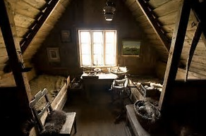
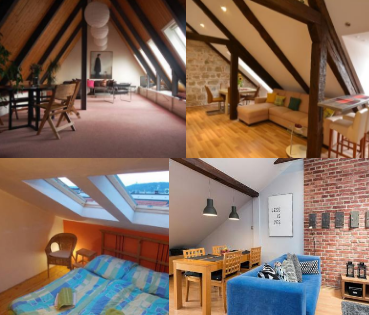
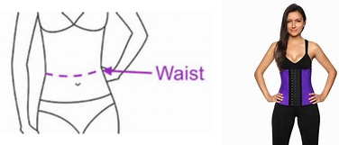
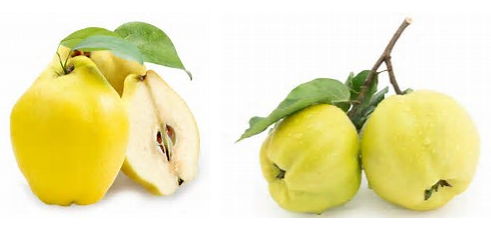

# 2017.12.04 DAY 5  #

> If we have our own why in life, we shall get along with almost any how.
> 如果我們能找到自己活著的理由，就幾乎能以任何方式活下去。

## 今日詞表 ##

1	

	foreground /ˈfɔːrɡraʊnd/
	n. 前景，最显著的位置

2	

	cunning /ˈkʌnɪŋ/
	n. 狡猾，精巧； adj. 狡猾的，精巧的

3	

	showcase /ˈʃoʊkeɪs/
	n. 陈列橱，展示； v. 在玻璃橱窗陈列，展示

4	

	crave /kreɪv/
	v. 渴望；恳求

5	

	meagre /ˈmiːɡər/
	adj. 瘦的；贫弱的；贫乏的

6	

	lumber /ˈlʌmbər/
	v. 伐木；杂乱地堆积；笨重地行动，缓慢地移动，隆隆地行进； n. 木材；废物，无用的杂物；隆隆声

7	

	emblem /ˈembləm/
	n. 象征；徽章；符号

8	

	deception /dɪˈsepʃn/
	n. 欺骗，诡计

9	

	palette /ˈpælət/
	n. 调色板，一套颜料

10	

	ferocious /fəˈroʊʃəs/
	adj. 凶猛的；强烈的，严重的

11	

	sidewalk /ˈsaɪdwɔːk/
	n. 人行道

## 今日閱讀 ##

Previous Story

年轻人在房间里思绪万千，突然一阵浓烈的木犀花香弥散着整个房间，他不觉一惊，这木犀花香就是他的爱人所特有的芬芳。于是他到处寻找爱人可能留下的痕迹，也再次询问了女房东却还是无果而终。最后，他信心殆尽，在他爱人曾经住过的房间里以同样的方式自杀了。接下来是一个多情的面包房女主人弄巧成拙的故事，一起来看看吧！

Chapter 5

Witches’ Loaves

Miss Martha Meacham kept the little **bakery** **on the corner** (the one where you go up three steps, and the bell **tinkles** when you open the door).

	bakery	英[ˈbeɪkəri]
	美[ˈbekəri]
	n.	面包房，面包店; 烘烤食品（面包、糕点等的总称）;
	[例句]A smell of bread drifted from some distant bakery.
	一阵面包的香味从远处的面包房飘来。

	on the corner
	英[ɔn ðə ˈkɔ:nə]
	美[ɑn ði ˈkɔrnɚ]
	[词典]	在转角处;
	[例句]He lit a cigarette and perched on the corner of the desk
	他点了一根烟，坐在桌角上。

	tinkle	英[ˈtɪŋkl]
	美[ˈtɪŋkəl]
	vt.	（使） 发出丁当声，（使）发铃铃声;
	vt.	叮当响着发出，铃铃响着报出;
	n.	丁当声，铃铃声; <英><口>一次电话;
	[例句]A fresh cascade of splintered glass tinkled to the floor
	大量刚裂开的玻璃碎片叮叮当当地落到地板上。

Miss Martha was forty, her **bank-book** showed a **credit** of two thousand dollars, and she possessed two false teeth and a **sympathetic** heart. Many people have married whose **chances** to do so were much inferior to Miss Martha’s.

	bank book	英[bæŋk buk]【lsieun】剛開始，我還以為是“賬本”，原來是“銀行存摺”的意思啊!!!
	美[bæŋk bʊk]
	[词典]	银行存折;
	[例句]Update my bank book please.
	请把我的存折更新一下。

	credit	英[ˈkredɪt]【lsieun】credit應當如何理解呢？
	美[ˈkrɛdɪt]
	n.	学分; 信誉，信用; [金融] 贷款; 荣誉;
	vt.	相信，信任; 归功于; [会] 记入贷方; 赞颂;
	[例句]The group can't get credit to buy farming machinery
	这些人无法赊购到农用机械。

	she possessed two false teeth and a sympathetic heart 【lsieun】說她有兩顆假牙是做什麽呢？

	sympathetic
	英[ˌsɪmpəˈθetɪk]
	美[ˌsɪmpəˈθɛtɪk]
	adj.	同情的，有同情心的; 赞同的; 相投合的，称心的; 〈口〉抱好感的;
	[例句]She was very sympathetic to the problems of adult students
	她对成年学生的问题深表同情。

	chance	英[tʃɑ:ns]【lsieun】本文中應該是“動詞”，表示“偶然發生”
	美[tʃæns]
	n.	机会，机遇; 概率，可能性; 偶然，运气;
	v.	偶然发生; 冒险; 碰巧; 偶然被发现;
	adj.	偶然的; 意外的; 碰巧的;
	[例句]Do you think they have a chance of beating Australia?
	你认为他们有可能击败澳大利亚吗？

Two or three times a week a customer came in in whom she began to take an interest. He was a middle-aged man, wearing spectacles and a brown beard trimmed to a careful point.

	spectacles	英['spektəklz] 【lsieun】這里是“眼鏡”的意思
	美['spektəkəlz]
	n.	眼镜; 壮观; 眼镜( spectacle的名词复数 ); 壮观的场面或景象; 可笑的事物;
	[例句]She took off her spectacles.
	她摘下了眼镜。

He spoke English with a strong German accent. His clothes were worn and **darned**(被缝补) in places, and **wrinkled** and **baggy** in others. But he looked neat, and had very good manners.

	darn	英[dɑ:n]
	美[dɑ:rn]
	vt.	织补; 缝补; 补缀;
	n.	织补之处; 补丁;
	[例句]Aunt Emilie darned old socks
	埃米莉姨妈织补旧袜子。

	wrinkled	英[ˈrɪŋkld]
	美[ˈrɪŋkl:d]
	adj.	有皱纹的;
	v.	使起皱纹( wrinkle的过去式和过去分词 ); （尤指皮肤） 起皱纹;
	[例句]Her stockings wrinkled at the ankles
	她的长筒袜在脚踝处起了褶儿。

	baggy	英[ˈbægi]
	美[ˈbæɡi]
	adj.	宽松下垂的; 袋状的;
	[例句]He was wearing a stripy shirt and baggy blue trousers.
	他身着一件条纹衬衫和一条宽松的蓝裤子。

He always bought two loaves of **stale** bread. Fresh bread was five cents a **loaf**. Stale ones were two for five. Never did he call for anything but stale bread.

	stale	英[steɪl]【lsieun】此處應該理解為“不新鮮的”
	美[stel]
	adj.	陈腐的; 不新鲜的; 走了味的;
	v.	变陈旧; 变得不新鲜; （牛马、骆驼等） 撒尿;
	n.	（牛马、骆驼的） 尿;
	[例句]Their daily diet consisted of a lump of stale bread, a bowl of rice and stale water.
	他们的日常饮食包括一块不新鲜的面包、一碗米饭和变味的水。

	loaf	英[ləʊf]
	美[loʊf]
	n.	一条（块）面包;
	v.	游荡; 游手好闲;
	[例句]Soldiers loafed at street corners.
	士兵们在街角逛荡。

Once Miss Martha saw a red and brown **stain** on his fingers. She was sure then that he was an artist and very poor. No doubt he lived in a **garret**(阁楼), where he painted pictures and ate stale bread and thought of the good things to eat in Miss Martha’s bakery.

	stain	英[steɪn]【lsieun】應該是“着色剂”
	美[sten]
	vi.	弄脏; 污染; 被玷污;
	vt.	玷污，染污; 败坏（名声）; 给…染色;
	n.	污点; 色斑; 瑕疵; 着色剂;
	[例句]Remove stains by soaking in a mild solution of bleach.
	用温和的漂白剂浸泡以去除污迹。

	garret	英[ˈgærət]
	美[ˈɡærɪt]
	n.	顶楼，阁楼;
	[例句]He should have gone up garret at once.
	他应该立即住进破旧的阁楼去才对。

Often when Miss Martha sat down to her **chops** and light rolls and jam and tea she would sigh, and wish that the gentle-mannered artist might share her tasty meal instead of eating his dry crust in that drafty(通风的) attic.

	chops	英[tʃɒps]
	美[tʃɒps]
	n.	印章; 摆簧夹; 剁( chop的名词复数 ); （海峡、港口） 入口; 掌劈;
	v.	砍，伐，劈( chop的第三人称单数 ); （大幅度地） 削减; 取消; 终止;
	[例句]Fry the chops until brown on both sides
	将排骨煎至两面呈棕黄色。

	rolls	英[rɒlz]
	美[rɒlz]
	n.	名册( roll的名词复数 ); 滚翻;
	v.	卷; （使） 打滚( roll的第三人称单数 ); （使） 转动; 把…卷成筒状;
	[例句]Place the frozen rolls on a greased baking tray.
	将冷冻的肉卷放到抹了油的烤盘上。

	jam	英[dʒæm]
	美[dʒæm]
	n.	果酱; 拥挤，挤满; 困境; [无线] 干扰;
	vt.	把…挤进; 把…塞满，使挤紧; 使堵塞; 使卡住;
	vi.	堵塞; 挤满，拥挤; 发生故障;
	[例句]He picked his cap up off the ground and jammed it on his head
	他从地上捡起帽子，猛地扣到头上。

	attic	英[ˈætɪk]
	美[ˈætɪk]
	n.	阁楼; 顶楼; 鼓室上的隐窝; 飞檐矮墙，飞檐矮楼;
	adj.	文雅的，古雅的; 古希腊阿蒂卡 [雅典]的; 雅典派的;
	[例句]I outfitted an attic bedroom as a studio.
	我把阁楼卧室改装成了工作室。

Miss Martha’s heart, as you have been told, was a sympathetic one.

In order to test her **theory** as to his **occupation**, she brought from her room one day a painting that she had bought at a sale, and set it against the shelves behind the bread counter.

	theory	英[ˈθɪəri] 【lsieun】習慣上把theory稱之為“理論”，其本質是“推測”的意思
	美[ˈθɪri]
	n.	理论; 原理; 学说; 推测;
	[例句]Marx produced a new theory about historical change based upon conflict between competing groups
	马克思创立了一种新理论，认为历史的演变是基于对立集团之间的冲突之上的。

	occupation	英[ˌɒkjuˈpeɪʃn]【lsieun】這里作為“職業”理解
	美[ˌɑ:kjuˈpeɪʃn]
	n.	职业，工作; 占有，占领; （土地、房屋、建筑等的） 使用;
	[例句]I suppose I was looking for an occupation which was going to be an adventure
	我想我在找的是一份具有冒险性的工作。

	counter	英[ˈkaʊntə(r)]【lsieun】此處應理解為“櫃檯”
	美[ˈkaʊntɚ]
	n.	计数器; 柜台; 对立面; （某些棋盘游戏的） 筹码;
	adj.	相反的;
	vt.	反击，还击; 反向移动，对着干; 反驳，回答;
	[例句]We were sitting on stools at the counter having coffee.
	我们坐在柜台边的凳子上喝着咖啡。

It was a Venetian(威尼斯的) scene. A **splendid** **marble** **palazzo**(宫殿) (so it said on the picture) stood in the foreground—or rather forewater. For the rest there were gondolas(平底船) (with the lady trailing her hand in the water), clouds, sky, and chiaroscuro(明确对比) in plenty. No artist could fail to notice it.

	splendid	英[ˈsplendɪd]
	美[ˈsplɛndɪd]
	adj.	壮观的，豪华的; 极好的或令人满意的; 闪亮的; 为众人所推崇的;
	[例句]The book includes a wealth of splendid photographs
	该书中有大量精彩的照片。

	marble	英[ˈmɑ:bl]
	美[ˈmɑ:rbl]
	n.	大理石; 大理石制品; 弹子游戏; 理智，常识;
	adj.	大理石的; 冷酷无情的; 有大理石花纹的;
	v.	把（书边）弄上大理石花纹;
	[例句]The house has a superb staircase made from oak and marble
	这座房子的楼梯堪称一流，是由橡木与大理石制成的。

	palazzo	英[pəˈlɑ:tsəu]
	美[pəˈlɑtso]
	n.	宫殿; （半正式场合穿的） 宽松的女式套装;
	[例句]Palazzo ( 2007) and comments on the political aspect of corporate social responsibility in the United States.
	的研究并评论了美国的公司社会责任的政治方面。

Two days afterward the customer came in.

“Two loafs of stale bread, if you blease.

“You haf(同have) here a fine bicture, madame,” he said while she was wrapping up the bread.

“Yes?” says Miss Martha, **reveling in**(陶醉于) her own **cunning**(狡黠).

	reveling in 
	陶醉在

	revel	英[ˈrevl]
	美[ˈrɛvəl]
	vi.	陶醉; 狂欢作乐; 扬扬得意;
	n.	狂欢，作乐; 喧闹的宴会或庆典;
	[例句]Revelling in her freedom, she took a hotel room and stayed for several days
	陶醉在自由中的她在宾馆开了一间房，住了几天。

	cunning	英[ˈkʌnɪŋ]
	美[ˈkʌnɪŋ]
	adj.	狡猾的; 灵巧的; 奸诈的;
	n.	狡猾; 狡黠; 诡诈;
	[例句]These disturbed kids can be cunning.
	这些心理不正常的孩子可能会很狡猾。

“I do so admire art and” (no, it would not do to say “artists” thus early) “and paintings,” she substituted.

“You think it is a good picture?” “Der( [德]这个 ) balance,” said the customer, “is not in good drawing.

Der bairspective( [德]透视法 ) of it is not true.

Goot morning, madame. ”

He took his bread, bowed, and hurried out.

Yes, he must be an artist. Miss Martha took the picture back to her room.

How gentle and kindly his eyes shone behind his spectacles! What a broad brow he had! To be able to judge perspective at a glance—and to live on stale bread! But genius often has to struggle before it is recognized.

	perspective	英[pəˈspektɪv]【lsieun】我理解應該為“透視畫法”
	美[pərˈspektɪv]
	n.	透镜，望远镜; 观点，看法; 远景，景色; 洞察力;
	adj.	（按照） 透视画法的; 透视的;
	[例句]He says the death of his father 18 months ago has given him a new perspective on life
	他说18个月前父亲的去世让他对人生有了新的认识。

What a thing it would be for art and perspective if genius were backed by two thousand dollars in the bank, a bakery, and a sympathetic heart to—But these were day-dreams, Miss Martha.

Often now when he came he would chat for a while across the showcase(货柜). He seemed to crave(渴望) Miss Martha’s cheerful words. 

He kept on buying stale bread. Never a cake, never a pie, never one of her delicious Sally Lunns.

	Sally Lunn	英[ˌsæli:ˈlʌn]
	美[ˌsæliˈlʌn]
	n.	萨利伦甜饼;

She thought he began to look thinner and discouraged. Her heart **ached** to add something good to eat to his **meager**(少量的) purchase, but her courage failed at the act. She did not dare affront him. She knew the pride of artists. 

	discouraged	英[dɪs'kʌrɪdʒd]
	美[dɪsˈkə:ɪdʒd]
	adj.	气馁的; 泄气的; 沮丧的; 灰心的;
	v.	劝阻; 使气馁( discourage的过去式和过去分词 ); 使沮丧; 阻碍;
	[例句]He is easily discouraged by difficulties and obstacles.
	他遇到困难和障碍很容易气馁。

	ached	
	v.	渴望( ache的过去式和过去分词 );
	[例句]My legs felt numb and my toes ached.
	我双腿麻木，脚趾疼痛。

	meager	英['mi:gə]
	美[ˈmiɡɚ]
	adj.	贫乏的; 瘦的; 粗劣的; 不足的;
	[例句]His meager allotment of gas had to be saved for emergencies.
	他分到的那一点点煤气必须留着急用。

	affront	英[əˈfrʌnt]
	美[əˈfrʌnt]
	n.	（当众） 侮辱，（故意）冒犯;
	vt.	冒犯; 面对; 公开侮辱; <古>相遇;
	[例句]It's an affront to human dignity to keep someone alive like this
	如此维持一个人的生命是对人类尊严的冒犯。

Miss Martha took to wearing her blue-dotted silk **waist** behind the counter. In the back room she cooked a mysterious compound of **quince** seeds and borax(硼砂). **Ever so** many people use it for the **complexion**. 

	waist	英[weɪst]【lsieun】這里應該理解為“（衣服的） 腰身”
	美[west]
	n.	腰，腰部; （衣服的） 腰身; 船腰; （女人，小孩子的） 背心;
	[例句]Ricky kept his arm round her waist
	里基一直揽着她的腰。

	quince	英[kwɪns]
	美[kwɪns]
	n.	温柏，温柏树;
	[例句]Pear trees are grafted on quince rootstocks.
	梨树被嫁接到榅的根茎上。

	ever so	英[ˈevə səʊ]
	美[ˈɛvɚ soʊ]
	[词典]	非常;
	[例句]I'm ever so grateful
	我太感激了。

	complexion	英[kəmˈplekʃn]【lsieun】大概是講，女為悅己者容吧
	美[kəmˈplɛkʃən]
	n.	肤色，面色，气色; 形式，局面;
	[例句]She had short brown hair and a pale complexion.
	她留着褐色短发，皮肤白皙。

One day the customer came in as usual, laid his **nickel** on the **showcase**, and called for his stale loaves. While Miss Martha was reaching for them there was a great tooting(嘟嘟响) and clanging(叮当声), and a fire-engine came **lumbering** past(缓慢经过).

	nickel	英[ˈnɪkl]
	美[ˈnɪkəl]
	n.	[化] 镍; 五分镍币;
	vt.	镀镍于;
	[例句]Nickel can be used for making coins.
	镍可做成钱币。

	showcase	英[ˈʃəʊkeɪs]
	美[ˈʃoʊkeɪs]
	n.	（商店或博物馆等的） 玻璃柜台，玻璃陈列柜; 显示优点的东西; <美俚>应接室;
	vt.	使展现; 在玻璃橱窗陈列;
	[例句]The festival remains a valuable showcase for new talent.
	音乐节一直是新秀展示才华的宝贵机会。

	lumbering	英[ˈlʌmbərɪŋ]
	美[ˈlʌmbərɪŋ]
	n.	伐木业;
	adj.	笨重的;
	[例句]He looked straight ahead and overtook a lumbering lorry.
	他眼睛直视前方，加速超过了前面一辆慢吞吞行进的大卡车。

The customer hurried to the door to look, as any one will. Suddenly inspired, Miss Martha seized the opportunity. 

On the bottom shelf behind the counter was a pound of fresh butter that the **dairyman** had left ten minutes before. With a bread-knife Miss Martha made a deep **slash** in each of the stale loaves, inserted a generous quantity of butter, and pressed the loaves tight again.

	dairyman	英[ˈdeərimən]
	美[ˈderimən]
	n.	乳品加工工人，乳牛场主，养乳牛者;
	[例句]''Tis years since I went to Conjuror Trendle's son in Egdon-years!'said the dairyman bitterly.
	“我没有见到爱敦荒原上的魔术师特伦德尔的儿子，已经有好多年啦！”奶牛场老板痛苦地说。

	slash	英[slæʃ]
	美[slæʃ]
	vt.	大幅削减; 挥砍; 鞭打; 严厉批评;
	vi.	猛砍; 严厉地批评;
	n.	斜线; 猛砍; 刀痕，伤痕; 沼泽低地;
	[例句]He came within two minutes of bleeding to death after slashing his wrists.
	若再晚两分钟割腕的他就会因失血过多而死。

When the customer turned once more she was **tying** the paper around them.

	tying	英['taɪɪŋ]
	美['taɪɪŋ]
	v.	（用线、绳等） 系( tie的现在分词 ); （在线、绳上） 打结; 连接; 将…系在…上;
	[例句]The search for other kinds of evidence tying him to trafficking has not produced a smoking gun.
	还没有找到其他能够证明他参与了毒品交易的确凿证据。

When he had gone, after an unusually pleasant little chat, Miss Martha smiled to herself, but not without a slight **fluttering** of the heart.

	fluttering	
	v.	飘动( flutter的现在分词 ); （心） 快速跳动; 振翼，拍翅膀;
	[例句]Her chiffon skirt was fluttering in the night breeze.
	她的雪纺裙在晚风中飘动着。

Had she been too bold? Would he take offence? But surely not. There was no language of **edibles**. Butter was no **emblem**(象征) of unmaidenly forwardness(冒失). 

	edibles	
	n.	食物; 可以吃的，可食用的( edible的名词复数 );
	[例句]This is because edibles such as snacks, cookies, food grains and fruits have always been associated with prosperity and happiness.
	因为食物如点心、饼干、粮食、和水果象征着繁荣和幸福。

	emblem	英[ˈembləm]
	美[ˈɛmbləm]
	n.	象征，标记; 纹章，徽章; 标记，典型; 〈古〉寓意画;
	vt.	象征; 用象征表示; 用图案（符号）表示;
	[例句]The eagle was an emblem of strength and courage.
	鹰是力量和勇气的象征。

	unmaidenly	英[ʌn'meɪdənlɪ]
	美[ʌn'mdeɪənlɪ]
	adj.	非少女（或处女）的，不适合少女（或处女）身份的;

	forwardness	英[ˈfɔ:wədnəs]
	美[ˈfɔ:rwərdnəs]
	n.	鲁莽; 提早; 提前; 冒失;
	[例句]He thereupon privately chide his wife for her forwardness in the matter.
	于是他私下责备他的妻子，因为她对这种事热心。

For a long time that day her mind **dwelt on**(老是想着) the subject. She imagined the scene when he should discover her little deception. 

He would lay down his brushes and palette(调色板). There would stand his easel(画架) with the picture he was painting in which the perspective was beyond criticism. 

He would prepare for his luncheon of dry bread and water. He would slice into a loaf—ah! 

	luncheon	英[ˈlʌntʃən]
	美[ˈlʌntʃən]
	n.	午餐; 午宴; 午餐会; 两餐之间吃的一点食物;
	[例句]Earlier this month, a luncheon for former UN staff was held in Vienna.
	本月早些时候在维也纳设午宴招待了前联合国工作人员。

Miss Martha blushed. Would he think of the hand that placed it there as he ate? Would he— 

The front door bell **jangled**(发出叮当声) viciously. Somebody was coming in, making a great deal of noise. 

	jangle	英[ˈdʒæŋgl]
	美[ˈdʒæŋɡəl]
	vi.	发出噪音; 发出刺耳的、金属质的声音;
	vt.	引发噪音; 引发出刺耳的、不和谐的声音; 激怒或刺激（人的神经）;
	n.	刺耳的、金属质的声音;
	[例句]Her bead necklaces and bracelets jangled as she walked
	她的珠子项链和手镯在她走动时叮当作响。

	viciously	英['vɪʃəslɪ]
	美['vɪʃəslɪ]
	adv.	邪恶地，敌意地;
	[例句]He sized me up viciously.
	他不怀好意地打量我。

Miss Martha hurried to the front. Two men were there. One was a young man smoking a pipe—a man she had never seen before. The other was her artist. 

His face was very red, his hat was on the back of his head, his hair was **wildly** **rumpled**(弄乱的). He clinched his two fists and shook them ferociously(凶恶地) at Miss Martha. At Miss Martha.

	wildly	英[ˈwaɪldli]
	美[ˈwaɪldlɪ]
	adv.	疯狂地; 粗暴地，野蛮地; 野生地; 失去控制地;
	[例句]Reports of his drinking have been wildly exaggerated
	有关他酗酒的报道极尽夸张。

	rumpled	
	v.	弄皱，使凌乱( rumple的过去式和过去分词 );
	[例句]I hurried to the tent and grabbed a few clean, if rumpled, clothes.
	我赶紧跑到帐篷里，抓起了几件虽然有些皱，但是很干净的衣服。

	clinch	英[klɪntʃ]
	美[klɪntʃ]
	vi.	（尤指两人） 互相紧紧抱[扭]住;
	vt.	<非正>解决（争端、交易），达成（协议）; 敲弯;
	n.	钳子，夹子; 敲弯;
	[例句]Hibernian clinched the First Division title when they beat Hamilton 2-0
	希伯尼安队以2比0战胜汉密尔顿队，夺得了甲级联赛的冠军。

“Dummkopf(笨蛋)!” he shouted with extreme loudness; and then “Tausendonfer(五雷轰顶的)!” or something like it, in German.

The young man tried to draw him away.

“I vill not go,” he said angrily, “else I shall told her.”

He made a **bass** **drum** of Miss Martha’s counter.

	bass	英[beɪs]
	美[beɪs]
	n.	低音歌唱家，低音乐器; [鱼] 欧洲鲈鱼; [植] 椴树，椴属树木，美洲椴木;
	adj.	低音的;
	[例句]They had a bass and a piano and a sax and percussion.
	他们有一把低音吉他、一架钢琴、一管萨克斯和打击乐器。

	drum	英[drʌm]
	美[drʌm]
	n.	鼓; 鼓声; 鼓状物; 石首鱼;
	vt.	击鼓; 连打; 反复讲; 鼓吹;
	vi.	击鼓; 连打; 拍翅;
	[例句]He had found a drum of electric cable.
	他发现了一卷电缆。

“You haf shpoilt me,” he cried, his blue eyes blazing behind his spectacles.

	blazing	英[ˈbleɪzɪŋ]
	adj.	炽热的; 酷热的; 极其愤怒的; 感情强烈的;
	v.	猛烈地燃烧( blaze的现在分词 ); 发光，照耀;
	[例句]Quite a few people were eating outside in the blazing sun.
	不少人在外面的炎炎烈日下吃饭。

“I vill tell you. You vas von meddingsome(爱管闲事的) old cat!” 

Miss Martha leaned weakly against the shelves and laid one hand on her blue-dotted silk waist. The young man took his companion by the collar.

	shelves	英[ʃelvz]
	美[ʃelvz]
	n.	架子; 架( shelf的名词复数 ); 棚; 沙洲; 暗礁;
	v.	将（书等）放置在架子上( shelve的第三人称单数 ); 将…搁在一边; （陆地） 逐渐倾斜;
	[例句]I worked stocking shelves in a grocery store
	我在一家杂货店工作，负责为货架上货。

	collar	英[ˈkɒlə(r)]
	美[ˈkɑ:lə(r)]
	n.	衣领; 领子; （狗等的） 项圈; （管子或机器部件的） 圈;
	vt.	抓住，逮住; 扭住领口; 拉用，扯用; 给…套上颈圈;
	[例句]His tie was pulled loose and his collar hung open.
	他的领带扯松了，领口也敞着。

“Come on,” he said, “you’ve said enough.”

He dragged the angry one out at the door to the **sidewalk**, and then came back.

	sidewalk	英[ˈsaɪdwɔ:k]
	美[ˈsaɪdˌwɔk]
	n.	人行道;
	[例句]Two men and a woman were walking briskly down the sidewalk toward him.
	两名男子和一名女子正轻快地沿人行道朝他走过去。

“Guess you ought to be told, ma’am,” he said, “what the **row** is about.

	row	英[rəʊ]【lsieun】這里應該是“吵闹”的意思
	美[roʊ]
	n.	划船; 行，排; 吵闹; 路，街;
	vt.	划船; 使…成排; 与…进行划船比赛; 〈口〉争吵，吵闹;
	[例句]Several men are pushing school desks and chairs into neat rows.
	几个人正挪动学校的桌椅，将它们排整齐。

That’s Blumberger.

He’s an **architectural** **draughtsman**.

	architectural
	英[ˌɑ:kɪˈtektʃərəl]
	美[ˌɑ:rkɪˈtektʃərəl]
	adj.	建筑学的; 建筑上的; 有关建筑的; 符合建筑法的;
	[例句]The palace is a complete hotch-potch of architectural styles.
	这座宫殿完全是各种建筑风格的大杂烩。

	draughtsman	英[ˈdrɑ:ftsmən]
	美[ˈdræftsmən]
	n.	国际象棋的棋子，起草人;
	[例句]This is a great drawing by one of the 19th century's finest draughtsmen.
	这幅恢宏画作出自一位19世纪最杰出的画家之手。

I work in the same office with him.

“He’s been working hard for three months drawing a plan for a new city hall.

It was a prize competition.

He finished inking the lines yesterday.

	inking	英[ɪŋkɪŋ]
	美[ɪŋkɪŋ]
	n.	着墨; 墨迹作图;
	[例句]I plan on inking the skateboard design and sticking it in my gallery.
	我计划在墨的滑板设计和坚持它在我的画廊。

You know, a draughtsman always makes his drawing in pencil first.

When it’s done he rubs out(擦去) the pencil lines with handfuls of stale breadcrumbs(面包屑).

That’s better than India rubber.

“Blumberger’s been buying the bread here.

Well, to-day—well, you know, ma’am, that butter isn’t—well, Blumberger’s plan isn’t good for anything now except to cut up into railroad sandwiches. ”

Miss Martha went into the back room. She took off the blue-dotted silk waist and put on the old brown serge(哔叽衣服) she used to wear. Then she poured the quince seed and borax mixture out of the window into the ash can(垃圾桶).

	serge	英[sɜ:dʒ]
	美[sɜ:rdʒ]
	n.	毛哔叽;哔叽（serge）是一个汉语词汇，读作bì jī，解释为用精梳毛纱织制的一种素色斜纹毛织物，光洁平整，纹路清晰，质地较厚而软，紧密适中，悬垂性好，以藏青色和黑色为多。
	vt.	粗缝的毛边，锁（毛边）;
	[例句]He wore a blue serge suit.
	他穿着一套蓝色哔叽西服。

>至此結束

