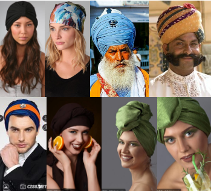
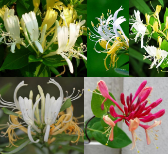
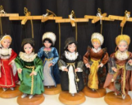
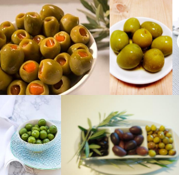

# 2017.12.05 DAY 6  #

> When one door of happiness closes, another opens; but often we look so long at the closed door that we do not see the one which has been opened for us.
> 當一扇幸福之門關上，會有另一扇門打開。但我們常常注視那扇關上的門太久，以至于看不見那扇已為我們開啟的門。

## 今日詞表 ##

1	

	piety /ˈpaɪəti/
	n. 虔诚，虔诚的行为或语言

2	

	pounce /paʊns/
	n. 猛扑，飞扑； vi. 猛扑，突然袭击； vt. 扑过去抓住

3	

	gallant /ˈɡælənt/
	adj. 勇敢的；（向女人）献殷勤的

4	

	complaisance /kəmˈpleɪzəns/
	n. 迁就，奉承，彬彬有礼

5	

	penitence /ˈpenɪtəns/
	n. 后悔，忏悔

6	

	humility /hjuːˈmɪləti/
	n. 谦逊，谦恭

7	

	inquisitive /ɪn'kwɪzətɪv/
	adj. 好奇的

8	

	surmise /sərˈmaɪz/
	v. 猜测，推测，认为； n. 推测，猜度

9	

	chauffeur /ʃoʊˈfɜːr/
	n. 司机； v. 开车运送，当汽车司机

10	

	candid /ˈkændɪd/
	adj. 坦白的；无偏见的；公正的；率直的

11	

	despicable /dɪˈspɪkəbl/
	adj. 可鄙的，卑劣的

12	

	monotony /məˈnɑːtəni/
	n. 单调乏味，无聊；无变化

13	

	gild /ɡɪld/
	v. 镀金

14	

	superfluous /suːˈpɜːrfluəs/
	adj. 多余的，过剩的；不必要的

15	
	
	tinkle /ˈtɪŋkl/
	v. 发叮当声； n. 叮当声

16	

	whim /wɪm/
	n. 一时的兴致，心血来潮，奇想，幻想

17	

	drone /droʊn/
	v. 嗡嗡地响； n. 单调的低音；雄蜂

18	

	mercenary /ˈmɜːrsəneri/
	n. 外国雇佣兵；唯利是图者； adj. 唯利是图的；雇佣的

19	

	bondage /ˈbɑːndɪdʒ/
	n. 奴役，束缚

20	

	stately /ˈsteɪtli/
	adj. 雄伟的；庄重的，庄严的； adv. 雄伟，壮观

21	

	stool /stuːl/
	n. 凳子；老根株；大便，粪便； vi. 发新枝

22	

	turf /tɜːrf/
	n. 草地，草皮； v. 覆草皮

23	

	picturesque /ˌpɪktʃəˈresk/
	adj. 似画的，生动的

24	

	irresolute /ɪˈrezəluːt/
	adj. 优柔寡断的；踌躇不定的

## 今日閱讀 ##

Previous Story

面包店的女主人爱上每天光顾店里的艺术家，某天，本是好心在艺术家的干面包里加了两大勺奶油，不想却彻底毁了艺术家的作品。本是自以为是的好心，换来啼笑皆非的结局。今日故事导读：Parkenstacker 在公园里邂逅了一位恬静美丽的姑娘。经过攀谈，得知姑娘出身显赫，厌倦了身份和财富的束缚，Parkenstacker则自称地位卑微。两人就此分别，却走向了截然相反的人生。

Chapter 6

While the Auto Waits

汽车等候时

	auto	英[ˈɔ:təʊ]
	美[ˈɔ:toʊ]
	n.	<美>汽车;
	vi.	乘汽车;
	[例句]Striking workers halted production at the auto plant yesterday
	罢工工人于昨日停止了汽车厂的生产。

**Promptly** at the beginning of **twilight**, came again to that quiet corner of that quiet, small park the girl in gray. She sat upon a bench and read a book, for there was yet to come a half hour in which print could be accomplished. 

	promptly	英[ˈprɒmptli]
	美[ˈprɑ:mptli]
	adv.	迅速地; 敏捷地; 立即地; 毫不迟疑;
	[例句]Sister Francesca entered the chapel, took her seat, and promptly fell asleep.
	弗朗西丝卡修女走进小教堂，坐下来，很快就睡着了。

	twilight	英[ˈtwaɪlaɪt] 【lsieun】這個詞應該是可以表示一天中的兩個時間：“黎明” 和 “黄昏”。
	美[ˈtwaɪˌlaɪt]
	n.	黎明，黄昏，暮光; 暮年，晚期，晚年; 衰退期，没落时期; <电影>暮光之城;
	[例句]They returned at twilight, and set off for one of the promenade bars.
	他们黄昏时分回来，然后去了一家步行街酒吧。

	there was yet to come a half hour in which print could be accomplished 這是什麽意思呢？

To repeat: Her dress was gray, and plain enough to mask its **impeccancy**(完美) of style and fit. A large-**meshed** **veil** imprisoned her **turban** hat and a face that shone through it with a calm and **unconscious** beauty. She had come there at the same hour on the day previous, and on the day before that; and there was one who knew it. 

	peccancy	英['pekənsɪ]
	美['pekənsɪ]
	n.	犯罪，罪行，违章;
	[例句]The method of vehicle peccancy surveillance is usually achieved through inductor buried in the ground or axle sensor.
	传统的对交通违章车辆监控是通过埋在地下的感应器或车轴传感器实现的。

	meshed	
	[词典]	有孔的，有孔眼的，啮合的;
	[例句]Their senses of humor meshed perfectly
	他们的幽默感配合得天衣无缝。

	veil	英[veɪl]
	美[vel]
	n.	面纱; 掩饰; 覆盖物; 托词;
	vt.	用面纱遮盖; 掩饰; 用帷幕分隔; 隐匿;
	[例句]She's got long fair hair but she's got a veil over it
	她有一头金色的长发，但她用头巾包住了。

	turban	英[ˈtɜ:bən][lsieun]這里應當是“（妇女的） 无檐帽”
	美[ˈtɜ:rbən]
	n.	长头巾; （伊斯兰教徒的） 包头巾; 女用头巾; （妇女的） 无檐帽;
	[例句]His head was covered with a khaki turban.
	他头上包着卡其布的穆斯林头巾。

	unconscious	英[ʌnˈkɒnʃəs]【lsieun】我之前只以為是“無意識的”，今天才知道這個詞可以用作“不自覺的、不受意識控制的”。兩者的區別是，前者是沒有，后者是不受控制的。
	美[ʌnˈkɑ:nʃəs]
	adj.	失去知觉的，无意识的; 无意的，不自觉的; 不知道的; 不受意识控制的;
	n.	[心] 无意识;
	[例句]By the time ambulancemen arrived he was unconscious
	救护人员到达时他已经不省人事了。

The young man who knew it **hovered** near, relying upon **burnt** sacrifices to the great joss, Luck. His piety(虔诚) was rewarded, for, in turning a page, her book slipped from her fingers and bounded from the bench a full yard away. 

	hover	英[ˈhɒvə(r)]【lsieun】在空中，用詞為“盘旋”；在地上，用詞“徘徊”
	美[ˈhʌvər]
	vi.	盘旋; 徘徊; 犹豫;
	n.	盘旋; 徘徊;
	[例句]Beautiful butterflies hovered above the wild flowers
	美丽的蝴蝶在野花上方飞舞。

	burnt	英[bɜ:nt] 【lsieun】 這個詞不是特別理解
	美[bɜ:rnt]
	adj.	烧伤的; 烧坏的; 烫伤的; 灼伤的;
	v.	烧毁; 烧坏; （使） 燃烧( burn的过去式和过去分词 ); 使用某物为燃料;
	[例句]I burnt the toast
	我把面包烤糊了。

	joss	英[dʒɒs]【lsieun】噢，原來有“偶像”的意思呀！！！
	美[dʒɒs]
	n.	（中国的） 偶像，神像，佛像;
	[例句]A joss stick spiralled smoke.
	一柱线香青烟袅袅。

The young man **pounced** upon it with instant **avidity**, returning it to its owner with that air that seems to flourish in parks and public places—a compound of **gallantry**(殷勤) and hope, **tempered** with respect for the policeman **on the beat**. In a pleasant voice, he risked an **inconsequent** **remark** upon the weather—that introductory topic responsible for so much of the world’s unhappiness—and stood poised for a moment, awaiting his fate.

	pounced	在本文中，應該理解為“猛扑了過去”，因為可能是為了獻殷勤
	v.	猛扑; 突然袭击( pounce的过去式和过去分词 ); 一眼看出; 抓住机会（进行抨击）;
	[例句]Before I could get the pigeon the cat pounced.
	未等我逮到鸽子，猫就猛扑了上去。

	avidity	英[ə'vɪdətɪ] 可能是理解為“渴望”
	美[ə'vɪdətɪ]
	n.	渴望，贪婪; （抗体与抗原的） 亲合力;
	[例句]Philosophers have an avidity to know how we perceive objects.
	哲学家渴望明了人类如何领悟事物之问题。

	with that air that seems to flourish 不是特別理解

	gallantry	英[ˈgæləntri]
	美[ˈɡæləntri]
	n.	勇敢; （对女子的） 殷勤; 礼貌的言行;
	[例句]For his gallantry he was awarded a Victoria Cross.
	他因为表现英勇而荣获维多利亚十字勋章。

	gallant	英[ˈgælənt]
	美[ˈɡælənt]
	adj.	勇敢的; 壮丽的; 堂皇的; （对女子） 献殷勤的;
	n.	时髦的青年男子; 对妇女献殷勤的男人; 情人;
	v.	向（女子）献殷勤;
	[例句]The gallant soldiers lost their lives so that peace might reign again.
	英勇的战士们为恢复和平献出了生命。

	temper	英[ˈtempə(r)] 這里應該理解為“调和”
	美[ˈtɛmpɚ]
	n.	性情，脾气; 特征; （钢等） 回火; 怒气;
	vt.	锻炼; 调和; 使回火; 缓和;
	vi.	使调和;
	[例句]He had a temper and could be nasty
	他脾气不大好，有时凶得很。

	on the beat	英[ɔn ðə bi:t] 應該是理解為“正在巡邏的”
	美[ɑn ði bit]
	adv.	合拍;
	[例句]These days, the bobby on the beat is a rare sight.
	现在很少能看到巡逻的警察。

	inconsequent
	英[ɪn'kɒnsɪkwənt]
	美[ɪn'kɒnsəˌkwent]
	adj.	不一致的;
	[例句]But this is inconsequent and very dangerous I think.
	但这不重要，而且十分危险。

	remark	英[rɪˈmɑ:k] 這里應該是“談論”
	美[rɪˈmɑ:rk]
	n.	话语; 注意，观察; 评论，谈论，;
	vt.	评论; 觉察;
	[例句]I remarked that I would go shopping that afternoon
	我说过我那天下午要去购物。

	poised	英[pɔɪzd]
	美[pɔɪzd]
	adj.	沉着的，镇定的; 保持平衡的，均衡的; 静止不动的; 悬空的;
	[例句]He studied the keyboard carefully, one finger poised.
	他仔细研究了键盘，一个手指随时准备敲击。

The girl looked him over **leisurely**; at his ordinary, neat dress and his features distinguished by nothing particular in the way of expression.

	leisurely	英[ˈleʒəli]
	美[ˈli:ʒərli]
	adj.	悠闲的; 从容的，不慌不忙的;
	adv.	从容不迫地，慢慢地，悠闲地;
	[例句]Lunch was a leisurely affair
	午饭吃得很悠闲。

“You may sit down, if you like,” she said, in a full, deliberate contralto(女低音).

“Really, I would like to have you do so.

The light is too bad for reading.

I would prefer to talk. ”

The vassal(附属物) of Luck **slid** upon the seat by her side with **complaisance**(殷勤).

	vassal	英[ˈvæsl] 本文中應該是指“男主人公”
	美[ˈvæsəl]
	n.	奴仆; <史>（封建时代）诸侯; 从属者; 下属;
	adj.	附庸的; 奴仆的; 奴隶的; 臣的;
	[例句]Opponents of the treaty argue that monetary union will turn France into a vassal of Germany.
	协定的反对者认为货币联盟会使法国沦为德国的附庸国。

	slid	英[slɪd]
	美[slɪd]
	v.	滑落; 下跌; 滑动，滑行( slide的过去式和过去分词 ); 打滑;
	[例句]I slid into a depression.
	我逐渐消沉了。

	complaisance
	英[kəm'pleɪzəns]
	美[kəmˈplesəns, -zəns]
	n.	讨好，殷勤;
	[例句]He is indeed& but considering the inducement, my dear Miss Eliza, we cannot wonder at his complaisance; for who would object to such a partner?
	他真的太客气了&可是，亲爱的伊丽莎小姐，看他这样求你，你总还会怪他多礼吧。谁不想要象你这样的一个舞伴？

“Do you know,” he said, speaking the **formula** with which park chairmen open their meetings, “that you are quite the stunningest girl I have seen in a long time? I had my eye on you yesterday.

	formula	英[ˈfɔ:mjələ] 我覺得formula理解為“客套話”和“方案”都行，都是屬於開啟“談話”的策略。
	美[ˈfɔ:rmjələ]
	n.	公式，准则; 客套话; 方案; 婴儿食品;
	[例句]It is difficult to imagine how the North and South could ever agree on a formula to unify the divided peninsula.
	很难想象南北双方在统一半岛的方案上究竟怎样才能达成一致。

Didn’t know somebody was **bowled over**(使印象深刻) by those pretty **lamps** of yours, did you, **honeysuckle**(忍冬花)?”

	bowled	
	vi.	参加保龄球赛（bowl的过去式与过去分词形式）;
	[例句]Like any tourist, I was bowled over by India.
	跟所有其他游客一样，我被印度深深吸引了。

	lamp	英[læmp] 為什麽會有“燈”呢？
	美[læmp]
	n.	灯; 发热灯，照射灯;
	[例句]She switched on the bedside lamp
	她打开床头灯。

	honeysuckle	英[ˈhʌnisʌkl] 金银花的花语:作为白羊座的守护花，金银花有鸳鸯成对、厚道之意。此外，金银花代表诚实的爱、奉献的爱、不变的爱和真爱。
	美[ˈhʌniˌsʌkəl]
	n.	忍冬，金银花;
	[例句]In my garden there are roses and two kinds of honeysuckle.
	在我的花园里有玫瑰和两种金银花。

“Whoever you are,” said the girl, in icy tones, “you must remember that I am a lady.

	icy	英[ˈaɪsi] 應該理解為“冷冰冰的，不友好的”
	美[ˈaɪsi]
	adj.	结冰的; 寒冷的，冰冷的; 冷冰冰的，不友好的;
	[例句]An icy wind blew hard across the open spaces
	刺骨的寒风于开阔处呼啸着。

I will **excuse** the remark you have just made because the mistake was, doubtless, not an unnatural one—in your circle.

	excuse	英[ɪkˈskju:s] 本文中為“原諒”
	美[ɪkˈskjuz]
	vt.	原谅; 为…申辩; 免除，宽免; 给…免去;
	n.	辩解; 借口，托辞; 道歉，歉意; 请假条;
	vi.	作为借口; 请示宽恕; 表示宽恕;
	[例句]It is easy to find excuses for his indecisiveness
	为他的犹豫不决寻找借口是很容易的。

I asked you to sit down; if the invitation must **constitute** me your honeysuckle, consider it **withdrawn**. ”

	constitute	英[ˈkɒnstɪtju:t] 本文中應為“等同于”
	美[ˈkɑ:nstətu:t]
	vt.	构成，组成; 制定，设立; 等同于; 指派;
	[例句]Testing patients without their consent would constitute a professional and legal offence
	未经患者同意而对其进行检查被视为违反职业操守并触犯法律。

	withdrawn	英[wɪðˈdrɔ:n] 應該理解為“請考慮收回你剛才的話”
	美[wɪðˈdrɔn, wɪθ-]
	adj.	孤僻的，离群的; 偏僻的;
	v.	取回，收回( withdraw的过去分词);
	[例句]Her husband had become withdrawn and moody.
	她丈夫变得沉默寡言、喜怒无常。

“I earnestly beg your pardon,” pleaded the young man.

His expression of satisfaction had changed to one of **penitence**(忏悔) and humility(谦卑).

	penitence	英[ˈpenɪtəns]
	美[ˈpɛnɪtəns]
	n.	悔过; 忏悔，赎罪;
	[例句]The thief expressed penitence for all his past actions.
	那盗贼对他犯过的一切罪恶表示忏悔。

“It was my fault, you know—I mean, there are girls in parks, you know—that is, of course, you don’t know, but—”

“Abandon the subject, if you please.

Of course I know.

Now, tell me about these people passing and crowding, each way, along these paths.

Where are they going? Why do they hurry so? Are they happy?”

The young man had **promptly** abandoned his **air** of **coquetry**(调情). His **cue** was now for a waiting part; he could not guess the role he would be expected to play.

	promptly	英[ˈprɒmptli]
	美[ˈprɑ:mptli]
	adv.	迅速地; 敏捷地; 立即地; 毫不迟疑;
	[例句]Sister Francesca entered the chapel, took her seat, and promptly fell asleep.
	弗朗西丝卡修女走进小教堂，坐下来，很快就睡着了。

	air	英[eə(r)]應該理解為“氣氛”
	美[er]
	n.	空运; 天空; 气氛; （简单易记的） 曲调;
	vt.	晾晒; 烘干; 播送; 广播;
	vt.	使房间通风， 透气;
	[例句]Draughts help to circulate air
	穿堂风有助于空气流通。

	coquetry	英[ˈkɒkɪtri]
	美[ˈkoʊkɪtri]
	n.	卖弄风情，卖俏，媚态;
	[例句]Her coquetry general reduction of the shrunken neck, depending on a man's shoulders.
	她撒娇一般地缩了缩脖子，依在了男人的肩上。

	cue	英[kju:] 應該理解為“情绪，心情”
	美[kju]
	n.	线索; 暗示，提示; [台] 球杆; 情绪，心情;
	vt.	把…插入演出; 给…暗示;
	[例句]The actors not performing sit at the side of the stage in full view, waiting for their cues
	还未轮到演出的演员坐在舞台旁边能看得一清二楚的地方，等待着他们的出场提示。

	he could not guess the role he would be expected to play. 這句話，讓我想到，在面對一個事情時，其實每個人都在扮演一個角色，只是有沒有主動意識到而已。

“It is interesting to watch them,” he replied, postulating her mood.

	postulating	
	v.	假定，假设( postulate的现在分词 );
	[例句]Newton is postulating this weird force between bodies.
	牛顿假设物体间存在着一个非常奇怪的力。

“It is the wonderful **drama** of life.

	drama	英[ˈdrɑ:mə]
	美[ˈdrɑmə, ˈdræmə]
	n.	戏剧，剧本; 戏剧效果; 戏剧文学[艺术]; 戏剧性事件[场面];
	[例句]He acted in radio dramas.
	他在广播剧中扮演角色。

Some are going to **supper** and some to—er—other places.

	supper	英[ˈsʌpə(r)] 剛開始，我理解成了super（超級）和upper（上層社會）的意思
	美[ˈsʌpɚ]
	n.	晚饭，晚餐; 夜点心; 晚餐会;
	[例句]Some guests like to dress for supper.
	一些客人喜欢穿礼服去赴晚宴。

One wonders what their histories are. ”

“I do not,” said the girl; “I am not so **inquisitive**(过分打听他人私事的).

	inquisitive	英[ɪnˈkwɪzətɪv]
	美[ɪnˈkwɪzɪtɪv]
	adj.	好问的，好奇的; 爱打听的;
	n.	好询问的人; 爱打听别人事情的人;
	[例句]Barrow had an inquisitive nature
	巴罗天生就爱打听别人隐私。

I come here to sit because here, only, can I be near the great, common, throbbing(悸动的) heart of humanity.

	throbbing	英[θrɒbɪŋ]
	美[θrɒbɪŋ]
	adj.	悸动的; 跳动的; 抽动的; <医> 搏动的;
	v.	抽痛( throb的现在分词 ); （心脏、脉搏等） 跳动;
	[例句]Her head was throbbing and she ached all over
	她的脑袋嗡嗡作响并且浑身疼痛。

My part in life is cast where its beats are never felt.

	cast	英[kɑ:st] 難道是當“演員”來理解嗎？
	美[kæst]
	vt.	铸造; 投射; 投掷; 脱落，脱皮;
	n.	铸型; 演员表; 轻微的斜视; 投，掷骰;
	vi.	掷，投; 计算，加;
	[例句]The show is very amusing and the cast are very good.
	演出妙趣横生，演员的表演也很出彩。

Can you **surmise**(猜测) why I spoke to you, Mr.—?”

	surmise	英[səˈmaɪz]
	美[sərˈmaɪz]
	n.	推测，猜测;
	vt.	揣测; 臆测，推断;
	vi.	猜想;
	[例句]There's so little to go on, we can only surmise what happened
	几乎毫无凭据，我们只能猜测发生了什么。

“Parkenstacker,” supplied the young man.

Then he looked eager and hopeful.

“No,” said the girl, holding up a **slender** finger, and smiling slightly.

	slender	英[ˈslendə(r)]
	美[ˈslɛndɚ]
	adj.	苗条的; 微薄的; 柔弱的;
	[例句]She was slender, with delicate wrists and ankles.
	她身量苗条，手腕和脚踝曲线玲珑。

“You would recognize it immediately.

It is impossible to keep one’s name **out of print**.

	out of print	英[aut ɔv print] 她說這些話是要做什麽呢？
	美[aʊt ʌv prɪnt]
	[词典]	绝版的;
	[例句]I believe the book is now out of print, but it can easily be borrowed from libraries.
	我想这本书现在已经停印了，但从图书馆很容易借到。

Or even one’s **portrait**.

	portrait	英[ˈpɔ:treɪt]
	美[ˈpɔ:rtrət]
	n.	肖像，肖像画; 模型，标本; 半身雕塑像; 人物描写;
	[例句]Lucian Freud has been asked to paint a portrait of the Queen.
	卢西恩·弗洛伊德已受邀为女王画肖像画。

This veil and this hat of my **maid** furnish me with an incog(化装出行的女人).

	maid	英[meɪd] 應該是“女仆，侍女”的意思
	美[med]
	n.	少女; 女仆，侍女; 处女，未婚女子;
	[例句]A maid brought me breakfast at half past eight.
	8点半女佣给我送来了早餐。

	incog	英[ɪn'kɒg]
	美[ɪn'kɒg]
	n.	隐姓埋名者，微行，用化名的微行者;
	adj.	隐姓埋名的;

You should have seen the **chauffeur**(司机) stare at it when he thought I did not see.

	chauffeur	英[ˈʃəʊfə(r)]
	美[ʃoʊˈfɜ:r]
	n.	受雇于人的汽车司机;
	vt.	开车运送; 作（别人）司机;
	vi.	为别人当汽车司机;
	[例句]It was certainly useful to have her there to chauffeur him around
	有她在那儿还是挺有用的，能开车带他到处跑。

**Candidly**(说实话), there are five or six names that belong in the holy of holies, and mine, by the accident of birth, is one of them.

	candidly	英['kændɪdlɪ]
	美['kændɪdlɪ]
	adv.	坦白地; 率直地; 耿直地; 自然地;
	[例句]He tends to speak candidly.
	他说话喜欢开门见山。

I spoke to you, Mr. Stackenpot—”

“Parkenstacker,” corrected the young man, modestly.

“—Mr. Parkenstacker, because I wanted to talk, for once, with a natural man—one unspoiled by the despicable(可鄙的) gloss of wealth and supposed social superiority.

	gloss	英[glɒs]
	美[glɔ:s]
	n.	光彩，光泽，光滑; 注释，注解; 假象;
	vt.	发光，给…加光泽; 注释，注解; 掩饰（错误）;
	[例句]Rain produced a black gloss on the asphalt.
	雨后的柏油路面显得黑亮黑亮的。

Oh! You do not know how weary I am of it—money, money, money! And of the men who surround me, dancing like little **marionettes**(牵线木偶) all cut by the same pattern.

	marionettes	
	网络	活动木偶;
	[例句]One who entertains with and operates puppets or marionettes. Suddenly, the puppet's head began to laugh.
	演布袋戏的人欣赏或演木偶或牵线木偶的人突然间，木偶笑了起来。

I am sick of pleasure, of jewels, of travel, of society, of luxuries of all kinds. ”

“I always had an idea,” **venture**d the young man, **hesitatingly**, “that money must be a pretty good thing.”

	venture	英[ˈventʃə(r)]
	美[ˈvɛntʃɚ]
	n.	冒险; 冒险事业; 冒险行动; 商业冒险;
	vt.	冒…的危险; 拿…冒险; 用…进行投机; 以…做赌注;
	vi.	冒险前进，冒险行事; 猜测（常与at连用）;
	[例句]People are afraid to venture out for fear of sniper attacks
	由于害怕狙击手，人们不敢冒险外出。

	hesitatingly
	英['hezɪteɪtɪŋlɪ]
	美['hezəˌteɪtɪŋlɪ]
	adv.	支吾其词地，踌躇地;
	[例句]Amber: ( hesitatingly) Oh, I'm not too old, but I'm over eighteen.
	（犹豫了一下）哦，我还不算太老，但是也过了18岁了。

“A **competence** is to be desired.

	competence	英[ˈkɒmpɪtəns]
	美[ˈkɑ:mpɪtəns]
	n.	能力; 技能; 相当的资产;
	[例句]His competence as an economist had been reinforced by his successful fight against inflation
	成功地扼制制通货膨胀的经历加强了他作为经济学家的才能。

But when you have so many millions that—!” She concluded the sentence with a gesture of despair.

“It is the monotony(单调乏味) of it” she continued, “that **palls**(使人厌倦).

	palls	意思應該是“（因过多或过久而） 生厌，感到乏味，厌烦”
	n.	棺罩; 柩衣( pall的名词复数 ); 墓衣; 深色或厚重的覆盖物;
	v.	（因过多或过久而） 生厌，感到乏味，厌烦( pall的第三人称单数 );
	[例句]Two towns shall he cover with funeral palls and to virgins he will present virgin gifts.
	他会在两个城镇覆盖上，他会给予处女童贞般的礼物。

Drives, dinners, theaters, balls, suppers, with the **gilding**(镀金) of superfluous(过多的) wealth over it all.

	gilding	英[ˈgɪldɪŋ]
	美[ˈɡɪldɪŋ]
	n.	贴金箔，镀金;
	v.	把…镀金( gild的现在分词 ); 给…上金色; 作多余的修饰（反而破坏原已完美的东西）; 画蛇添足;
	[例句]The gilding is extremely lavish.
	这层镀金极为奢华。

Sometimes the very **tinkle** of the ice in my **champagne** glass nearly drives me mad. ”

	tinkle	英[ˈtɪŋkl]
	美[ˈtɪŋkəl]
	vt.	（使） 发出丁当声，（使）发铃铃声;
	vt.	叮当响着发出，铃铃响着报出;
	n.	丁当声，铃铃声; <英><口>一次电话;
	[例句]A fresh cascade of splintered glass tinkled to the floor
	大量刚裂开的玻璃碎片叮叮当当地落到地板上。

	champagne	英[ʃæmˈpeɪn]
	美[ʃæmˈpen]
	n.	香槟酒; 香槟酒色; 平原; 平野;
	[例句]We had a nice meal with a bottle of champagne.
	我们美餐了一顿，还喝了一瓶香槟。

Mr. Parkenstacker looked **ingenuously** interested.

	ingenuously	英[ɪn'dʒenjʊəslɪ]
	美[ɪn'dʒenjʊrslɪ]
	adv.	率直地，正直地;
	[例句]Despite the evidence, she still ingenuously believes that her husband was never unfaithful to her.
	尽管有证据，她仍然单纯地相信她的丈夫从未对她不忠实。

“I have always liked,” he said, “to read and hear about the ways of wealthy and fashionable folks.

I suppose I am a bit of a **snob**.

	snob	英[snɒb]
	美[snɑ:b]
	n.	势利小人，势利眼; 附庸风雅之徒，假内行;
	[例句]Going to a private school had made her a snob
	上私立学校后，她变得很势利。

But I like to have my information accurate.

Now, I had formed the opinion that champagne is cooled in the bottle and not by placing ice in the glass. ”

The girl gave a **musical** laugh of genuine amusement.

	musical	英[ˈmju:zɪkl]
	美[ˈmju:zɪkl]
	adj.	悦耳的; 音乐的，用于音乐的; 喜爱[精通]音乐的; 音调优美的;
	n.	（社交性的） 音乐会; [影视] 歌舞片; 音乐（喜）剧 = musical comedy;
	[例句]We have a wealth of musical talent in this region
	在这一地区有大量的音乐人才。

“You should know,” she explained, in an **indulgent** tone, “that we of the non-useful class depend for our amusement upon departure from precedent.

	indulgent	英[ɪnˈdʌldʒənt]
	美[ɪnˈdʌldʒənt]
	adj.	宽容的; 任性的; 放纵的，纵容的;
	[例句]His indulgent mother was willing to let him do anything he wanted.
	他母亲很溺爱他，任由他想干什么就干什么。

Just now it is a **fad** to put ice in champagne.

	fad	英[fæd]
	美[fæd]
	n.	一时的流行; 一时的风尚; 一时的怪念头;
	abbr.	[生化] (=flavin adenine dinucleotide) 黄素腺嘌呤二核苷酸;
	[例句]Hamnett does not believe environmental concern is a passing fad.
	哈姆内特不相信对环境的关注是昙花一现。

The idea was originated by a visiting Prince of **Tartary** while dining at the Waldorf.

	Tartary	英[ˈtɑ:təri]
	美[ˈtɑrtəri]
	n.	鞑靼地方（指中世纪时受蒙古人统治的自东欧至亚洲的广大地区）;
	[例句]Pot-culture experiment was conducted to nutritional evaluation of protein in tartary buckwheat grain and its response to selenium.
	采用盆栽实验研究苦荞籽粒蛋白质营养评价对硒的响应。

	Waldorf	
	[词典]	[人名] 沃尔多夫; [地名] [美国] 沃尔多夫; [地名] [德国] 瓦尔多夫;
	[例句]So the next time you forget you "re Blair Waldorf".
	如果下次你忘了你是布莱尔·霍道夫。

It will soon give way to some other whim(一时兴致).

Just as at a dinner party this week on Madison Avenue a green kid glove was laid by the plate of each guest to be put on and used while eating **olives**. ”

	olives	英['ɒlɪvz]
	美['ɒlɪvz]
	n.	橄榄树; 油橄榄; 橄榄( olive的名词复数 ); 橄榄色;
	[例句]Every square metre of soil was used, mainly for olives, vines, and almonds.
	每一寸土地都利用上了，主要用来种植橄榄树、葡萄藤和杏树。

“I see,” admitted the young man, humbly.

“These special diversions of the inner circle do not become familiar to the common public.”

“Sometimes,” continued the girl, acknowledging his confession of error by a slight **bow**, “I have thought that if I ever should love a man, it would be one of lowly station.

	bow	英[bəʊ]
	美[boʊ]
	n.	弓; 鞠躬; 船头; 艏;
	vi.	（向…） 弯腰，鞠躬;
	vt.	低头; 俯首; 垂首; （使） 弯曲;
	[例句]They bowed low to Louis and hastened out of his way
	他们向路易斯深深鞠躬，并忙不迭地给他让道。

One who is a worker and not a drone(游手好闲者).

	drone	英[drəʊn]
	美[droʊn]
	n.	雄蜂; 无人驾驶飞机; 嗡嗡声; 持续低音;
	v.	嗡嗡叫; 嗡嗡响; 絮絮叨叨地说;
	[例句]Above him an invisible plane droned through the night sky.
	在他头顶上一架隐形飞机嗡嗡地飞过夜空。

But, doubtless, the **claims** of **caste** and wealth will prove stronger than my **inclination**.

	claims	
	n.	主张; （根据权利而提出的） 要求( claim的名词复数 ); （尤指向公司、政府等） （根据保险政策、赔偿法等）要求的付款; 所要求的东西;
	v.	声称; 要求（应得权利）( claim的第三人称单数 ); 需要; 夺走;
	[例句]She claims he ratted on their divorce settlement.
	她声称他违反了他们的离婚协议。

	caste	英[kɑ:st]
	美[kæst]
	n.	（印度社会中的） 种姓; 印度的世袭阶级; 等级（制度）;
	[例句]Most of the upper castes worship the Goddess Kali.
	印度上层种姓多数崇拜女神时母。

	inclination
	英[ˌɪnklɪˈneɪʃn]
	美[ˌɪn.klɪˈneɪ.ʃən]
	n.	倾向; 爱好; 斜坡;
	[例句]He had neither the time nor the inclination to think of other things
	他没有时间也不愿意去考虑其他事情。

Just now I am **besieged** by two.

	besieged	英[bɪ'sɪdʒd]
	美[bɪ'sɪdʒd]
	v.	包围，围困，围攻( besiege的过去式和过去分词 );
	[例句]The enemy were besieged by us.
	敌军被我们包围了。

One is a Grand Duke of a German principality(侯国).

I think he has, or has had, a wife, somewhere, driven mad by his **intemperance**(放纵) and **cruelty**.

	intemperance	英[ɪn'tempərəns]
	美[ɪn'tempərəns]
	n.	放纵;
	[例句]He thought of her serenity as a foil for his intemperance
	在他看来，她的平静反衬出了他的放纵。

	cruelty	英[ˈkru:əlti]
	美[ˈkruəlti]
	n.	残忍; 虐待; 残忍的行为; 残酷行为;
	[例句]He had been unable to escape the cruelties of war.
	他没能逃脱战争的残酷。

The other is an English Marquis, so cold and **mercenary**(唯利是图的) that I even prefer the **diabolism**(恶魔般的行径) of the Duke.

	mercenary	英[ˈmɜ:sənəri]
	美[ˈmɜ:rsəneri]
	adj.	雇用的; 图利的，唯利是图的;
	n.	雇佣兵; 唯利是图者;
	[例句]They suggest that my motives for proposing reform are self-serving and mercenary.
	他们暗示说我之所以提议改革是贪图金钱，想谋取私利。

	diabolism	英[daɪ'æbəlɪzəm]
	美[daɪ'æbəlɪzəm]
	n.	魔道; 魔法，恶魔般的行径;
	[例句]Diabolism has a very long history in the West, and its origin can be traced back to ancient Greek mythology and ancient Hebrew Bible.
	恶魔主题在西方由来已久，其源头可以上溯到古希腊神话和古希伯来圣经神话中的恶神。

What is it that impels(驱使) me to tell you these things, Mr. Packenstacker?”

“Parkenstacker,” breathed the young man.

“Indeed, you cannot know how much I appreciate your confidences.”

	how much I appreciate your confidences可能這說出了心里話吧

The girl contemplated him with the calm, **impersonal**(冷淡的) **regard** that befitted the difference in their stations.

	contemplated 這里應該理解為“注视，凝视”
	英['kɒntəmpleɪtɪd]
	美['kɒntəmpleɪtɪd]
	v.	深思，细想，仔细考虑( contemplate的过去式 ); 注视，凝视; 考虑接受（发生某事的可能性）; 深思熟虑，沉思，苦思冥想;
	[例句]As he lay in his hospital bed that night, he cried as he contemplated his future
	那天晚上，他躺在医院的病床上，想到未来，他哭了起来。

	impersonal	英[ɪmˈpɜ:sənl]
	美[ɪmˈpɜ:rsənl]
	adj.	没有人情味的; 非个人的，和个人无关的; 不具人格的，一般性的; [语] 非人称的;
	n.	[语] 非人称动词; 非人称代名词; 不具人格的事物;
	[例句]Before then many children were cared for in large impersonal orphanages
	在那之前，许多孩子被安置在一个缺乏人情味的大孤儿院里。

	regard	英[rɪˈgɑ:d]
	美[rɪˈgɑ:rd]
	vt.	认为; 注视; 涉及; 尊敬;
	vi.	凝视; 留意;
	n.	凝视; 留意; 尊敬; 问候;
	[例句]He was regarded as the most successful Chancellor of modern times
	他被认为是现代最为成功的财政大臣。

	befit	英[bɪˈfɪt]
	美[bɪˈfɪt]
	vt.	适合于; 为…该做的; 对…适当;
	[例句]They offered him a post befitting his seniority and experience
	他们给他提供了一个同他资历相当的职位。

“What is your line of business, Mr. Parkenstacker?” she asked.

“A very humble one.

But I hope to rise in the world.

Were you really in earnest when you said that you could love a man of lowly position?”

“Indeed I was.

But I said ‘might’.

There is the Grand Duke and the Marquis, you know.

Yes; no **calling** could be too humble were the man what I would wish him to be. ”

	calling	英[ˈkɔ:lɪŋ] 可能應該理解為“職業”
	美[ˈkɔlɪŋ]
	n.	呼喊; （从事某职业或活动的） 欲望; 职业; 邀请;
	v.	叫( call的现在分词); 通电话; 认为; 估计;
	[例句]I have omitted calling on you for fear of disturbing you.
	我怕打扰你而没有来拜访你。

“I work,” declared Mr. Parkenstacker, “in a restaurant.”

The girl **shrank** slightly.

	shrank	英[ʃræŋk]
	美[ʃræŋk]
	v.	退缩; 收缩( shrink的过去式 ); （使） 缩水; 畏缩;
	[例句]Siegfried cringed and shrank against the wall
	西格弗里德畏缩了，退避到墙根。

“Not as a waiter?” she said, a little imploringly(恳求地). “Labor is noble, but personal attendance, you know—**valets**(服务员) and—” “I am not a waiter. I am cashier in”—on the street they faced that **bounded** the opposite side of the park was the brilliant electric sign “RESTAURANT”—“I am cashier in that restaurant you see there. ” The girl consulted a tiny watch set in a bracelet of rich design upon her left wrist, and rose, hurriedly. She **thrust** her book into a **glittering** reticule(女用手提包) suspended from her waist, for which, however, the book was too large.

	imploringly	英[ɪmp'lɔ:rɪŋlɪ]
	美[ɪmp'lɔ:rɪŋlɪ]
	adv.	恳求地，哀求地;
	[例句]Michael looked at him imploringly, eyes brimming with tears.
	迈克尔满怀乞求地看着他，两眼泪汪汪的。

	attendance	英[əˈtendəns]
	美[əˈtɛndəns]
	n.	出席率; 出席，参加; 出席者，出席人数;
	[例句]Her attendance at school was sporadic.
	她三天两头旷课。

	valets	
	n.	衣帽架; 男子的贴身男仆( valet的名词复数 ); （旅馆中洗熨衣服的） 侍者; 伺候客人停车、用车的人;
	v.	做贴身男仆( valet的第三人称单数 ); 为…管理衣物，替…洗熨衣服; 伺候，服侍; 清洗（汽车）;
	[例句]I come from a long line of French valets.
	我正是一个法国来的男仆。

	bounded	英['baʊndɪd]
	美['baʊndɪd]
	adj.	有界限的，有限制的;
	v.	跳( bound的过去式和过去分词 ); 弹回; 向上弹; 向上跳;
	[例句]Our lives are bounded by work, family and television.
	我们的生活囿于工作、家庭和电视中。

	bracelet	英[ˈbreɪslət]
	美[ˈbreslɪt]
	n.	手镯; 手铐;
	[例句]Hanging from his right wrist is a heavy gold bracelet.
	他的右腕上戴着一只沉甸甸的金手镯。

	thrust	英[θrʌst]
	美[θrʌst]
	vt.	猛推; 逼迫; 强行推入; 延伸;
	n.	推力; 刺; [军] 突击; [地] 逆断层;
	vi.	插入; 用力向某人刺去; 猛然或用力推;
	[例句]They thrust him into the back of a jeep
	他们把他硬塞进吉普车后座。

	glittering	英[ˈglɪtərɪŋ]
	美[ˈɡlɪtərɪŋ]
	adj.	闪闪发光的; 辉煌的; 光辉灿烂的;
	v.	闪烁，闪耀，闪光(glitter的现在分词);
	[例句]A glittering Islamic crescent tops the mosque.
	新月形标志在清真寺顶端闪闪发光。

“Why are you not at work?” she asked. “I am on the night turn,” said the young man; “it is yet an hour before my period begins. May I not hope to see you again?” 

“I do not know. Perhaps—but **the whim may not seize me again**. I must go quickly now. There is a dinner, and a box at the play—and, oh! **The same old round**. Perhaps you noticed an automobile at the upper corner of the park as you came. One with a white body. ” “And red running gear?” asked the young man, **knitting** his brows reflectively. 

	knitting	英[ˈnɪtɪŋ]
	美[ˈnɪtɪŋ]
	n.	编结物; 接合，联合; [外科] 骨愈合;
	v.	（使） 愈合( knit的现在分词); 编结，编织; （使） 紧密地结合; 织平针;
	[例句]Take up a relaxing hobby, such as knitting.
	培养一种能放松身心的爱好，比如编织。

“Yes. I always come in that. Pierre waits for me there. He supposes me to be shopping in the department store across the square. **Conceive** of the **bondage** of the life wherein we must deceive even our chauffeurs. Good-night. ” 

	conceive	英[kənˈsi:v]
	美[kənˈsiv]
	vt.	怀孕; 构思; 想像，设想; 持有;
	vi.	设想; 怀孕; 考虑;
	[例句]I just can't even conceive of that quantity of money
	那么多钱，我根本都无法想象。

	bondage	英[ˈbɒndɪdʒ]
	美[ˈbɑ:ndɪdʒ]
	n.	奴役，束缚; 身体受束缚; 奴役处境; （英国古代的） 农奴租地法;
	[例句]Masters sometimes allowed their slaves to buy their way out of bondage.
	奴隶主们有时允许奴隶为自己赎身。

“But it is dark now,” said Mr. Parkenstacker, “and the park is full of rude men. May I not wal—” 

“If you have the slightest **regard** for my wishes,” said the girl, firmly, “you will remain at this bench for ten minutes after I have left. I do not mean to **accuse** you, but you are probably aware that autos generally bear the monogram(花押字) of their owner. Again, good-night. ” 

	regard	英[rɪˈgɑ:d] 這里應該理解為“尊重”
	美[rɪˈgɑ:rd]
	vt.	认为; 注视; 涉及; 尊敬;
	vi.	凝视; 留意;
	n.	凝视; 留意; 尊敬; 问候;
	[例句]He was regarded as the most successful Chancellor of modern times
	他被认为是现代最为成功的财政大臣。

	accuse	英[əˈkju:z]
	美[əˈkjuz]
	v.	指控; 指责，谴责;
	[例句]He was accusing my mum of having an affair with another man
	他指责我妈妈与另一个男人有染。

	autos generally bear the monogram(花押字) of their owner

	monogram	英[ˈmɒnəgræm]
	美[ˈmɑ:nəgræm]
	n.	字母组合;
	[例句]The jacquard bathrobe hanging on his bedpost bore the monogram: HOTEL RITZ PARIS.
	挂在床柱上的提花浴衣上写着：巴黎丽兹酒店。

Swift and stately(庄重地) she moved away through the **dusk**. The young man watched her graceful form as she reached the pavement at the park’s edge, and turned up along it toward the corner where stood the automobile. 

	dusk	英[dʌsk]
	美[dʌsk]
	n.	黄昏，傍晚; 幽暗;
	adj.	微暗的; 变暗的; 〈诗〉同dusky;
	v.	变暗; 使变暗;
	[例句]We arrived home at dusk.
	我们傍晚到家。

Then he **treacherously**(背信弃义地) and unhesitatingly began to **dodge** and **skim** among the park trees and **shrubbery** in a course parallel to her route, keeping her well in sight. When she reached the corner she turned her head to glance at the motor car, and then passed it, continuing on across the street. Sheltered behind a convenient standing **cab**, the young man followed her movements closely with his eyes. 

	treacherously	英['tretʃərəslɪ]
	美['tretʃərəslɪ]
	adv.	背信弃义地; 背叛地; 靠不住地; 危险地;
	[例句]But they, like Adam, have transgressed the covenant, there have they dealt treacherously against me.
	但是他们在阿当就违犯了盟约，在那里已背叛了我。

	dodge	英[dɒdʒ]
	美[dɑ:dʒ]
	vt.	闪躲; 回避;
	n.	躲避; 闪躲; 伎俩; 妙计;
	[例句]He dodged amongst the seething crowds of men
	他在川流不息的人群中东躲西闪。

	skim	英[skɪm]
	美[skɪm]
	v.	略读; 撇去; 使掠过; （为逃税而）隐瞒（部分收入） ;
	adj.	脱脂的; 撇去浮沫的;
	n.	撇; 撇去的东西; 瞒报所得的收入;
	[例句]Rough seas today prevented specially equipped ships from skimming oil off the water's surface
	今天海面上风浪很大，那些配有专门设备的船只无法展开清除海面浮油的工作。

	shrubbery	英[ˈʃrʌbəri]
	美[ˈʃrʌbəri]
	n.	灌木，灌木林;
	[例句]The mountains are sparsely covered with shrubbery and trees.
	山上有稀疏的灌木和树覆盖。

	course	英[kɔ:s] 這里應該是“行動方向”
	美[kɔ:rs]
	n.	课程; 航线; 行动方向; 一道菜;
	vt.	快速地流动; 奔流; 跑过; 追逐;
	vi.	沿…（方向）前进; 指引航线; 快跑; 迅速移动;
	[例句]Aircraft can avoid each other by going up and down, as well as by altering course to left or right
	飞机可以通过上下升降和左右移动改变航线来避免相撞。

	cab	英[kæb]
	美[kæb]
	n.	出租车; 驾驶室; （公共汽车、火车等的） 司机室; 出租马车;
	vi.	乘出租车;
	[例句]A Luton van has additional load space over the driver's cab.
	卢顿厢式货车的驾驶室上方有富余的装载空间。

Passing down the **sidewalk** of the street opposite the park, she entered the restaurant with the **blazing** sign. The place was one of those **frankly** glaring establishments, all white, paint and glass, where one may dine cheaply and conspicuously. 

	sidewalk	英[ˈsaɪdwɔ:k]
	美[ˈsaɪdˌwɔk]
	n.	人行道;
	[例句]Two men and a woman were walking briskly down the sidewalk toward him.
	两名男子和一名女子正轻快地沿人行道朝他走过去。

	blazing	英[ˈbleɪzɪŋ]
	adj.	炽热的; 酷热的; 极其愤怒的; 感情强烈的;
	v.	猛烈地燃烧( blaze的现在分词 ); 发光，照耀;
	[例句]Quite a few people were eating outside in the blazing sun.
	不少人在外面的炎炎烈日下吃饭。

	frankly	英[ˈfræŋkli]
	美[ˈfræŋkli]
	adv.	坦白地; 直率地（说），坦诚地; 真诚地; 平心而论;
	[例句]'Quite frankly, I don't.'
	“你根本不在乎我的感受，是不是。”——“说老实话，是不在乎。”

	conspicuously
	英[kən'spɪkjʊəslɪ]
	美[kən'spɪkjʊrslɪ]
	adv.	显著地，超群地;
	[例句]I like to be well-dressed, but not too conspicuously.
	我喜欢穿得好，但又不太引人注目。

The girl penetrated the restaurant to some **retreat** at its rear, whence she quickly emerged without her hat and veil. The cashier’s desk was well to the front. A red-haired girl on the stool(高脚凳) climbed down, glancing pointedly at the clock as she did so. The girl in gray mounted in her place. The young man thrust his hands into his pockets and walked slowly back along the sidewalk. 

	retreat	英[rɪˈtri:t]可能理解為“静居处”更合適一些吧
	美[rɪˈtrit]
	vi.	撤退，后退; 撤销，作罢; （眼睛等） 凹进; [航] 向后倾斜;
	n.	撤回; 静居处; 引退期间; 静思，静修;
	[例句]'I've already got a job,' I said quickly, and retreated from the room
	“我已经有了一份工作。”我马上说道，并从房间里退了出来。

At the corner his foot **struck** a small, paper-covered volume lying there, sending it **sliding** to the edge of the **turf**(草皮). By its **picturesque**(别致的) cover he recognized it as the book the girl had been reading. He picked it up carelessly, and saw that its title was New Arabian Nights(《新天方夜谭》), the author being of the name of Stevenson. He dropped it again upon the grass, and **lounged**, irresolute(犹豫的), for a minute. Then he stepped into the automobile, reclined upon the cushions, and said two words to the chauffeur: “Club, Henri.”

	struck	英[strʌk]
	美[strʌk]
	v.	击打; 打（ strike的过去式和过去分词 ）; 攻击; 侵袭;
	[例句]He hit me, so I struck him back.
	他打了我，所以我才还手打他。

	volume	英[ˈvɒlju:m]
	美[ˈvɑ:lju:m]
	n.	体积; 卷; 音量; 量，大量;
	adj.	大量的;
	vi.	成团卷起;
	[例句]Senior officials will be discussing how the volume of sales might be reduced.
	高层领导将要讨论销售量如何削减。

	sliding	英['slaɪdɪŋ]
	美['slaɪdɪŋ]
	adj.	滑行的，变化的;
	v.	滑落; 滑动，滑行( slide的现在分词 ); 下跌; 打滑;
	[例句]Sliding doors move in grooves.
	滑动门在槽沟中移动。

	turf	英[tɜ:f]
	美[tɜ:rf]
	n.	草皮; 泥炭; <非正>地盘，势力范围; 赛马场，跑马场;
	vt.	用草皮覆盖; <英><口>抛出; 扔掉; 赶走;
	[例句]They shuffled slowly down the turf towards the cliff's edge.
	他们拖着脚步沿着草皮慢慢地走向悬崖边。

	picturesque	英[ˌpɪktʃəˈresk]
	美[ˌpɪktʃəˈrɛsk]
	adj.	别致的; 美丽的; 生动的; 奇特的，独创的;
	[例句]Alte, in the hills northwest of Loule, is the Algarve's most picturesque village.
	位于洛莱西北部山区的阿尔特，是阿尔加维风景最美丽的村庄。

	lounged	
	vi.	闲逛（lounge的过去式与过去分词形式）;
	[例句]They ate and drank and lounged in the shade
	他们在阴凉处吃吃喝喝懒懒地闲坐着。

	irresolute	英[ɪˈrezəlu:t]
	美[ɪˈrɛzəˌlut]
	adj.	憧; 犹豫不定的，无决断的; 迟疑不决;
	[例句]The worst reason to launch an attack would be a fear of seeming irresolute
	因为担心看上去缺乏决断力就发动攻击，这是最糟糕的理由。

> 至此結束