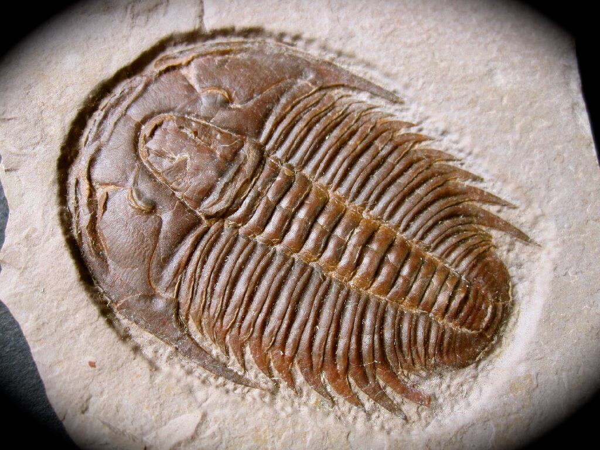

# 考古

## 学科

- archaeology
  - 考古学 the study of cultures of the past, and of periods of history by examining the remains of buildings and objects found in the ground

## 人员

- archaeologist
  - 考古学家 a person who studies archaeology

## 化石

- trilobite
  - 三叶虫（生活于几百万年前的小型海洋生物，已成化石） a small sea creature that lived millions of years ago and is now a fossil

