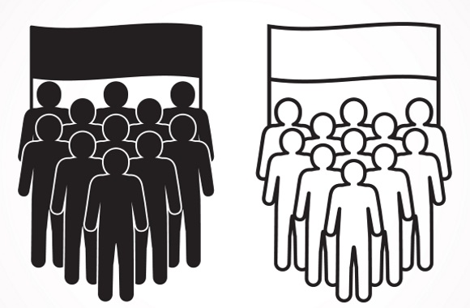

# differece

- disparate
  - 由不同的人（或事物）组成的 made up of parts or people that are very different from each other
  - 迥然不同的；无法比较的；不相干的 so different from each other that they cannot be compared or cannot work together

- segregated
  - 隔离的；被隔离的；种族隔离的 separated according to race, sex, or religion

