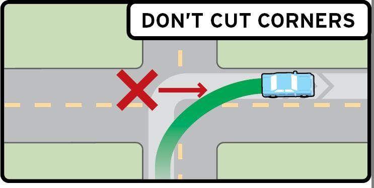

# do

- hands-on
  - 动手的；实际操作的 doing sth rather than just talking about it

hands-on computer training
计算机操作培训

to gain hands-on experience of industry
获得实际的从业经验

a hands-on style of management
事必躬亲的管理方式

- cut corners
  - 走捷径;抄近路；偷工减料 to not do a job as thoroughly as you should, especially because you want to finish it quickly or save money

> 这两个图，一个是“转弯儿”，另一个是“用剪刀铰下纸的折角”，两者在“抄近路”。
