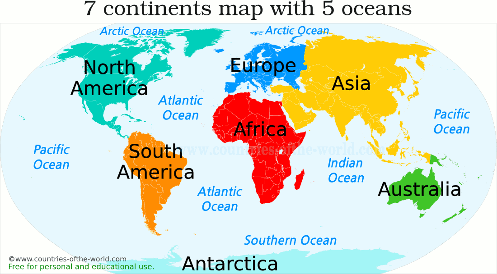

# continent

- continent
  - 大陆；陆地；洲 one of the large land masses of the earth such as Europe, Asia or Africa
  - 欧洲大陆（不包括英国和爱尔兰） the main part of the continent of Europe, not including Britain or Ireland

## 七大洲

- Oceania
  - 大洋洲 a large region of the world consisting of the Pacific islands and the seas around them

7 continents of the world

The widely recognized all the 7 continents are listed by size below, from biggest to smallest.

- **ASIA** includes 50 countries, and it is the most populated continent, the 60% of the total population of the Earth live here.
- **AFRICA** comprises 54 countries. It is the hottest continent and home of the world's largest desert, the Sahara, occupying the 25% of the total area of Africa.
- **NORTH AMERICA** includes 23 countries led by the USA as the largest economy in the world.
- **SOUTH AMERICA** comprises 12 countries. Here is located the largest forest, the Amazon rainforest, which covers 30% of the South America total area.
- **ANTARCTICA** is the coldest continent in the world, completely covered with ice. There are no permanent inhabitants, except of scientists maintaining research stations in Antarctica.
- **EUROPE** comprises 51 countries. It is the most developed economically continent with the European Union as the biggest economic and political union in the world.
- **AUSTRALIA** includes 14 countries. It is the least populated continent after Antarctica, only 0.3% of the total Earth population live here.

