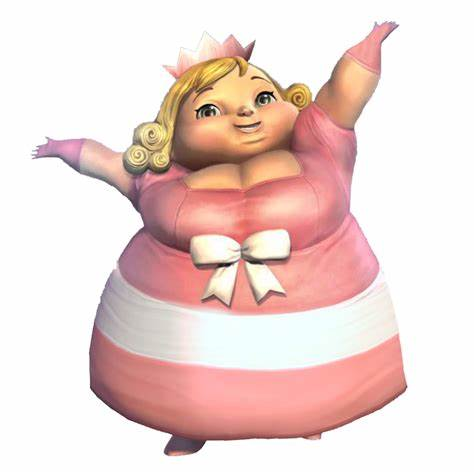

# 外貌

## 总

- look
  - （可数名词）样子；外观；相貌；外表 the way sb/sth looks; the appearance of sb/sth

It's going to rain today by the **look** of it(= judging by appearances) .
看样子今天要下雨了。

**Looks can be deceptive**.
外表有时是靠不住的。

I don't like the **look** of that guy(= I don't trust him, judging by his appearance) .
我不喜欢他那副样子。

- appearance
  - 外貌；外观；外表 the way that sb/sth looks on the outside; what sb/sth seems to be

the physical/outward/external appearance of sth
某物的外观（这是“物”的外观）

She had never been greatly concerned about her appearance.
她从来不怎么注重外貌。（这是“人”的外貌）

He gave every appearance of(= seemed very much to be) enjoying himself.
他处处表现得很快活。

**Judging by appearances can be misleading**.
单凭外表判断可能出错。

To all appearances(= as far as people could tell) he was dead.
从一切**迹象**来看，他已经死了。

When she lost all her money, she was determined to keep up **appearances**(= hide the true situation and pretend that everything was going well) .
她把钱全亏光时，决意佯装若无其事。

## 胖

- plump
  - 丰腴的；微胖的 having a soft, round body; slightly fat 这是从“人”的角度来解释
  - 松软的；丰满的；饱满的 looking soft, full and attractive to use or eat 这是从“物”的角度来解释

a short, plump woman
一个矮胖的女人

a plump face
饱满的面庞

plump cushions
松软的垫子

plump tomatoes
滚圆的番茄

