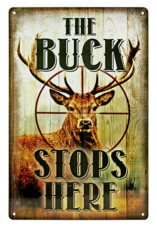
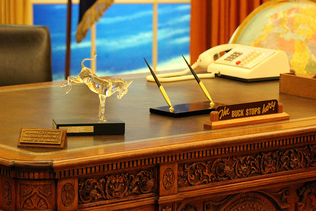

# responsibility

- buck stops here
  - **The ultimate responsibility is mine**. A set phrase used when the speaker intends to resolve a situation mired(进退不得) in indecision or inaction.
  - **The need to act or take responsibility**, that other people pass on to still other people, **ultimately ends up here**. (An expression made famous by U.S. President Harry Truman(杜鲁门), about the finality of decisions a president must make.)

This strike can't go on any longer, so the buck stops here—I will personally meet with the head of the union today.

After everyone else has avoided making the decision, I will have to do it. The buck stops here.

> 这让我想了“逐鹿天下，舍我其谁”

- buck
  - 雄鹿；公兔 a male deer , hare or rabbit
  - （用于某些表达方式）责任，过失 used in some expressions to refer to the responsibility or blame for sth

- accountability
  - 责任 responsibility to give account of

