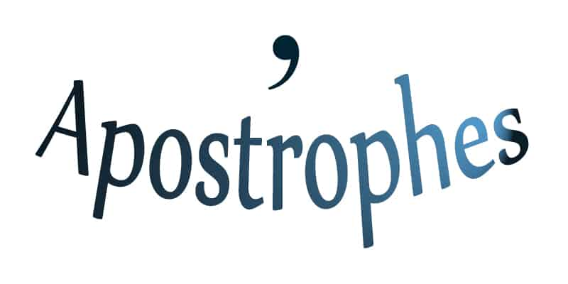

# A

## apostrophe

n.**撇号**；【语】顿呼法；所有格符号；复数符号
网络表示省略的撇号；省略符号；表示省略或所有格

Surely you’ve seen web pages like this, with strange question-mark-like characters where **apostrophes** should be. That usually means the page author didn’t declare their character encoding correctly, your browser was left guessing, and the result was a mix of expected and unexpected characters. 

