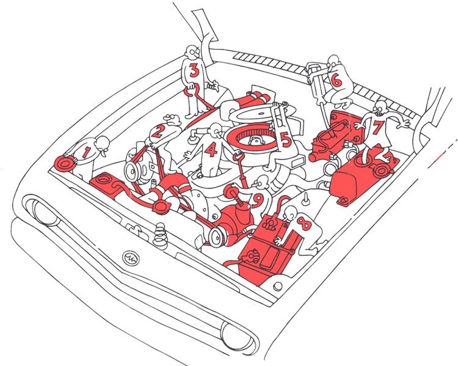

# U

## under the hood

Generally "**under the hood**" refers to how something works or functions internally.

Think of an automobile(汽车). We can (and often do) drive an automobile without understanding how it works. Most people never look at the **engine** of the car, which lives **under the hood** (we call it the **hood**(面罩；引擎盖) in America, but for example, British folks call it the **bonnet**(旧式女帽；车辆的引擎盖)).

In addition to the **engine**, there is a **transmission**, which takes the power generated by the engine and transmits it to the drivetrain(动力传动系统；驱动系统), which ultimately takes that power and turns the wheels. Most people don’t understand any of these details, nor do they need to in order to operate an automobile.

As a programmer, it’s often helpful to know what’s happening **under the hood**, because **it gives you insight into things you cannot see**.

