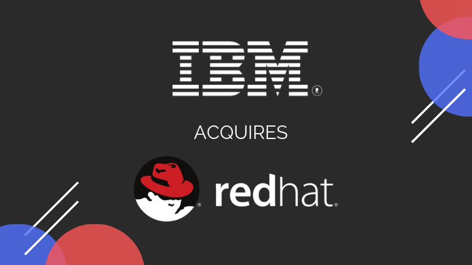

# Breaking News: IBM is Buying Red Hat for $34 Billion

URL: [Breaking News: IBM is Buying Red Hat for $34 Billion](https://itsfoss.com/ibm-red-hat-acquisition/)

IBM and Red Hat have inked the deal. IBM is **acquiring** Red Hat for approximately $34 billion in order to become the number one hybrid cloud provider in the world.

If you think open source projects doesn’t make money, it’s time to think again. A few months back Microsoft bought GitHub for $7.5 billion. SUSE Enterprise Linux was sold for $2.5 billion. Today IBM announced that it is buying Red Hat for approximately $34 billion.

Red Hat, the first billion dollar open source company is one of the strongest players in the containers and the cloud game. IBM has been lagging behind the likes of Microsoft and Google in the trillion dollar cloud market. So to strengthen their position in this field, IBM is **acquiring** Red Hat.

IBM will **acquire** all of the issued and outstanding common shares of Red Hat for $190.00 per share in cash, which is approximately $34 billion.

The deal was facilitated by JPMorgan from IBM side and Guggenheim Partners from Red Hat side.

Red Hat will join IBM’s Hybrid Cloud team as a distinct unit. It will continue to be led by **Jim Whitehurst** and the current Red Hat management team.

> “The **acquisition** of Red Hat is a game-changer. It changes everything about the cloud market. IBM will become the world’s #1 hybrid cloud provider, offering companies the only open cloud solution that will unlock the full value of the cloud for their businesses.”  
> -- Ginni Rometty, IBM Chairman, President and Chief Executive Officer

Red Hat is obviously excited about the deal:

> Joining forces with IBM will provide us with a greater level of scale, resources and capabilities to accelerate the impact of open source as the basis for digital transformation and bring Red Hat to an even wider audience – all while preserving our unique culture and unwavering commitment to open source innovation  
> -- Jim Whitehurst, President and CEO, Red Hat

As per the announcement, “IBM will remain committed to Red Hat’s open governance, open source contributions, participation in the open source community and development model, and fostering its widespread developer ecosystem. In addition, IBM and Red Hat will remain committed to the continued freedom of open source, via such efforts as Patent Promise, GPL Cooperation Commitment, the Open Invention Network and the LOT Network.”

This deal makes IBM the number one player in the cloud market. It will be interesting to see if other players Microsoft and Google make similar moves.

SUSE has already been sold to EQT and Debian is a community owned project so that leaves Ubuntu. Can **Ubuntu** be the next acquisition target, perhaps by Microsoft? Only time will tell.

What are your views on IBM-Red Hat deal? Will it impact the open source projects by Red Hat? Do you see the recent trend of **acquisition** of Open Source companies as a ‘threat to the open source culture’? So share your views in the comment section.
