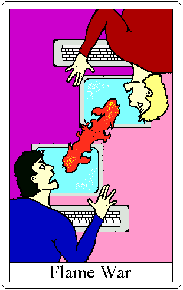

# war

- flame war
  - 舌战；口水战；不良信息战 （这里强调“口头打架”，是中文的翻译）
  - a period of repeated exchanges of abusive and insulting e-mail between people or groups 这里是强调“一段时间”，人们用“邮件”互相攻击
  - a period during which people send angry or rude e-mails to each other

But there was one problem: some Linux developers **took exception** with the **proprietary** nature of their version control system and what **ensued** was an **epic** **flame war**.

